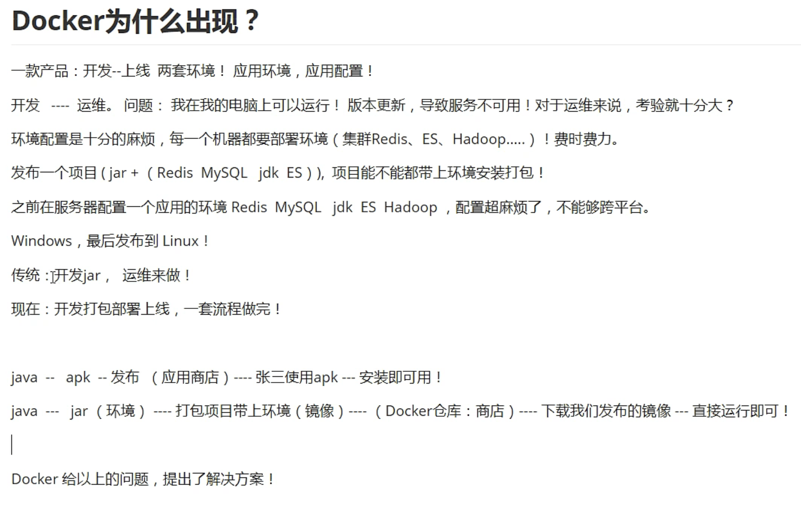

# Docker概述



## 虚拟机技术

模拟的基本是完整的操作系统


虚拟机技术缺点：

+ 资源占用多
+ 冗余步骤多
+ 启动很慢

##容器化技术

不是模拟的一个完整的操作系统	


Docker和虚拟机的比较：

+ 传统虚拟机，虚拟出一套硬件，运行一个完整的操作系统，然后在这个系统上安装和运行软件。
+ 容器内的应用直接运行在宿主机（容器安装的机器）的内核，容器没有自己的内核。
+ 每个容器内是相互隔离的，每个容器内都有一个属于自己的文件系统，互不影响。

# Docker安装

## Docker基本组成


###镜像（image）

Docker镜像就好比是一个模板，可以通过这个模板来创建容器服务，tomcat镜像-->run-->tomcat01容器（提供服务器），通过这个镜像可以创建多个容器（最终服务运行或者项目运行就是在容器中）。

###容器（container）

Docker利用容器技术，独立运行一个或者一个组应用，通过镜像来创建的。

###仓库（repository）

仓库就是用来存放镜像的地方。

仓库分为公有仓库和私有仓库。

配置镜像加速（参考maven）

```shell
#卸载旧版本
yum remove docker \
docker-client \
docker-client-latest \
docker-common \
docker-latest \
docker-latest-logrotate \
docker-logrotate \
docker-engine

#需要的安装包
yum install -y yum-utils

#设置镜像仓库
yum-config-manager \
> --add-repo \
> http://mirrors.aliyun.com/docker-ce/linux/centos/docker-ce.repo

#更新yum软件包索引
yum makecache fast

#安装docker
yum install docker-ce docker-ce-cli containerd.io

#启动docker
systemctl start docker

#查看是否安装成功
docker version
```


#Docker运行流程


# Docker底层原理

## Docker是怎么工作的

Docker是一个Client-Server结构的系统，Docker的守护进程运行在主机上，通过Socket从客户端访问。

Docker-Server接收到Docker-Client的指令，就会执行这个命令。


## Docker为什么比VM快

+ Docker比虚拟机有更少的抽象层
+ Docker利用的是宿主机的内核，VM需要Guest OS


==所以说，新建一个容器的时候，Docker不需要像虚拟机一样重新加载一个操作系统内核，Docker直接利用宿主机的操作系统，省略了很多繁杂的步骤。==

# Docker常用命令


## 帮助命令

```shell
docker version		#显示docker版本信息
docker info			#显示docker系统信息
docker 命令 --help  #万能命令
```

**帮助文档地址：[Reference documentation (docker.com)](https://docs.docker.com/reference/)**


## 镜像命令

### 查看镜像

```shell
docker images [OPTION]

#选项
-a, --all          #列出所有镜像
-q, --quiet  	   #只显示镜像id
```

### 搜索镜像

```shell
docker search mysql    #搜索mysql

#可以用docker search --help 查看可选项
```

### 下载镜像

```shell
docker pull mysql #[:tag]
#如果不写tag默认就是下载最新的

docker pull mysql:5.7 #指定版本下载
```

### 删除镜像

```shell
# docker rmi -f 镜像id   #删除指定的镜像
# docker rmi -f 镜像id 镜像id 镜像id   #删除多个镜像
# docker rmi -f $(docker images -aq)   #删除所有的镜像
```


## 容器命令

有了镜像才可以创建容器

###创建并启动容器

```shell
docker run [OPTION] image

#参数说明
--name="name"  容器名字  tomcat01 tomcat02  用来区分容器
-d   后台方式运行
-it   使用交互方式运行，进入容器查看内容
-p    指定容器的端口
	-p 主机端口：容器端口（常用）
	-p 容器端口
-P    大写P，随机指定端口


#测试 启动并进入容器
docker run -it centos /bin/bash

#从容器中退出
exit
```

###列出运行的容器

```shell
docker ps [option]
# -a 列出当前正在运行的容器和历史运行过的容器
# -n=? 显示最近创建的容器
# -q 只显示容器编号
```

### 退出容器

```shell
exit  #直接容器停止并退出
Ctrl + P + Q #容器不停止退出
```

### 删除容器

```shell
docker rm 容器id	#删除指定容器
docker rm -f $(docker ps -aq)	#删除所有容器
```

###启动和停止

```shell
docker start 容器id		#启动容器
docker restart 容器id		#重启容器
docker stop 容器id		#停止当前正在运行的容器
docker kill 容器id		#强制停止当前容器
```


## 常用其他命令

###后台启动容器

```shell
docker run -d 镜像名

#docker容器使用后台运行，就必须要有一个前台进程，docker发现没有应用就会停止。
```

###日志

```shell
docker logs [option]  #接--help自己查
docker logs -tf -tail [num] 容器id
```

###查看容器中的进程信息

```shell
docker top
```

###查看镜像元数据

```shell
docker inspect 镜像id
```

### 进入当前正在运行的容器

```shell
docker exec -it 容器id bashShell	#进入容器
docker attach 容器id	#同样是进入容器，不用加-it 
#二者区别：exec进入容器后开启一个新的终端，可以在里面操作（常用），attach进入容器正在执行的终端，不会启动新的进程。
```

###容器拷贝文件到主机

```shell
docker cp 容器id:容器内路径 目的主机路径
#即使容器并未启动 文件也是存在的，所以不需要容器启动也能复制文件。
```

### 小结


# 作业


##Docker安装Nginx

```shell
#首先用docker search nginx 去搜索nginx
docker search nginx
#然后下载nginx(默认下载最新版本)
docker pull nginx
#启动nginx镜像容器 3344:80的意思是主机3344的端口对应容器的80端口
docker run -d -p 3344:80 --name nginx01 nginx
```


##Docker部署ES和Kibana

```shell
#es暴露的端口很多
#es十分消耗内存
#es需要挂载

#下载es启动
$ docker run -d --name elasticsearch -p 9200:9200 -p 9300:9300 -e "discovery.type=single-node" elasticsearch:7.6.2

#docker stats 查看cpu状态

#安装kibana
$ docker run -d --name kibana --net somenetwork -p 5601:5601 kibana:tag
```

# Docker镜像讲解


## 镜像是什么

镜像是一种轻量级，可执行的独立软件包，用来打包软件运行环境和基于运行环境开发的软件，它包含运行某个软件所需的所有内容包括代码，运行时，库，环境变量和配置文件。

如何得到镜像；

+ 远程仓库下载
+ 朋友拷贝
+ 自己制作一个镜像DockerFile


## Docker镜像加载原理

### UnionFS（联合文件系统）

UnionFS是一种分层，轻量级并且高性能的文件系统，它支持对文件系统的修改，作为一次提交来层层叠加，同时可以将不同目录挂载到同一个虚拟文件系统下，Union文件系统是Docker镜像的基础。镜像可以通过分层来进行继承，基于基础镜像（没有父镜像）可以制作各种具体的应用镜像。

###Docker镜像加载原理


### 分层的镜像

所有的Docker镜像都起始于一个基础镜像层，当进行修改或者增加新的内容时，就会在当前镜像层之上，创建新的镜像层。

举例：假设居于Ubuntu创建一个新的镜像，这就是新镜像的第一层，如果添加python包，就会在基础镜像层之上创建第二个镜像层，如果继续添加安全补丁，就会创建第三个镜像层，


注意：在这里的第1层，2层，3层内部其实还有多层，但是pull过来之后对外显示是一个镜像层。

###Commit镜像

```shell
docker commit -m="提交的描述信息" -a="作者" 容器id 目标镜像名:[tag]
```

# 容器数据卷


## 什么是容器数据卷

docker理念回顾

将应用和环境打包成镜像

但是如果数据都在容器中，那么我们容器删除，数据就会丢失。需求：数据持久化

容器之间可以有一个数据共享技术，Docker容器中产生的数据，同步到本地。

这就是卷技术，目录的挂载，将我们容器内的目录，挂载到Linux上面。


## 使用数据卷

直接使用命令  -v

```shell
docker run -it -v 主机目录:容器目录
```

优点：以后修改只需要在本地修改，容器内文件夹也会自动同步。

### 实战：安装Mysql

```shell
#获取镜像
docker pull mysql：5.7

#运行容器，需要数据挂载

# -d 后台运行
# -p 端口控制
# -v 卷挂载
# -e 环境配置
# --name 容器名字
docker run -d -p 3310:3306 -v /home/mysql/conf:/etc/mysql/conf.d -v /home/mysql/date:/var/lib/mysql -e MYSQL_PASSWORD=12345 --name mysql01 mysql:5.7


```

## 匿名挂载

```shell
#匿名挂载
-v 容器内路径
docker run -d -P --name nginx01 -v /etc/nginx nginx #注意这里未指定主机路径

#查看所有volune的情况
docker volume ls
```

所有的docker容器内的卷，没有指定目录的情况下都是再 /var/lib/docker/volumes/xxx/_data，一般不建议匿名挂载。

如何确定匿名挂载还是具名挂载，还是指定路径挂载

+ -v 容器内路径	匿名挂载
+ -v 卷名:容器内路径    具名挂载
+ -v /宿主机路径:容器内路径    指定路径加载

拓展：

```shell
#通过 iv 容器内路径:ro  rw改变读写权限
#ro readonly 只读
#rw readwrite 读写
#一旦设定了容器权限，容器对我们挂载出来的内容就有限定了

docker run -d -P --name nginx01 -v /etc/nginx:ro nginx
docker run -d -P --name nginx01 -v /etc/nginx:rw nginx

#ro 只要看到ro就说明这个路径只能通过宿主机操作，容器内部是无法操作的
```


##数据卷容器

两个或多个mysql同步数据。

--volumes-from


结论：

容器之间配置信息的传递，数据卷容器的生命周期一直持续到没有容器使用为止。

但是一旦持久化到了本地 -v，这个时候本地的数据是不会删除的。


#DockerFile


##初识DockerFile

DockerFile就是用来构建docker镜像的构建文件，本质是个命令脚本。

通过这个脚本可以生成镜像，镜像是一层层的，脚本是一个个的命令，每个命令都是一层。

构建步骤：

1. 编写一个dockerfile文件
2. docker build 构建成为一个镜像
3. docker run运行镜像
4. docker push发布镜像（DockerHub，阿里云镜像仓库）

```shell
#dockerFile
FROM centos

VOLUME["volume01","volume02"]

CMD echo "---end---"

CMD /bin/bash
```

通过docker build构建镜像

```shell
docker build -f /home/docker-test-volume/dockerfile -t kuangshen/centos .	#后面这个点别忘了
```


##DockerFile的构建过程

基础知识：

1. **每个保留关键字（指令）都是必须是大写字母**
2. **执行从上到下顺序执行**
3. **“#”表示注释**
4. **每个指令都会创建提交一个新的镜像层，并提交。**


dockerfile是面向开发的，以后要发布项目，就需要编写dockerfile文件，这个文件十分简单。

DockerFile：构建文件，定义了一切步骤，源代码。

Dockerimages：通过DockerFile构建生成的镜像，最终发布和运行的产品。

DockerContainer：容器就是镜像运行起来提供服务器。


##DockerFile指令

```shell
FROM		#基础镜像，一切从这里开始构建
MAINTAINER	#镜像是谁写的
RUN			#镜像构建的时候需要运行的命令
ADD			#步骤：tomcat镜像，tomcat的压缩包添加内容
WORKDIR		#镜像工作目录
VOLUME		#挂载的目录
EXPOSE		#指定暴露端口 参考-p
CMD			#指定这个容器启动的时候要运行的命令，只有最后一个会生效，可被替代
ENTRYPOINT	#指定这个容器启动的时候要运行的命令，可以追加命令
ONBUILD		#当构建一个被继承dockerfile这个时候就会运行此命令
COPY		#类似ADD,将文件拷贝到镜像中
ENV			#构建的时候设置环境变量
```


##实战测试


###Dockerfile构建centos

```shell
#编写dockerfile文件
FROM centos:7
MAINTAINER WANYU<1140267690@qq.com>

ENV MYPATH /usr/local
WORKDIR $MYPATH

RUN yum -y install vim
RUN yum -y isntall net-tools

EXPOSE 80

CMD echo $MYPATH 
CMD echo "---end---"
CMD /bin/bash

#通过这个文件构建镜像
docker build -f mydockerfile -t mycentos:1.0 .

```

**CMD和ENTRYPOINT区别**（自己去查）

#发布镜像到DockerHub

1. https://hub.docker.com/，注册自己的账号
2. 确定此账号能够登录
3. 在我们的服务器上提交自己的镜像

```shell
docker login --help
-p -u
```

4. 登录完毕之后就能够提交镜像了

```shell
docker push wanyu/xxxx
```

#小结


==暂且在这里打止，继续深入学习再看狂神的Docker基础篇33==
