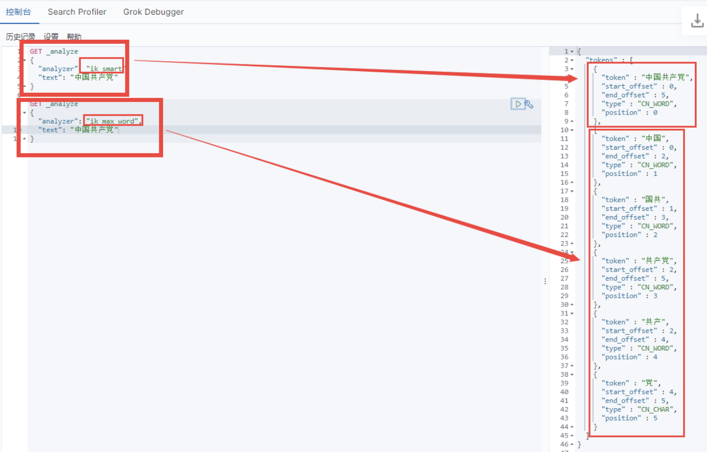

#概述

ElasticSearch是一个开源的高拓展的**分布式全文检索引擎。**

# 安装使用


## 先去官网下载安装包


## 解压到环境下


## 打开Elasticsearch


## 访问端口


## 安装可视化界面es head


##启动


##访问网页


## 解决跨域问题

### 找到配置文件


### 修改配置文件


### 配置成功的标志


# ES的核心概念

ES是面向文档的

ES和传统的关系型数据库比较（ES一切都是JSON）

| 列1          | 列2           |
| ------------ | ------------- |
| 关系型数据库 | ElasticSearch |
| 数据库       | 索引          |
| 表           | types         |
| 行           | documents     |
| 字段         | fields        |


## 文档

就是一条条的数据

1 张三 3 2 李四 4

之前说ES是面向文档的，那么久意味着索引和搜索数据的最小单位是文档。

- 自我包含，一篇文档同时包含字段和对应的值，也就是同时包含key：value
- 可以是层次型的，一个文档中包含自文档，复杂的逻辑实体就是这么来的！（就是一个json对象）
- 灵活的结构。


## 类型

类型就是文档的逻辑容器，就像关系型数据库一样，表格是行的容器。


## 索引

就是数据库！

索引是映射类型的容器，ES中的索引是一个非常大的文档集合。

# 倒排索引

ES使用的是一种称为倒排索引的结构，采用Lucene倒排索引作为地城。这种结构适用于快速的全文搜索，一个索引由文档中所有不重复的列表构成，对每一个词，都有一个包含它的文档列表。

例如：

现在有 A B C D四篇文档

A: abc

B: bcd

C: cde

D: def

为了创建倒排索引，首先要将每个文档拆分成独立的词，然后创建一个包含所有不重复的词条的排序列表，然后列出每个词条出现在哪个文档（√表示命中，×表示未命中）

| 列1  | 列2  | 列3  | 列4  | 列5  |
| ---- | ---- | ---- | ---- | ---- |
| term | A    | B    | C    | D    |
| a    | √    | ×    | ×    | ×    |
| b    | √    | √    | ×    | ×    |
| c    | √    | √    | √    | ×    |
| d    | ×    | √    | √    | √    |
| e    | ×    | ×    | √    | √    |
| f    | ×    | ×    | ×    | √    |

现在我们试图搜索a和c:

| 列1   | 列2  | 列3  | 列4  | 列5  |
| ----- | ---- | ---- | ---- | ---- |
| term  | A    | B    | C    | D    |
| a     | √    | ×    | ×    | ×    |
| c     | √    | √    | √    | ×    |
| total | 2    | 1    | 1    | 0    |

显然A文档的权重Score更高，如果没有别的条件，ABC三个文档都将返回。

自己的理解：

本来如果是要查询a和c两个term的话，我们是要一个一个文档里面查，A查完查B，B查完查C，C查完查D，但是建立倒排索引之后，就是将term做为列，对文档进行查询，将不重复的term作为列，我们查到需要的term，然后看这个term位于哪个文档即可，就不要一个个去查所有文档。

即，原本我们是：

| 列1  | 列2  |
| ---- | ---- |
| 文档 | 字段 |
| A    | a,c  |
| B    | c    |
| C    | c    |
| D    |      |

进行倒排索引之后变成了：

| 列1  | 列2   |
| ---- | ----- |
| 字段 | 文档  |
| a    | A     |
| c    | A,B,C |

# IK分词器

分词：即把一段中文或者别的划分成一个个的关键字，我们在搜索时候会把自己的信息进行分词，会把数据库中或者索引库中的数据进行分词，然后一个个进行匹配的操作，默认的中文分词是将每个字看成一个词。

下载IK分词器对应的压缩包，版本要对应ES的版本，然后将压缩包解压到ES的plugins文件夹下，重新启动ES和Kibana

IK提供了两个分词算法：**ik_smart**和**ik_max_word** 其中**ik_smart是最小切分**，**ik_max_word是最细粒度划分**。



但是有时候我们的输入会被过度拆分

上面的周某被拆分成了两个词，所以我们要将需要的词自己加入到词典中：


新建一个自己的字典：zmy.dic


字典里加入自己想加入的词：


在配置文件中加入自己的字典：


重启es


注意字符编码问题。

# Rest风格说明

一种软件架构风格，而不是标准，只是提供了一组设计原则和约束条件，它主要用于客户端和服务器交互类的软件。基于这个风格设计的软件可以更简洁，更有层次，更易于实现缓存机制。

基本Rest命令说明

| 列1    | 列2                                             | 列3                |
| ------ | ----------------------------------------------- | ------------------ |
| method | url地址                                         | 描述               |
| PUT    | localhost:9200/索引名称/类型名称/文档id         | 创建文档（指定id） |
| POST   | localhost:9200/索引名称/类型名称                | 创建文档（随机id） |
| POST   | localhost:9200/索引名称/类型名称/文档id/_update | 修改文档           |
| DELETE | localhost:9200/索引名称/类型名称/文档id         | 删除文档           |
| GET    | localhost:9200/索引名称/类型名称/文档id         | 通过id查询文档     |
| POST   | localhost:9200/索引名称/类型名称/_search        | 查询所有数据       |

------

# 关于索引的基本操作


## 创建索引（增）

```
PUT /索引名/类型名/文档id {请求体}
```


查看刚刚创建的数据


## 基本类型

- 字符串类型：text，keyword
- 数值类型：long，integer，short，byte，double，float，half float，scaled float
- 日期类型：date
- 布尔值类型：boolean
- 二进制类型：binary
- 。。。。


## 指定字段类型


## 获取索引的信息


## 查看默认信息

首先创建一个新的索引，并且存入一个数据


查看


如果自己的文档字段没有指定类型，那么es会给我们自动配置默认类型


## 修改索引（改）


###直接PUT覆盖修改

原来的数据：


修改数据：


查看数据：


###POST请求修改


查看修改后的数据：


## 删除索引（删）


删除数据的话在索引后面加上文档名就可以了。

# 关于文档的基本操作


## 基本操作

### 添加一条数据（增）


和上面那个一样

### 获取数据（查）


### 更新数据(改)

直接PUT覆盖


和上面讲的那个好像是一样的。。

和上面一样还能用POST改(一般推荐使用post修改数据)

### 删除操作（删，同上）


## 复杂操作

### 类似模糊查询

/_search


### 只查哪些信息


### 排序


### 分页


### 高亮查询


###自定义搜索高亮条件


# Elastic Search集成Springboot


## 首先去找到官方文档中找到依赖

```xml
<dependency>   
<groupId>org.elasticsearch.client</groupId>   
<artifactId>elasticsearch-rest-high-level-client</artifactId>   <version>7.12.0</version>  
</dependency>
```

注意 springboot默认的es版本可能不对应你想用的版本，需要在pom文件中进行修改


## 构建对象（初始化）


## 分析类中的方法

### 创建索引CreateIndex

```java
@Test//创建索引     
void test1() throws IOException {         
    //1.创建索引请求         
    CreateIndexRequest request = new CreateIndexRequest("zmy_index");         //2.客户端执行请求，并拿到请求后的响应。         
    CreateIndexResponse response = client.indices().create(request, RequestOptions.DEFAULT);                 
    System.out.println(response);     
}
```

结果：


### 获得索引(判断是否存在)GetIndex

```java
@Test//获取索引   
void test2() throws IOException {     
    //1.获得索引请求     
    GetIndexRequest request = new GetIndexRequest("zmy_index");    
    //2.判断是否存在     
    boolean exists = client.indices().exists(request, RequestOptions.DEFAULT);     
    System.out.println(exists);   
}
```

结果：


### 删除索引DeleteIndex

```java
@Test//删除索引   
void test3() throws IOException {     
//1.删除索引请求     
DeleteIndexRequest request = new DeleteIndexRequest("zmy_index");     
//2.执行删除之后获得响应对象。     
AcknowledgedResponse delete = client.indices().delete(request, RequestOptions.DEFAULT);     
System.out.println(delete.isAcknowledged());   
}
```

结果：


### 添加文档IndexRequest

```java
@Test//添加文档   
void test4() throws IOException {     
//创建对象     
User user = new User(         "周某",         21     );     
//创建请求     
IndexRequest request = new IndexRequest("zmy");     
//规则 put /zmy/_doc/1     
request.id("1");     
request.timeout(TimeValue.timeValueSeconds(1));     
//将数据放入请求 json(将对象转成json之后传入source)
request.source(JSON.toJSONString(user), XContentType.JSON);     

//客户端发送请求，并获取响应结果     
IndexResponse response = client.index(request, RequestOptions.DEFAULT);     System.out.println(response.status());   
}
```

结果:


### 获取文档（判断是否存在）GetRequest

```java
@Test//获取文档，判断文档是否存在   
void test5() throws IOException {     GetRequest request = new GetRequest("zmy","1");     
//不获取返回的_source的上下文了     
request.fetchSourceContext(new FetchSourceContext(false));     request.storedFields("_none_");     
boolean exists = client.exists(request, RequestOptions.DEFAULT);     System.out.println(exists);   
}
```

结果：


### 获取文档信息 GetRequest

```java
@Test//获取文档信息   
void test6() throws IOException {     
GetRequest request = new GetRequest("zmy","1");     
GetResponse response = client.get(request, RequestOptions.DEFAULT);     String str = response.getSourceAsString();     
System.out.println(str);   
}
```

结果：


### 更新文档信息 UpdateRequest

```java
@Test//更新文档信息   
void test7() throws IOException {     
UpdateRequest request = new UpdateRequest("zmy", "1");     request.timeout("1s");     
User user = new User("万宇", 21);     request.doc(JSON.toJSONString(user),XContentType.JSON);     UpdateResponse response = client.update(request, RequestOptions.DEFAULT);  System.out.println(response.status());   
}
```

结果：


### 删除文档信息DeleteRequest

```java
@Test//删除文档信息   
void test8() throws IOException {     
DeleteRequest request = new DeleteRequest("zmy","1");     request.timeout("1s");     
DeleteResponse response = client.delete(request, RequestOptions.DEFAULT);  System.out.println(response.status());   
}
```


### 批量插入数据BulkReques

```java
@Test//批量插入数据（大批量请求）  
void test9() throws IOException {     
BulkRequest bulkRequest = new BulkRequest();     bulkRequest.timeout("10s");     
ArrayList<User> list = new ArrayList<>();     
list.add(new User("周某",21));     
list.add(new User("蔡某",21));     
list.add(new User("驰某",21));     
list.add(new User("曾某",23));     
for (int i = 0; i < list.size(); i++) {       
bulkRequest.add(           
new IndexRequest("zmy").id(""+(i+1)).source(JSON.toJSONString(list.get(i)),XContentType.JSON));     }     BulkResponse response = client.bulk(bulkRequest, RequestOptions.DEFAULT);     
System.out.println(response.status());   }
```

结果：


### 查询SearchRequest

```java
@Test//查询     
void test10() throws IOException {         
SearchRequest searchRequest = new SearchRequest("zmy");         
//构建搜索条件         
SearchSourceBuilder builder = new SearchSourceBuilder();         
//构建查询条件         
//QueryBuilders.termQuery  精确匹配         
//QueryBuilders.matchAllQuery 匹配所有         
TermQueryBuilder query = QueryBuilders.termQuery("name", "某");         builder.query(query);         
builder.timeout(new TimeValue(60, TimeUnit.SECONDS));         searchRequest.source(builder);         //构建分页         /*builder.from(1);         
builder.size(3);*/         
SearchResponse response = client.search(searchRequest, RequestOptions.DEFAULT);         
SearchHits hits = response.getHits();
//查询之后的所有数据都放在hits里面！         
    System.out.println(JSON.toJSONString(hits));         System.out.println("===========================");         
for (SearchHit hit : hits.getHits()) {             System.out.println(hit.getSourceAsMap());         
}     
}
```

