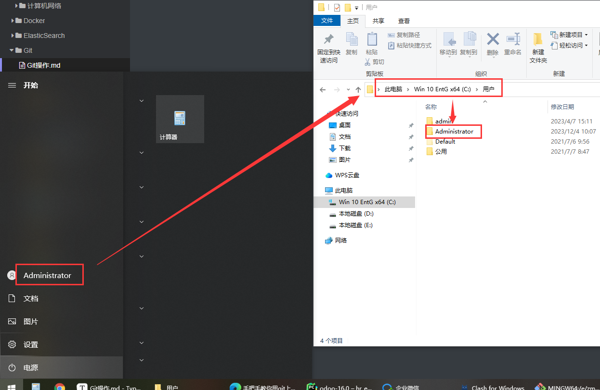
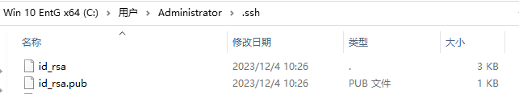
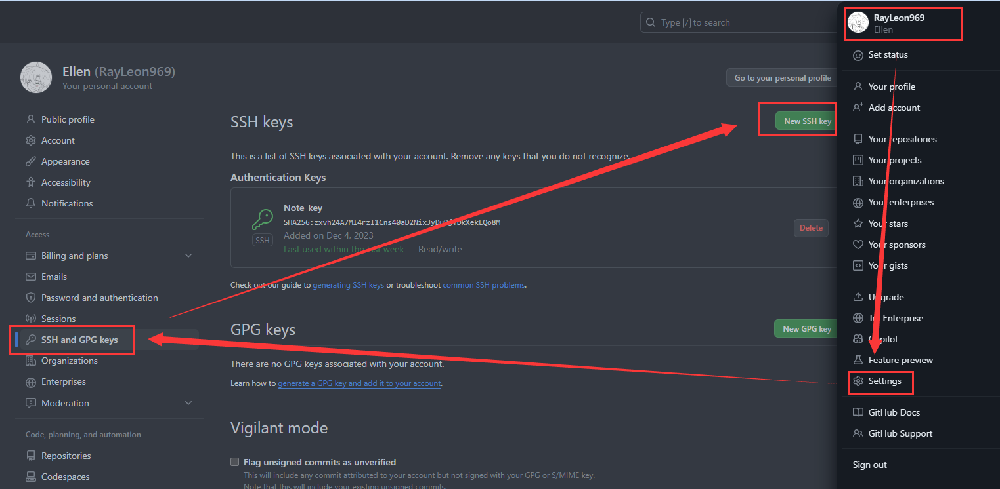
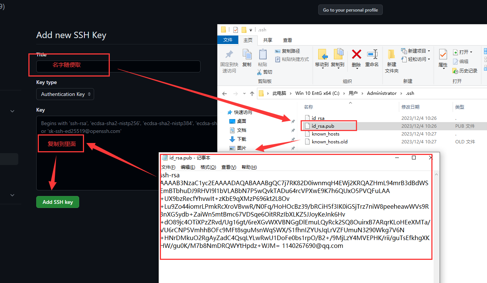
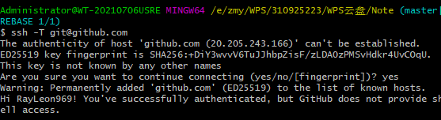
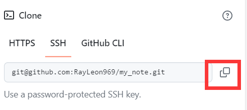
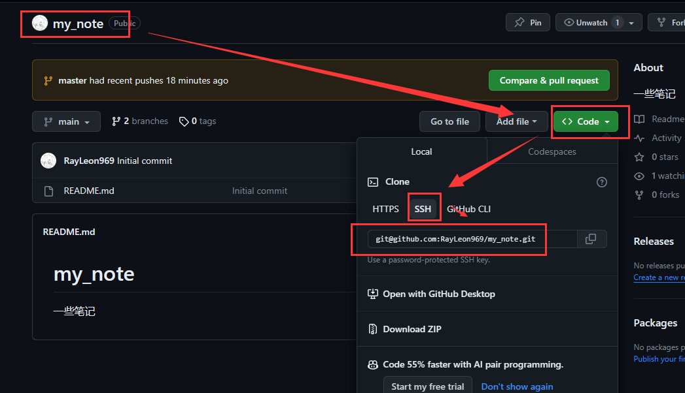

在此记录笔记上传的操作

git安装自行下载安装：傻瓜式操作

# SSH密匙

安装好git后，首先去计算机登录用户的文件夹下，即：



然后找到.ssh文件夹


​		进去后打开Git Bash

```bash
设置用户名
git config --global user.name "Ellen"

设置邮箱
git config --global user.email "1140267690@qq.com"

生成rsa密匙和公匙
ssh-keygen -t rsa -C “1140267690@qq.com”
```

一直按回车即可

执行完毕后显示：



然后去github添加SSH key





然后可以在Bash中输入以下内容检查是否成功

```bash
 ssh -T git@github.com
```

成功显示：




# Pull操作

如果是新建文件夹	


1. 首先去需要pull的GitHub项目下，复制如下内容。



2. 然后使用 git clone

```bash
git clone git@github.com:RayLeon969/my_note.git
```

3. 然后 cd my_note/
4. git checkout master 切换分支
5. 然后直接git pull


# Push操作

操作顺序是先add，然后commit，最后push.

首先来到项目文件夹下

## add

```bash
git add .
```


## commit

```bash
git commit -m "第几次提交or别的"
```


## push

```bash

git push -u origin master

覆盖式提交
git push -f origin master

标有origin的代表是远程分支 git push origin<远程分支>:<本地分支> 代表从本地分支推送到远程分支 如果没有远程分支就会创建这个远程分支
git push origin master:master
```


如果提示没有origin则可能是未建立remote的原因

## remote

```bash
查看有无remote
git remote -v

添加remote
git remote add origin git@github.com:RayLeon969/my_note.git
```

添加remote的地址来源于：




# Reset操作

```bash
git reset --hard xxxxx
```

--hard会强制回退到xxxx的commit节点，不会保留你所做的更改，所以你应该将所做的更改保存u或者考虑用--sorf

xxxx可以用git log 查询

# Branch

```bash
查看分支
git branch

删除分支
git branch -d or -D xxxx
-D是强制删除，不会保留更改

查看远程分支
git branch -r

删除远程分支
git push origin --delete xxxx
```


# checkout操作

```bash
切换分支
git checkout master

基于当前分支创建新分支并切换到新分支
git checkout -b new_branch
```


# 记录端口不可用Bug

上传报错：

```bash
ssh: connect to host github.com port 22: Connection timed out
```

显示22端口连接超时 查阅相关资料后解决方法如下：

1. 进入当前用户的下的.ssh文件中

2. 使用vim config来编写config文件

3. 文件内容如下

   ```tex
   Host github.com
   User git
   Hostname ssh.github.com
   PreferredAuthentications publickey
   IdentityFile ~/.ssh/id_rsa
   Port 443
   ```

4. 保存后使用以下命令检查连通性

   ```bash
   ssh -T git@github.com
   ```

   

# 记录git bash找不到应用程序的问题

问题引发原因：换电脑后E和F的盘符对调了，导致路径错误

首先win+R


输入路径：计算机\HKEY_LOCAL_MACHINE\SOFTWARE\Classes\Directory\background\shell\git_shell\command


点击数据进行修改，改为正确的git路径即可


# 记录如果拉错代码分支紊乱，如果重新恢复

首先删除git所在的文件夹所有文件

```bash
git clone -b fix_master ssh:xxxxxxxxxxxxxxxxx

git branch 查看分支 此时是fix_master
git checkout -b fix_mouyuan 此时是在fix_master 用checkout -b 根据当前分支建立新分支fix_moyuan
此时fix_mouyuan里面就是fix_master一样的代码
push fix_mouyuan到远程的fix_mouyuan 如果被拒绝了就删除远程分支重新push，会重新创建远程分支，然后提PR检查push过去的fix_mouyuan等不等于fix_master

然后 日更是fix_master 周更是feature_week 此时我们需要把feature_week同样加到代码中，注意不是两个文件而是在同一个文件中
此时是在fix_mouyuan分支，但是我们不和第一步一样直接clone或者pull，我们直接:
git checkout feature_week
注意不是checkout -b而是直接checkout,然后git会自动根据远程同名的fearture_week在本地建立分支feature_week
然后我们checkout -b dev_mouyuan，此时我们就生成了dev_mouyuan，然后和前面一样push到远程分支，然后提pr检查是否一样

```

