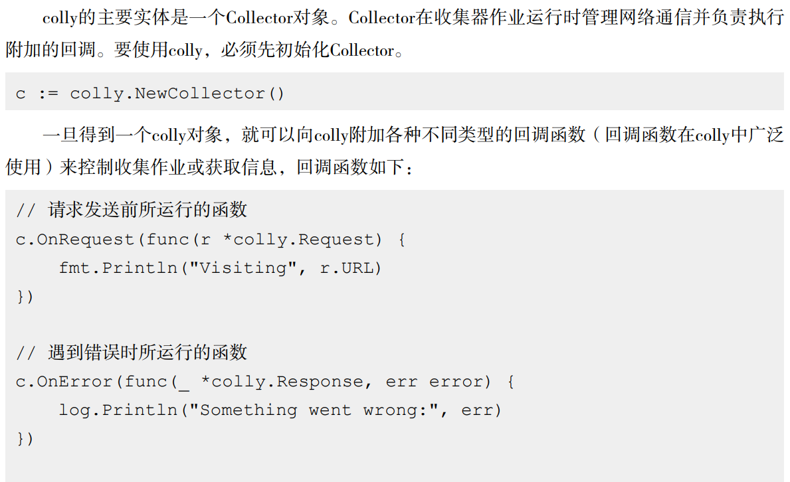
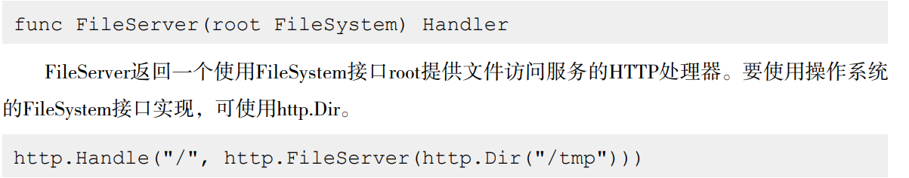

# 	Go基础

[toc]


## 变量声明

```go
package main

import (
	"fmt"
	"reflect"
)

func main() {
	var num int = 2
	var (
		a int
		b string
		c bool
	)

	age := 14               // 短声明变量 更加常用 上面num是最基本的变量声明 短声明变量会自动根据右边的变量确定类型
	name, sex := "周谋远", "男" // 短声明变量的多重声明 额外需注意短声明变量不能声明已经声明过得变量

	num = 1
	a = 2
	b = "你好"
	c = false

	fmt.Println("hello world!")
	fmt.Println(num)
	fmt.Println(a)
	fmt.Println(b)
	fmt.Println(c)
	fmt.Println("name:", name) // 注意不是加号
	fmt.Println("age:", age)
	fmt.Println("sex:", sex)
	fmt.Println("sex变量类型", reflect.TypeOf(sex))

}

```


## 数据类型

```go
package main

import (
	"fmt"
	"reflect"
)

// 数据类型

func main() {
	// 有整形符号int8 int16 int32 int64
	var a int8 = 1
	var b int16 = 1
	// 无整形符号uint8 uint16 uint32 uint64
	var c uint8
	// 浮点型 float32 float64
	var d float32
	// 字符类型 "123"
	var e string = "123"
	// 布尔类型 bool true false
	var f bool = false

	fmt.Println(reflect.TypeOf(a))
	fmt.Println(reflect.TypeOf(b))
	fmt.Println(reflect.TypeOf(c))
	fmt.Println(reflect.TypeOf(d))
	fmt.Println(reflect.TypeOf(e))
	fmt.Println(reflect.TypeOf(f))

}

```


## 指针

```go
package main

import "fmt"

// 指针

func main() {
	var p *int

	num := 1
	p = &num

	fmt.Println("p指向的值：", *p)
	fmt.Println("p指针存储的地址：", &p)

	*p = 2
	fmt.Println("*p=", *p)
	fmt.Println("num=", num)

	num = 3
	fmt.Println("*p=", *p)
	fmt.Println("num=", num)
}

```


## 字符串

```go
package main

import (
	"bytes"
	"fmt"
)

// 字符串

func main() {

	a := "123"
	b := "456"
	c := a + b // 当字符串不长时 可以直接用+号拼接

	fmt.Println("拼接后的字符串：", c)

	var d bytes.Buffer // 当字符串过长时，可以用buffer缓存来进行构造
	d.WriteString(a)
	d.WriteString(b)
	fmt.Println("拼接后的字符串：", d.String())

	// 字符串切片
	fmt.Println("切片后的字符串：", a[0:1])

}

```


## 常量定义

```go
package main

import "fmt"

// 常量定义

func main() {
	const a float32 = 3.1415
	const c = 3.1415 // 常量的隐式声明格式
	var b float32 = 3.1415

	// 注意 常量定义可以不使用 但是变量定义一定要使用
	fmt.Println(b)

}

```


## 分支控制

```go
package main

import "fmt"

func main() {
	a := true
	if a { // 分支控制
		fmt.Println("its grate!")
	} else {
		fmt.Println("whats up?")
	}

	for i := 1; i < 10; i++ { // 循环语句
		fmt.Println(i)

		if i == 8 {
			break // 跳出循环
		}
	}

outLoop:
	// 外循环
	for a := 1; a <= 10; a++ {
		fmt.Println(a)
		// 内循环
		for b := 1; b <= 10; b++ {
			if b == 7 {
				continue
			}

			fmt.Println(b)

			if b == 9 {
				break outLoop // 直接跳出外循环 这个很有用
			}
		}

	}

	switch a { // 分支语句
	case true:
		fmt.Println("a is ", true)
	case false:
		fmt.Println("a is ", false)
	default:
		fmt.Println("a is default")
	}

}

```


## goto语句

```go
package main

import "fmt"

func main() {
	// goto语句 代码块跳转

	fmt.Println("现在是1")

	goto district // 通过goto直接跳转到district代码块内去了 直接略过了2

	fmt.Println("这里是2")

district:
	fmt.Println("这是3")
}

```


## 数组，数组切片

```go
package main

import "fmt"

func main() {
	// 数组定义 var 数组变量名 [数组长度]元素类型
	var nums = [10]int{1, 2, 3, 4, 5, 6, 7, 8, 9, 10}
	// 不确定数组大小时可以用...
	var nums2 = [...]int{1, 2, 3}

	fmt.Println(nums)
	fmt.Println(nums2)

	// range关键字
	for k, v := range nums2 { // 通过k,v来遍历数组 k是数组下标 v是该下标存储的数
		fmt.Println("变量k：", k, " ", "变量v：", v)
	}

	// 数组切片生成引用
	nums3 := nums[0:4] // 1 2 3 4
	fmt.Println(nums3)
	// len()和cap() len可以用来计算长度 cap用来计算容量
	// 新生成的切片是对现有数组或切片的引用，其地址与截取的数组或切片开始位置对应的元素地址相同
	fmt.Println("nums3的长度为：", len(nums3)) // 4
	fmt.Println("nums3的容量为：", cap(nums3)) // 10 容量是指从切片的起始元素开始到其底层数组中的最后一个元素的个数
	nums3[1] = 4
	fmt.Println(nums) // 前面说到 由于此种切片生成的nums3是对nums的一种引用，故而修改nums3的1号数据时，nums里面的数据也发生了改变

	// 判定数组是否为空 nums == nil
	// 使用make()初始化切片数组 make([]元素类型,切片长度,切片容量) 注意 容量值要大于等于长度值 对切片的容量值需要有个大概的估值 不然多次扩充容量会造成性能损耗
	nums4 := make([]int, 2, 10)
	nums4 = append(nums[8:]) // append 数组加东西 这里吧nums数组的9 10加进去了
	fmt.Println("nums4: ", nums4)
	fmt.Println("nums4长度: ", len(nums4))
	fmt.Println("nums4容量: ", cap(nums4))
	nums4[0] = 0
	fmt.Println(nums)
}

```


## map

```go
package main

import "fmt"

func main() {

	// 映射 map
	// var map [键类型]值类型
	map1 := map[string]string{
		"1": "china",
		"2": "america",
		"3": "england",
	}
	fmt.Println(map1["1"])

	// map同样也能用make初始化
	// make(map[键类型]值类型, map容量) 初始化时可以不填map容量，但是map进行扩容的时候同样会造成性能损失
	map2 := make(map[string]int, 2)
	map2["1"] = 1
	map2["2"] = 2

	// map遍历 同样可以通过kv取键值对
	for k, v := range map1 {
		fmt.Println(k, v)
	}
	// 如果只想遍历值
	for _, v := range map1 {
		fmt.Println(v)
	}
	// 删除键值对 delete()
	delete(map1, "2")
	fmt.Println(map1)

}

```


## 函数

```go
package main

import "fmt"

// 函数 func 函数名(参数列表)(返回参数列表){  函数体  }
func test() (a int, b string, c bool) {
    //return //会返回每个类型的默认值
    return 1, "123", false
}

// 可变参数 func 函数名(固定参数列表, v ...T)(返回参数列表){  函数体  } v ...T表示为变量v的T类型切片
func test2(slice ...int) int {
    sum := 0
    for _, v := range slice {
       sum += v
    }
    return sum
}

func main() {

    // 测试test
    a, b, c := test()
    fmt.Println(a)
    fmt.Println(b)
    fmt.Println(c)

    // 测试test2
    res := test2(1, 2, 3, 4, 5)
    fmt.Println(res)

    // 匿名函数
    // func (参数列表)(返回参数列表){  函数体  }
    // 匿名函数的调用有两种方式 1.编写并直接调用 2.赋值给变量

    // 匿名函数直接调用 hello zmy
    func(data string) {
       fmt.Println("hello ", data)
    }("zmy") // 此处直接传参

    // 赋值给变量调用
    test3 := func(data string) {
       fmt.Println("你好 ", data)
    }
    // 变量变成函数
    test3("周谋远")

    // 闭包 闭包就是包含了自由变量的匿名函数，其中的自由变量即使已经脱离了原有的自由变量环境也不会被删除，在闭包的作用域内可继续使用这个自由变量，同一个匿名函数和不同的引用环境组成了不同的闭包
    num := 1
    func() {
       num++
       fmt.Println("第一个匿名num = ", num) //2
    }()

    func() {
       num++
       fmt.Println("第二个匿名num = ", num) //3

    }()
    fmt.Println("外部num = ", num) //3  可以看到经过两次匿名函数的引用修改，外部的num变成了3

    // 同一个匿名函数形成的不同闭包
    k := addOne(1)
    fmt.Println("k1=", k())
    fmt.Println("k2=", k())
    v := addOne(10)
    fmt.Println("v1=", v())
    fmt.Println("v2=", v())
}

// addOne方法 返回一个匿名函数
func addOne(num int) func() int {
    return func() int {
       num++
       return num
    }
}
```


## defer关键字

```go
package main

import "fmt"

func main() {

	// defer关键字
	/*
		defer后的语句不会被马上执行，在defer所属的函数即将返回时，函数体中的所有defer语句将会按出现的顺序被逆序执行
		即函数体中的最后一个defer语句最先被执行
		defer常被用来释放资源
	*/

	fmt.Println("开始")
	defer fmt.Println("这是顺序第一条")
	defer fmt.Println("这是顺序第二条")
	defer fmt.Println("这是顺序第三条")
	fmt.Println("结束")

	/*
		执行结果：

				开始
				结束
				这是顺序第三条
				这是顺序第二条
				这是顺序第一条
	*/

	/*
		函数参数传递
		值传递：将变量的一个副本传递给函数，函数中不管如何操作该变量副本，都不会改变原变量的值。
		引用传递：将变量的内存地址传递给函数，函数中操作变量时会找到保存在该地址的变量，对其进行操作，会改变原变量的值。

		go语言中主要分为两种情况：
		1.对于int,string,bool等值类型变量，传递的是原变量的副本，对副本的操作不会影响原变量。
		2.对于指针，切片，map和channel引用类型变量，传递的是原变量指针的一份副本，该副本指向了原变量地址，因此对该副本的操作会影响原变量。


	*/

}

```


## 结构体

```go
package main

import "fmt"

// 结构体
type Book struct {
	title  string
	ID     int
	author string
}

type isBorrow struct {
	Book       // 结构体内嵌
	borrowTime string
}

// 结构体方法 请注意这里是在方法名之前写了括号并在里面注明了Book结构体的指针
// 注意，此处接收一定要是指针类型，也就是引用传递，如果这里改成(book Book)的话此处就是值传递，不会修改原来的变量。
func (book *Book) isThis() (res bool) {
	if book.ID == 1 {
		book.title = "修改"
		return true
	}

	return false

}

func main() {
	book := new(Book) // new函数可以对结构体进行实例化，实例化完成后会返回结构体的指针
	fmt.Println(book)
	book.ID = 1
	book.title = "Go语言开发圣经"
	book.author = "unknown"
	fmt.Println(*book)

	book2 := &Book{
		title:  "Go语言开发从入门到精通",
		ID:     2,
		author: "unknown",
	}

	fmt.Println(*book2)

	book3 := &Book{
		"Go开发指南",
		3,
		"unknown",
	}

	fmt.Println(book3)

	res := book.isThis()
	res1 := book3.isThis()

	fmt.Println(res, res1)

	// 初始化结构体内嵌
	bookBorrow := &isBorrow{
		Book{
			"gogogo",
			4,
			"123",
		},
		"123",
	}
	fmt.Println(bookBorrow)

}

```


## 错误

```go
package main

import (
	"fmt"
	"os"
)

// 自定义错误
type error interface {
	Error() string
}

// 错误处理
func main() {

	f, err := os.ReadFile("test.txt")
	/*
			readfile方法会返回两个类型为[]byte和error的值，通过error类型的返回值来
		判断方法调用是否产生错误。
	*/
	if err != nil {
		fmt.Println(err)
	} else {
		fmt.Println(f)
	}

}

```


## 宕机

```go
package main

import (
	"errors"
	"fmt"
)

func main() {

	/*
		Go语言宕机
		关键字panic
		一般而言，只有当程序发生不可逆的错误时，才会使用panic方法来触发宕机。
		使用panic方法后，程序的执行将直接中断

		调用panic方法后，之后的代码都是无效代码，因为程序会直接退出。
		一般以下两种情况可以调用panic方法来退出程序。
		1. 程序处于失控状态且无法恢复，继续执行将会影响其他正常程序，引发操作系统异常甚至是死机。
		2. 发生不可预知的错误。
	*/

	panic("Serious bug")
	fmt.Println("hello")

	/*
		宕机恢复
		Go语言通过内置函数recover来捕获宕机，类似于java的try_catch机制。

	*/
}
func protect(f func()) {
	defer func() { // 由于defer语句的延迟执行特性，我们可以通过defer语句+匿名函数+recover方法来完成对宕机的捕获
		if err := recover(); err != nil {
			fmt.Println(err)
		}
	}()
}

func div(dividend int, divisor int) (int, error) {
	if divisor == 0 { // 捕获错误并返回值 比起上面的更推荐这种
		return 0, errors.New("zero exception")

	}
	return dividend / divisor, nil
}

```


## 文件操作

```go
package main

import (
	"fmt"
	"os"
)

// 文件操作

func main() {
	/*_, err := os.ReadDir("C:\\Users")
	if err != nil {
		fmt.Println(err)
	}*/

	// Mkdir 创建目录

	// Remove 删除目录

	// OpenFile 打开文件 r 读权限 w 写权限 x 执行权限
	/*file, err := os.OpenFile("E:\\zmy\\test.txt", os.O_RDWR|os.O_CREATE, 0766) // os.O_RDWR|os.O_CREATE表示以读写方式打开该文件，不存在则创建。
	if err != nil {
		fmt.Println(err)
	}
	fmt.Println(file)
	defer file.Close()*/

	// 文件读取
	path := "E:\\zmy\\test.txt"
	ReadFile(path)

	// 文件写入 file.Write() 同样也有WriteAt

	// 文件删除 os.Remove

}

// 文件读取
func ReadFile(path string) {
	file, err := os.Open(path)
	if err != nil {
		fmt.Println(err)
	}
	buf := make([]byte, 1024)
	fmt.Println("以下是文件内容")
	// 循环读取
	for {
		len, _ := file.Read(buf) // 还有个ReadAt 可以从相对文件位置开始的一个位置读取长度为len的数据
		if len == 0 {
			break
		}
		fmt.Println(string(buf))
	}
	file.Close()
}

```


## json处理

```go
package main

import (
	"encoding/json"
	"fmt"
)

// JSON处理

func main() {
	/*
		标准库提供了encoding/json库来处理JSON，编码JSON，即从其他的数据类型编码成JSON字符串，这个过程我们会使用如下接口。
		func Marshal(v interface{}) ([]byte, error)
		Marshal函数返回interface{}类型的json编码，通常interface{}类型会使用map或者结构体。为了让输出的json字符串更加直观，可以使用另一个json编码接口，对输出的json进行格式化操作。
		func MarshalIndent(v interface{}, prefix, indent string)([]byte, error)
		类似于Marshal，但会使用缩进将输出格式化。我们可以使用map来创建最简单的json
	*/

	// map转json
	m := make(map[string]interface{}, 6)
	m["name"] = "齐良"
	m["age"] = "24"
	m["sex"] = "man"
	m["birthday"] = "1999-05-17"
	m["company"] = "mihoyo"
	m["language"] = []string{"chinese", "english", "any"}

	// 编码成json
	result, _ := json.Marshal(m)
	resultFormant, _ := json.MarshalIndent(m, "", " ")
	fmt.Println("result = ", string(result))
	fmt.Println("resultFormat = ", string(resultFormant))

	// 结构体转json
	zmy := Person{
		"万宇",
		24,
		"man",
		"1999-05-17",
		"mihoyo",
		[]string{"chinese", "english"},
	}

	result1, _ := json.Marshal(zmy)
	resultFormat1, _ := json.MarshalIndent(zmy, "", " ")
	fmt.Println("result = ", string(result1))
	fmt.Println("resultFormat = ", string(resultFormat1))

	// json解码
	jsonStr := `{
		"name": "zmy",
		"age": 24,
		"sex": "man",
		"birthday": "1999-05-17",
		"company": "mihoyo",
		"language": ["go", "python", "java"]
				}` //注意这个单引号不是双引号键的那个单引号，是esc下面那个
	m2 := make(map[string]interface{}, 6)
	err := json.Unmarshal([]byte(jsonStr), &m2)
	if err != nil {
		fmt.Println(err)
	}
	fmt.Println(" m = ", m2)
}

type Person struct {
	Name     string
	Age      int
	Sex      string
	Birthday string
	Company  string
	Language []string
}

```


## 接口与类型

```go
package main

import (
	"errors"
	"fmt"
)

// 接口与类型
/*
	这就是一个接口的写法，只要哪个类型实现了这两个方法就可以说该类型是IDatabase接口的实例
	区别于Java，在java中当你构建一个接口之后，需要去写一个类继承并实现该接口，而Go并不需要，
	在Go中，接口的继承是隐式的，只要实现了接口方法，就会判定继承这个接口
*/
type IDatabaser interface {
	Connect() error
	Disconnect() error
}

type IRediser interface {
	Connect() error
}

type Mysql struct {
	DBName    string
	isConnect bool
}

type Redis struct {
	DBName    string
	isConnect bool
}

func (mysql *Mysql) Connect() error {
	fmt.Println("Mysql Connect DB => " + mysql.DBName)

	// 链接
	mysql.isConnect = true

	if mysql.isConnect {
		fmt.Println("mysql connect Success")
		return nil
	} else {
		return errors.New("Connect error")
	}

}

func (mysql *Mysql) Disconnect() error {
	fmt.Println("mysql disconnect success!")
	return nil
}

func (redis *Redis) Connect() error {
	fmt.Println("Redis Connect DB => " + redis.DBName)

	// 链接
	redis.isConnect = true

	if redis.isConnect {
		fmt.Println("redis connect Success")
		return nil
	} else {
		return errors.New("Connect error")
	}

}

func (redis *Redis) Disconnect() error {
	fmt.Println("redis disconnect success!")
	return nil
}

func handleDB(db IDatabaser) {
	db.Connect()
	// do something
	db.Disconnect()
}

func main() {

	redis := Redis{DBName: "redis"}
	mysql := Mysql{DBName: "mysql"}
	/*
		handleDB通过传入接口的实例对象 注意这个实例对象对应结构体不一定是同一个
		可能有多个结构体同时实现了该接口，所以这就是Go中的多态。
	*/
	handleDB(&redis)
	handleDB(&mysql)

	// 接口赋值
	/*
		1. 将对象实例赋值给接口
		2. 将一个接口赋值给另一个接口
	*/

	// 1. 将对象实例赋值给接口	有点像Java的向上转换
	redis1 := Redis{DBName: "redis"}
	var idb IDatabaser = &redis1 // 此处注意是把地址赋值给接口
	idb.Connect()
	idb.Disconnect()

	// 2. 将一个接口赋值给另一个接口
	var idb1 IDatabaser = &Redis{
		DBName: "rediser",
	}
	var iredis IRediser
	iredis = idb1
	iredis.Connect()

	/*
		空接口是Go中最特殊的接口，Java中所有的类都继承自一个基类Object，Go中的interface{}接口就相当于Object
	*/

}

```


## 类型断言

```go
package main

import "fmt"

/*
	类型断言
	是使用在接口变量上的操作，简单来说，接口类型向普通类型的转换就是类型断言
	类型断言语法： t, ok := X.(T)
	此处X表示一个接口变量，T表示一个类型（也可为接口类型），这句代码的含义是判断X的类型是否为T，
	如果断言成功，则ok为true，t的值为接口变量X的动态值，如果断言失败，则t的值为类型T的初始值，
	t的类型始终为T
*/

type People interface {
	Speak()
}

type Student struct {
	name string
}

/*
此处有疑问，为什么结构体实现接口方法时，方法前面的括号不能传指针(student *Student)，否则断言会失败？？ 似乎是不能使用指针类型
*/
func (student Student) Speak() {
	fmt.Println("i am a student, my name is ", student.name)
}

func checkType(t interface{}, ok bool) {
	if ok {
		fmt.Println("断言成功！")
	} else {
		fmt.Println("断言失败！")
	}
	fmt.Println("变量t的类型 = %T， 值 = %v \n", t, t)
}

func main() {
	var X interface{} = 1
	fmt.Println("第一次断言：")
	t0, ok := X.(string)
	checkType(t0, ok)

	fmt.Println("第二次断言：")
	t1, ok := X.(float64)
	checkType(t1, ok)

	fmt.Println("第三次断言：")
	t2, ok := X.(int)
	checkType(t2, ok)

	// 注意此处student是一个空接口示例 可以赋任何接口的值 Student接口实现了People接口 而断言只是针对接口而言的 单纯的结构体实例并不能断言
	var student interface{} = Student{"zmy"}

	tt, ok := student.(People)
	checkType(tt, ok)
	fmt.Println(tt, ok)

	/*
		接口类型断言有两种方式，一种是ok-pattern 一种是switch-type
	*/

	//	当断言的接口类型种类较少时 用ok-pattern
	if t4, ok := X.(int); ok == true {
		checkType(t4, ok)
	}

	/*//  种类较多用switch-type
	switch t4, ok := X.(int){
		case 类型1:
			// 处理
		case 类型2:
			....
							}
	*/

}

```


## 协程

```go
package main

import (
	"fmt"
	"time"
)

//并发：协程

/*
	Go语言的并发基于CSP (Communication Sequential Process，通信顺序进程）模型，
	CSP模型是在20世纪70年代提出的用于描述两个独立的并发实体通过共享的通信管道（ channel)进行通信的并发模型。
	CSP中channel是一类对象，它不关注发送消息的实体，而关注发送消息时使用的通信管道。简单来说，
	CSP模型提倡通过通信来共享内存，而非通过共享内存来通信。

	基于CSP模型，也就意味着显式锁都是可以避免的，比如资源竞争——多个进程同时获取文件资源并需要进行修改时，首先拿到资源的进程会加上锁，
	等修改完之后再把锁去掉，然后提供给下一个进程来进行修改，只有这样才不会出现数据不一致。但是Go语言不是通过锁的方式，而是通过通信的方式，
	通过安全的通道发送和接收数据以实现同步，这就大大简化了并发编程的编写。

	goroutine是Go并发设计的核心，也叫协程，它比线程更加轻量，因此可以同时运行成千上万个并发任务，不仅如此，Go语言内部已经实现了goroutine之间
	的内存共享，他比线程更加易用，高效轻便。

	Go中，每一个并发的执行单元叫作一个goroutine。想要编写一个并发任务，只需要在调用的函数前面添加go关键字，就能使这个函数以协程的方式运作

*/

func run() {
	fmt.Println("hello this is a new thread!!!")
}

func task1() {
	for {
		fmt.Println(time.Now().Format("115:04:05"), "正在处理task1任务!!!")
		time.Sleep(time.Second * 3)
	}
}

func task2() {
	for {
		fmt.Println(time.Now().Format("115:04:05"), "正在处理task2任务!!!")
		time.Sleep(time.Second * 1)
	}
}

func main() {
	// 启动仅仅只需要go关键字 go 函数名(函数参数) 但是注意：如果函数有返回值 返回值就会被忽略。
	// 因此 一旦使用go关键字，就不能使用函数返回值来与主进程进行数据交换，而只能使用channel
	// 一个Go程序启动时 其主函数在一个单独的goroutine中运行 称为main goroutine
	//go run()

	go task1()
	go task2()
	for {
		fmt.Println(time.Now().Format("115:04:05"), "正在处理主进程任务!!!")

		//time.Sleep(time.Second * 2)
		break
	}

	// 匿名函数创建goroutine 这样就不用单独去程序外面写func函数了
	go func() {
		for {
			fmt.Println(time.Now().Format("115:04:05"), "正在处理匿名函数协程任务!!!")
			time.Sleep(time.Second * 5)
		}
	}()

}

```


## runtime

```go
package main

// runtime包
/*
	runtime包实现了一个小型的任务调度器。这个调度器的工作原理和系统对线程的调度类似。
	1.Gosched()
	2.Goexit()
	3.GOMAXPROCS()
*/

func main() {
	/*
		1.Gosched()
		Gosched会让当前Go线程放弃处理器，让其他Go协程运行。它不会挂起当前Go协程，因此当前Go协程未来会恢复执行 有点像Java的wait 个人理解
		Go语言的协程是抢占式调度，当遇到长时间执行或者进行系统调用时，会主动把当前的goroutine的CPU转让出去。一般以下情况下goroutine会发生调度：
		1.syscall
		2.C函数调用 本质上和syscall一样
		3.主动调用runtime.Gosched
		4.某个goroutine的调用时间超过100ms，并且这个goroutine调用了非内联函数。

		func main() {
			go func() {
				for i:= 0; i<3; i++{
					fmt.Println("go")
														}
						}()

			for i:=0; i<2; i++{
				runtime.Gosched()// 此处调用后main进程让出了CPU给上面的匿名函数协程
				fmt.Println("main")
								}

					}


	*/

	/*
		2.Goexit()
		Goexit终止调用它的Go协程，但其他Go协程不会受影响。Goexit会在终止该Go协程钱执行所有defer的函数。
		在程序的main go协程调用本函数时，会终结该Go协程，而不会让main返回。这是因为main函数没有返回。程序回继续执行其他的Go协程。
		如果所有其他Go协程都退出了，程序就会崩溃。


	*/

	/*
		3.GOMAXPROCS()
		该函数可以设置程序在运行中所使用的CPU数，在以后的编程中是用的最多的，Go语言程序默认会使用最大CPU数进行计算。
		func GOMAXPROCS(n int) int
		设置可同时执行的最大CPU数，并返回先前的设置。若n<1，它就不会更改当前设置。本地机器的逻辑CPU数可通过NumCPU查询。本函数在调度程序优化后会去掉。

	*/

}

```


## channel

```go
package main

import "fmt"

/*
	channel
	goroutine运行在相同的地址空间，因此访问共享内存必须做好同步。引用类型channel是CSP模式的具体体现，用于多个goroutine之间的通信。
	其内部实现了同步，确保并发安全。

	channel类型
	channel是一种特殊的类型，和map类似，channel也是一个对应make创建的底层数据结构的引用。
	var 通道变量 chan 通道类型

	通道变量是保存通道的引用变量，通道类型是指该通道可传输的数据类型。当我们复制一个channel或用于函数参数传递时，我们只是拷贝了一个channel引用，
	因此调用者与被调用者都将引用同一个对象。和其它引用类型一样，channel的零值也是nil。

	make(chan type)
	make(chan type, capacity)
	当capacity为0时，channel是无缓冲阻塞读写的；当capacity大于0时，channel是有缓冲，非阻塞的，直到写满capacity个元素才阻塞写入。

	channel通过操作符“<-”来接收和发送数据，接收和发送数据语法如下：
	channel <- value //发送value到channel
	<-channel 		 //接收并将其丢弃
	x := <-channel	 //从channel中接收数据，并赋值给x
	x, ok := <-channel //同上，并检查通道是否关闭，并将此状态赋值给ok

	缓冲机制：
	channel按是否支持缓冲区可分为无缓冲的通道（ unbuffered channel)和有缓冲的通道（ buffered channel ) 。

	无缓冲的通道是指在接收前没有能力保存任何值的通道。
	这种类型的通道要求发送goroutine和接收goroutine同时准备好，才能完成发送和接收操作。如果两个goroutine没有同时准备好，
	会导致先执行发送或接收操作的goroutine阻塞等待
	这种对通道进行发送和接收的交互行为本身就是同步的，其中任意一个操作都无法离开另一个操作单独存在。

	有缓冲的通道并不强制要求goroutine之间必须同时完成接收和发送。通道阻塞发送和接收的条件也会不同。只有在通道中没有要接收的值时，
	接收动作才会阻塞。只有在通道没有可用缓冲区容纳被发送的值时，发送动作才会阻塞。
	这导致有缓冲的通道和无缓冲的通道之间有一个很大的不同:无缓冲的通道保证进行发送和接收的goroutine会在同一时间进行数据交换，有缓冲的通道没有这种保证。


*/

/*
	1.close
	当发送者知道没有更多的值需要发送到channel时，让接收者也能及时知道没有更多的值需要接收是很有必要的，
	因为这样就可以让接收者停止不必要的等待。这可以通过内置的close函数和range关键字来实现。

	channel不像文件一样需要经常去关闭，只有当你确实没有任何需要发送的数据时，或者想要显式地结束range循环之类的，才会去关闭channelo
	关闭channel后，无法向channel再次发送数据，再次发送将会引发panic错误。关闭channel后，可以继续从channel接收数据。
	对于nil channel，无论接收还是发送都会被阻塞。

*/

func main() {
	ch := make(chan int, 3)
	go func() {
		for i := 0; i < 3; i++ {
			fmt.Println("len=%v,cap=%v\n", len(ch), cap(ch))
			ch <- i
		}
		close(ch)
	}()

	/*for {
		if val, ok := <-ch; ok == true {
			fmt.Println(val)
		} else {
			return
		}
	}*/

	// 除上述遍历方法外 可以使用range进行遍历
	for data := range ch {
		fmt.Println(data)
	}

}

```

```go
package main

import (
	"fmt"
)

/*
	单向channel
	默认情况下，channel是双向的，但有时需要单向的channel

	var ch1 chan int // 双向通道
	var ch2 chan<- int // 只能接受的单向通道
	var ch3 <-chan int // 只能发送的单向通道


*/

func Producer(out chan<- int) {
	for i := 0; i < 10; i++ {
		out <- i
	}
	close(out)
}

func Consumer(in <-chan int) {
	for val := range in {
		fmt.Println(val)
	}
}

func main() {
	ch := make(chan int)
	go Producer(ch) // 此处可以将双向channel隐式的转换为单向channel 但是反之不成立
	Consumer(ch)

	/*
		定时器：定时打印loop 定时器就是单向通道实现的
		ticker := time.NewTicker(time.Second)
		for {
			<-ticker.C
			fmt.Println("loop")
		}
	*/

	/*
		select:在go中，可以通过select关键字监听channel上的数据流动，select的使用语法与switch非常相似。
		每个case语句里面必须是一个I/O操作

		select {
			case <-chan1:
				// 如果chan1成功读到数据，则执行
			case chan2<-1:
				// 如果成功向chan2写入数据，则执行
			default:
				// 上述都没执行成功，则执行default

				}

		在一个select语句中，Go语言会按顺序从头至尾评估每一个发送和接收语句，如果其中的任意一个语句可以继续执行（没有被阻塞)，
		那么就从那些可以执行的语句中随机选择一条来使用。
		如果没有任何一条语句可以执行（即所有通道都被阻塞），就会默认执行default语句，同时程序的执行会从select语句后的语句中恢复。
		如果没有default语句，则select语句将被阻塞，直到有一个channel可以进行下去。
	*/

	/*
		超时:有时候会出现goroutine阻塞的情况，为了避免程序长时间进入阻塞，可以通过select实现阻塞超时机制。

	*/

}

```


### 缓冲机制：

面试考点

channel按是否支持缓冲区可分为==无缓冲的通道==（ unbuffered channel)和==有缓冲的通道==（ buffered channel ) 。

**无缓冲的通道是指在接收前没有能力保存任何值的通道。**
**这种类型的通道要求发送goroutine和接收goroutine同时准备好，才能完成发送和接收操作。如果两个goroutine没有同时准备好，**
**会导致先执行发送或接收操作的goroutine阻塞等待**
**这种对通道进行发送和接收的交互行为本身就是同步的，其中任意一个操作都无法离开另一个操作单独存在。**

**有缓冲的通道并不强制要求goroutine之间必须同时完成接收和发送。通道阻塞发送和接收的条件也会不同。只有在通道中没有要接收的值时，**
**接收动作才会阻塞。只有在通道没有可用缓冲区容纳被发送的值时，发送动作才会阻塞。**
**这导致有缓冲的通道和无缓冲的通道之间有一个很大的不同:无缓冲的通道保证进行发送和接收的goroutine会在同一时间进行数据交换，有缓冲的通道没有这种保证。**


## 反射

```go
package main

import (
	"fmt"
	"reflect"
)

/*

	Go语言提供了一种机制:在运行时更新变量和检查它们的值、调用它们的方法和它们支持的内在操作，但是在编译时并不知道这些变量的具体类型。
	这种机制被称为反射。Go语言在reflect包中实现了反射，通过reflect.TypeOf()，reflect.ValueOf()分别从类型、值的角度来描述个Go对象。

*/

func Equal(a, b int) bool {
	if a == b {
		return true
	}
	return false
}

type Person1 struct {
	Name   string
	Age    int
	string // 只有类型没有变量 这叫匿名字段
}

func (p Person) GetName() {
	fmt.Println(p.Name)
}

func main() {
	var a interface{} = "我是字符串"
	typeOfa := reflect.TypeOf(a)
	fmt.Println("a的类型为：", typeOfa.Name())
	valueOfa := reflect.ValueOf(a)
	if valueOfa.Kind() == reflect.String {
		fmt.Println("a的值为：", valueOfa.String())
	}

	/*
		使用反射调用函数需要用到reflect.ValueOf()方法传入想要反射的函数名，获取到reflect.Value对象，
		再通过reflect.Value对象的Call方法调用该函数，Call方法的声明如下:
		func (v Value)Call(in []Value)[]Value
		Call方法使用输入的参数in调用v持有的函数。例如，如果len(in)== 3，v.Call(in)代表调用v(in[0].in[1], in[2])(其中Value值表示其持有值)。
		如果v的Kind不是Func会引发panic。它返回函数所有输出结果的Value封装的切片。和Go代码一样，每一个输入实参的持有值都必须可以直接赋值给函数对应输人参数的类型。
		如果v持有值是可变参数函数，Call方法会自行创建一个代表可变参数的切片，将对应可变参数的值都拷贝到里面。

	*/
	// 反射调用函数需使用Valueof
	valueOfFunc := reflect.ValueOf(Equal)

	//构造函数参数
	args := []reflect.Value{reflect.ValueOf(1), reflect.ValueOf(2)}

	// 通过反射调用函数计算
	result := valueOfFunc.Call(args)

	fmt.Println("函数运行结果:", result[0].Bool())

	/*
			结构体反射：
			结构体通过reflect.TypeOf获取反射类型变量后，可以调用reflect.Type对象的NumField()方法获取结构体成员的数量，
			调用FieldO则可以根据索引返回对应结构体字段的详细信息，具体信息如下:

			type structField struct {
			//字段名
			Name string

			//字段路径
			PkgPath string

			//字段反射类型对象
			Type Type

			//字段结构体标签
			Tag structTag

			//字段在结构体中的偏移
			Offset uintptr

			//字段的索引值
			Index []int

			//是否为匿名字段
			Anonymous bool


		}
	*/

	person := Person1{
		"小周",
		10,
		"备注",
	}

	typeOfPerson := reflect.TypeOf(person)

	// 遍历所有结构体成员获取字段信息
	fmt.Println("遍历结构体")
	for i := 0; i < typeOfPerson.NumField(); i++ {
		filed := typeOfPerson.Field(i)
		fmt.Printf("字段名： %v 字段标签：%v 是否是匿名字段：%v \n", filed.Name, filed.Tag, filed.Anonymous)
	}

	// 通过字段名获取字段信息
	if filed, ok := typeOfPerson.FieldByName("Age"); ok {
		fmt.Println("通过字段名获取字段信息")
		fmt.Printf("字段名 : %v \n", filed.Name)
	}

	// 通过下标获取字段信息
	filed := typeOfPerson.FieldByIndex([]int{1})
	fmt.Println("通过下标获取字段信息")
	fmt.Printf("字段名 : %v \n", filed.Name)

	valueOfPerson := reflect.ValueOf(person)

	// 通过下标获取字段值
	fmt.Printf("通过下标获取字段值：%v \n", valueOfPerson.Field(1).Int())

	// 通过字段名获取字段值
	fmt.Printf("通过字段名获取字段值：%v \n", valueOfPerson.FieldByName("Age").Interface())

	// 通过下标索引获取字段值
	fmt.Printf("通过下标索引获取字段值：%v \n", valueOfPerson.FieldByIndex([]int{0}).Interface())

	// 根据名字获取结构体方法
	f := valueOfPerson.MethodByName("GetName")
	// 执行结构体方法
	f.Call([]reflect.Value{})

}

```

反射三定律：

1. ==反射可以将接口类型变量转换为反射类型变量==。
2. ==反射可以将反射类型变量转换为接口类型==。
3. ==想要使用反射来修改变量的值，其值必须是可写的。这个值必须满足两个条件：一是变量可以被寻址，而是变量是可导出的（结构体字段名首字母需大写）==。

还有一点就是：反射的性能很差，能不用反射就尽量不要用到反射。


## 正则表达式

```go
package main

import (
	"fmt"
	"regexp"
)

/*
	正则表达式
	正则表达式，即符合一定规则的表达式，是用于匹配字符串中字符组合的模式。正则表达式使用单个字符串来描述、匹配一系列符合某个句法规则的字符串。
	在很多文本编辑器里，正则表达式通常被用来检索、替换那些匹配某个模式的文本（字符串）。

	Go在处理正则表达式时主要使用regexp包，包中实现了正则表达式的查找、替换和模式匹配功能。

	知识扩充：
	1.E-mail地址
		^\w+([-+.]\w+)*@\w+([一.]\w+)*\.\w+([一.] \w＋)*$
	2.URL地址
		^(https?:\/\/)?(\da-z.-]+)\.([a-z.]{2,6})([\/\w .-] )\/?$
	3.匹配首尾空白字符的正则表达式
		^\s|\s$


*/

func main() {

	//MatchString方法，匹配目标字符串中是否有需要匹配的字符串 match=true or false

	targetString := "hello world"
	matchString := "hello"
	match, ok := regexp.MatchString(matchString, targetString)
	if ok != nil {
		fmt.Println(ok)
	}
	fmt.Println(match)

}

```


## Http编程


### Get和Post的区别

1. GET是用来从服务器上获得数据，而POST是用来向服务器传递数据。

2. GET将表单中的数据按照variable=value的形式，添加到action所指向的URL后面，并且两者使用“?”连接，而各个变量之间使用“&”连接;POST是将表单中的数据放在form的数据体中，按照变量和值相对应的方式，传递到action所指向的URL。

3. GET是不安全的，因为在传输过程中，数据被放在请求的URL中，而如今现有的很多服务器、代理服务器或者用户代理都会将请求URL记录到日志文件中，然后放在某个地方，这样就可能会有一些隐私的信息被第三方看到。另外，用户也可以在浏览器上直接看到提交的数据，一些系统内部消息将会一同显示在用户面前。而POST的所有操作对用户来说都是不可见的。

4. GET传输的数据量小，这主要是因为受URL长度限制，而POST可以传输大量的数据，所以在上传文件时只能使用POST (当然还有一个原因，将在后面提到)。

5. GET限制Form表单的数据集的值必须为ASCII字符，而POST支持整个ISO 10646字符集。

6. 使用POST传输的数据，可以通过设置编码的方式正确转化中文，而GET传输的数据却没有变化。

7. POST会有浏览器提示重新提交表单的问题，GET没有。

  

### 发起Get请求

```go
package main

import (
	"fmt"
	"io"
	"net/http"
)

/*
	http编程

	HTTP，即超文本传输协议（HyperText 'Transfer Protocol )，是互联网上应用最为广泛的一种网络协议。
	它详细规定了浏览器和万维网服务器之间的相互通信规则，所有的WWW文件都必须遵守这个标准。
	设计HTTP最初的目的是为了提供一种发布和接收HTML页面的方法。

	HTTP协议是基于TCP协议之上建立的，有时也会承载于TLS或SSL协议之上，这时候HTTP协议就变成了加密的HTTPS协议。


*/

func main() {

	client := &http.Client{}

	request, err := http.NewRequest("GET", "http://www.baidu.com", nil)
	if err != nil {
		fmt.Println(err)
	}

	response, err := client.Do(request)
	fmt.Println(response.StatusCode) // 获取响应的状态码 200

	res, err := io.ReadAll(response.Body) // 获取响应体
	if err != nil {
		fmt.Println(err)
	}
	fmt.Println(string(res)) // 打印响应体内容

	/*
		//此处是构建并像请求中添加cookie
		cookie := &http.Cookie{Name: "userId", Value: strconv.Itoa(12345)}
		request.AddCookie(cookie)
		request.AddCookie(&http.Cookie{Name: "session", Value: "xxxxxx"})

	*/

	// 设置请求头
	request.Header.Set("Accept-Charset", "utf-8")

}

```


### 发起Post请求

```go
package main

import (
	"fmt"
	"io"
	"net/http"
	"strings"
)

/*
	POST请求

*/

func main() {

	client := &http.Client{}

	// 使用NopClose创建一个实现io.Closer接口的body
	body := io.NopCloser(strings.NewReader("user=qaz698356&pass=qaz5094515"))

	req, err := http.NewRequest("POST", "http://www.baidu.com", body)

	if err != nil {
		fmt.Println(err)
	}

	// 打印输出body
	req_body, err := io.ReadAll(req.Body)

	if err != nil {
		fmt.Println(err)
	}

	// 在client.do之前打印一次请求体
	fmt.Println(string(req_body))

	// POST提交表单需要添加次header头
	req.Header.Set("Content-Type", "application/x-www-form-urlencoded")
	resp, err := client.Do(req)
	if err != nil {
		fmt.Println(err)
	}

	// 在Client使用Do方法后，再次打印body发现Body已经被关闭，使用ReadAll读取会发现没东西
	reqb, err := io.ReadAll(resp.Request.Body)

	if err != nil {
		fmt.Println(err)
	}
	fmt.Println(string(reqb))

}

```

### 解决命令go get 调用时 无法获取github的包问题


## 爬虫框架gocolly

​	


## http服务端


Go语言的标准库net/http提供了http编程有关的接口，封装了内部TCP连接和报文解析的复杂琐碎的细节，
使用者只需要与http.request和http.ResponseWriter这两个对象交互就行。
也就是说，我们只要写一个handler，请求会通过参数传递进来，而它要做的就是根据请求的数据做处理，把结果写到Response中。


### http服务器

```go
package main

import (
	"fmt"
	"log"
	"net/http"
)

/*

	搭建http服务端

*/

func myfunc(w http.ResponseWriter, r *http.Request) {
	fmt.Fprintf(w, "hello world!")
}

func main() {

	// http服务器
	http.HandleFunc("/hello", myfunc)
	log.Fatal(http.ListenAndServe("localhost:8080", nil))
	/*
		打印内容：
		StatusCode        : 200
		StatusDescription : OK
		Content           : hello world!
		RawContent        : HTTP/1.1 200 OK

		                    hello world!
		Forms             : {}
		Headers           : {[Content-Length, 12], [Content-Type, text/plain; charset=utf-8], [Date, Thu, 30 Nov 2023 01:24:36 GMT]}
		Images            : {}
		InputFields       : {}
		Links             : {}
		ParsedHtml        : mshtml.HTMLDocumentClass
		RawContentLength  : 12

	*/

	
	
}

```


### 静态文件

http包提供了http.FileServer方法来创建一个静态文件服务器。



```go
package main

import (
	"fmt"
	"log"
	"net/http"
)

/*
静态文件
*/
func index(w http.ResponseWriter, r *http.Request) {
	fmt.Fprintf(w, "hello!")
}

func main() {
	http.HandleFunc("/", index)

	// 设置静态目录
	h := http.FileServer(http.Dir("./static/"))
	http.Handle("/static/", http.StripPrefix("/static/", h))

	log.Fatal(http.ListenAndServe("localhost:8080", nil))

}

```


### 路由

服务端在接受request的过程中最重要的一个环节就是路由( router)，路由将URL匹配信息与处理器函数( handler)连接起来，当用户访问的URL与路由中的URL匹配时，会调用对应的处理器(handler)。Go中内置了一个默认路由DefaultServeMux。使用路由前我们需要先明白什么是路由处理器Handler，它的结构如下:


只要是实现了Handler接口的类型，都可以作为路由处理器来实现对请求的处理及响应。我们创建一个helloHandler类型来实现Handler接口，并创建一个HTTP服务器。

```go
package main

import "net/http"

/*
	路由
*/

type helloHandler struct {
}

func (h *helloHandler) ServeHTTP(w http.ResponseWriter, r *http.Request) {
	w.Write([]byte("Hello world!"))
}

func main() {
	http.Handle("/hello", &helloHandler{})
	http.ListenAndServe("localhost:8080", nil)
}

```


### ServeMux管理handle和url的关系

```go
package main

import (
	"log"
	"net/http"
)

func hiIndex(w http.ResponseWriter, r *http.Request) {
	w.Write([]byte("this is index"))
}

func hiHeloo(w http.ResponseWriter, r *http.Request) {
	w.Write([]byte("Hello world!"))
}

func main() {
	mux := http.NewServeMux()
	mux.HandleFunc("/hello", hiHeloo)
	mux.HandleFunc("/", hiIndex)

	log.Fatal(http.ListenAndServe("localhost:8080", mux))
}

```


