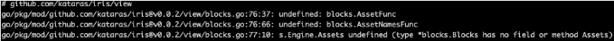

# 安装

```terminal
go get -u github.com/kataras/iris
```

若遇到以下情况



可删除报错路径中的 kataras 目录并，执行：go get github.com/kataras/iris/v12@master

概览

```go
package main

import (
	"github.com/kataras/iris/v12"
	"github.com/kataras/iris/v12/middleware/logger"
	"github.com/kataras/iris/v12/middleware/recover"
)

func main() {
	app := iris.New()
	app.Use(recover.New())
	app.Use(logger.New())

	// Method:   GET
	// Resource: http://localhost:8080
	app.Handle("GET", "/", func(ctx iris.Context) {
		ctx.HTML("<h1>Welcome</h1>")
	})

	// same as app.Handle("GET", "/ping", [...])
	// Method:   GET
	// Resource: http://localhost:8080/ping
	app.Get("/ping", func(ctx iris.Context) {
		ctx.WriteString("pong")
	})

	// Method:   GET
	// Resource: http://localhost:8080/hello
	app.Get("/hello", func(ctx iris.Context) {
		ctx.JSON(iris.Map{"message": "Hello Iris!"})
	})

	// http://localhost:8080
	// http://localhost:8080/ping
	// http://localhost:8080/hello
	app.Run(iris.Addr(":8080"))
}

```

MVC架构

```go
package main

/*
	MVC架构
*/
import (
	"github.com/kataras/iris"

	"github.com/kataras/iris/middleware/logger"
	"github.com/kataras/iris/middleware/recover"
	"github.com/kataras/iris/mvc"
)

func main() {
	app := iris.New()
	app.Use(recover.New())
	app.Use(logger.New())

	mvc.New(app).Handle(new(ExampleController))

	// http://localhost:8080
	// http://localhost:8080/ping
	// http://localhost:8080/hello
	app.Run(iris.Addr(":8080"))
}

// ExampleController serves the "/", "/ping" and "/hello".
type ExampleController struct{}

// Get serves
// Method:   GET
// Resource: http://localhost:8080
func (c *ExampleController) Get() mvc.Result {
	return mvc.Response{
		ContentType: "text/html",
		Text:        "<h1>Welcome</h1>",
	}
}

// GetPing serves
// Method:   GET
// Resource: http://localhost:8080/ping
func (c *ExampleController) GetPing() string {
	return "pong"
}

// GetHello serves
// Method:   GET
// Resource: http://localhost:8080/hello
func (c *ExampleController) GetHello() interface{} {

	return map[string]string{"message": "Hello Iris!"}
}

```


# 监听和服务

你可以启动服务监听任何类型为 net.Listener乃至http.Server实例。服务器的初始化方法应该是在最后，最后 Run方法执行。

Go开发者使用最常见的方法是通过使用包含[hostname:ip]的网络地址来为服务器提供服务。在iris中，我们使用类型为iris.Runner的iris.Addr

```go
// 在TCP上监听网络地址 0.0.0.0:8080
app.Run(iris.Addr(":8080"))
```

有时你会创建一个标准的net/http服务在你的应用中，并且使用它为你的iris网站提供服务

```go
// 和前面一样，但是使用自定义http.server 也可以在其他地方运行
app.Run(iris.Server(&http.Server{Addr:":8080"}))
```

最先进的使用方法是创建一个自定义或者标准的net.Listener并传递给app.Run

```go
// 使用自定义 net.Listener
l, err := net.Listen("tcp4", ":8080")
if err != nil {
    panic(err)
}
app.Run(iris.Listener(l))

```

```go
package main

import (
    // tcplisten 包提供可定制的 TCP net.Listener以及各种性能相关选项：
    //
    //   - SO_REUSEPORT。这个选项允许在多 CPU 服务器上线性扩展服务器性能。
    //     查看 https://www.nginx.com/blog/socket-sharding-nginx-release-1-9-1/ 了解详情.
    //
    //   - TCP_DEFER_ACCEPT。这个选项期望服务器在写入前从已接受的连接中读取。
    //
    //   - TCP_FASTOPEN. 查看 https://lwn.net/Articles/508865/ 获取详情
    "github.com/valyala/tcplisten"

    "github.com/kataras/iris"
)

// go get github.com/valyala/tcplisten
// go run main.go

func main() {
    app := iris.New()

    app.Get("/", func(ctx iris.Context) {
        ctx.HTML("<h1>Hello World!</h1>")
    })

    listenerCfg := tcplisten.Config{
        ReusePort:   true,
        DeferAccept: true,
        FastOpen:    true,
    }

    l, err := listenerCfg.NewListener("tcp", ":8080")
    if err != nil {
        app.Logger().Fatal(err)
    }

    app.Run(iris.Listener(l))
}


```

