# 什么是JUC

juc一般是指的JDK中的

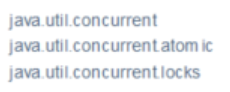


Java默认有两个线程

* main(JVM)
* GC(垃圾回收机制)


Java真的能够开启线程吗

回答是：不能，Java调用的是底层C++，Java不能直接调用硬件


线程有几个状态？

答：6个

```java
public enum State {
    
    NEW,
    //新生
    
    RUNNABLE,
    //运行
    
    BLOCKED,
    //阻塞

    WAITING,
    //等待，一直等待

    TIMED_WAITING,
    //超时等待，过了时间就不等了

    TERMINATED;
    //结束
}
```

wait/sleep的区别

+ 二者的类不相同
  + sleep属于Thread类
  + wait属于Objetc类
+ 关于锁的释放
  + wait会释放锁
  + sleep不会
+ 适用范围是不同的
  + wait必须放在同步代码块中
  + sleep可以在任何地方使用


# Lock锁


##买票问题

###sychronized

```java
package com.zmy.Demo1;


//基本的卖票例子
/*
* 线程就是一个单独的资源类，没有任何附属操作！
* 1.属性，擦做
* */
public class SaleTicketDemo1 {


    public static void main(String[] args) {
        //并发：多线程操作同一个资源类,把资源类丢入线程
        Ticket ticket = new Ticket();


        //Lamda表达式 (参数)->{代码}
        new Thread(()->{ for (int i = 0; i < 60; i++) ticket.sale(); },"A").start();
        new Thread(()->{ for (int i = 0; i < 60; i++) ticket.sale(); },"B").start();
        new Thread(()->{ for (int i = 0; i < 60; i++) ticket.sale(); },"C").start();


    }
}


//资源类 OOP
class Ticket {
    //属性,方法
    private int num = 30;


    //买票方式
    //Synchronized
    public synchronized void sale(){
        if (num>0){
            System.out.println(Thread.currentThread().getName()+"卖出了第"+(num--)+"张票,剩余："+num);
        }
    }


}
```


###Lock

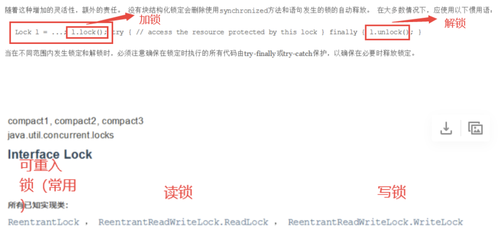

+ 公平锁：十分公平，可以先来后到
+ 非公平锁：不公平，可以插队。==（默认）==

买票问题用Lock锁的方法：

```java
package com.zmy.Demo1;


import java.util.concurrent.locks.Lock;
import java.util.concurrent.locks.ReentrantLock;


//基本的卖票例子 Lock锁
public class SaleTicketDemo2 {


    public static void main(String[] args) {
        //并发：多线程操作同一个资源类,把资源类丢入线程
        Ticket2 ticket = new Ticket2();


        //Lamda表达式 (参数)->{代码}
        new Thread(()->{ for (int i = 0; i < 60; i++) ticket.sale(); },"A").start();
        new Thread(()->{ for (int i = 0; i < 60; i++) ticket.sale(); },"B").start();
        new Thread(()->{ for (int i = 0; i < 60; i++) ticket.sale(); },"C").start();


    }
}


//资源类 OOP
class Ticket2 {
    //属性,方法
    private int num = 30;
    /*
    * Lock三部曲
    * 1.new一个Lock对象
    * 2.调用对象的lock方法
    * 3.在finally块中使用对象的unlock方法释放锁
    *
    * */


    Lock lock = new ReentrantLock();


    //买票方式


    public  void sale(){
        //首先加锁
        lock.lock();
        try {   //业务代码块要用try/catch块包裹
            if (num>0){
                System.out.println(Thread.currentThread().getName()+"卖出了第"+(num--)+"张票,剩余："+num);
            }
        }catch (Exception e){
            e.printStackTrace();
        }finally {
            //在finally块中解锁
            lock.unlock();
        }


    }


}
```

Lock/synchronized的区别

- synchronized是一个内置的JAVA关键字，而Lock是java的一个类
- synchronized无法判断获取锁的状态，Lock可以判断是否获取到了锁
- synchronized会自动释放锁，Lock必须要手动释放锁，如果不释放锁，会出现死锁
- synchronized 可重入锁，不可以中断的，非公平，Lock，可重入锁，可以判断锁，公平锁（可以自己设置）
- synchronized适合锁少量的代码同步问题，Lock适合锁大量的同步代码!


##生产者消费者问题

```java
package com.zmy.Demo2;


import java.util.concurrent.locks.Condition;
import java.util.concurrent.locks.Lock;
import java.util.concurrent.locks.ReentrantLock;


//基本的生产者消费者问题
/*
* 线程之间的通信问题：生产者和消费者问题！ 等待唤醒，通知唤醒
* 线程交替执行 A B 操作同一个变量 num = 0；
* A num+1
* B num-1
* */
public class ProductConsumer {


    public static void main(String[] args) {
        Data data = new Data();


        //创建线程A
        new Thread(()->{
            for (int i = 0; i < 10; i++) {
                try {
                    data.increment();
                } catch (Exception e) {
                    e.printStackTrace();
                }
            }
        },"A").start();


        //创建线程B
        new Thread(()->{
            for (int i = 0; i < 10; i++) {
                try {
                    data.decrement();
                } catch (Exception e) {
                    e.printStackTrace();
                }
            }
        },"B").start();


        new Thread(() -> {
            for (int i = 0; i < 10; i++) {
                try {
                    data.decrement();
                } catch (Exception e) {
                    e.printStackTrace();
                }
            }
        }, "B").start();


    }


}


//资源类
class Data{     //利用synchronized，wait，notify实现
    private int num = 0;


    //判断等待，业务，通知
    public synchronized void increment() throws Exception{
        while (num!=0) {
            //等待
            this.wait();
        }
        num++;
        System.out.println(Thread.currentThread().getName()+"->"+num);
        //通知其他线程，我+1完毕了
        this.notifyAll();
    }


    public synchronized void decrement() throws Exception{
        while (num==0){
            //等待
            this.wait();
        }
        num--;
        System.out.println(Thread.currentThread().getName()+"->"+num);
        //通知其他线程，我-1完毕了
        this.notifyAll();
    }


}


class Data2{        //利用Lock，await，signal实现
    private int num = 0;


    Lock lock = new ReentrantLock();
    Condition condition = lock.newCondition();


    //判断等待，业务，通知
    public  void increment() throws Exception{
        lock.lock();
        try {
            while(num!=0) {
                //等待
                condition.await();
            }
            num++;
            System.out.println(Thread.currentThread().getName()+"->"+num);
            //通知其他线程，我+1完毕了
            condition.signalAll();


        }catch (Exception e){
            e.printStackTrace();
        }finally {
            lock.unlock();

        }

    }

    public  void decrement() throws Exception{
        lock.lock();
        try {
            while(num==0){
                //等待
                condition.await();
            }
            num--;
            System.out.println(Thread.currentThread().getName()+"->"+num);
            //通知其他线程，我-1完毕了
            condition.signalAll();

        }catch (Exception e){
            e.printStackTrace();
        }finally {
            lock.unlock();
        }

    }
}
```

==在上述代码中，如果出现多个线程，就会出现虚假唤醒==

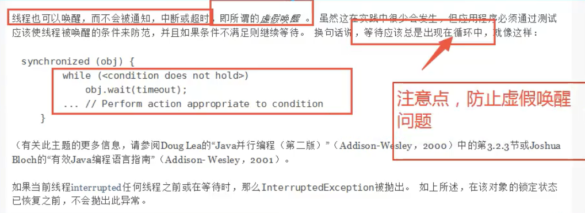

因为if判断只会判断一次

==将if改为while判断即可==

关于Condition的作用，即将Synchronized换成Lock后有什么用？

可以设置多个监视器(Condition)，用来==精确唤醒线程==

```java
package com.zmy.Demo2;


import java.util.concurrent.locks.Condition;
import java.util.concurrent.locks.Lock;
import java.util.concurrent.locks.ReentrantLock;

//    此类实现的是A线程执行完之后执行B线程，B线程执行完之后执行C线程，C线程执行完之后执行A线程
public class FunctionOfCondition {


    public static void main(String[] args) {
        Data3 data = new Data3();


        new Thread(()->{
            for (int i = 0; i < 10; i++) {
                data.printA();
            }
        },"A").start();
        new Thread(()->{
            for (int i = 0; i < 10; i++) {
                data.printB();
            }
        },"B").start();
        new Thread(()->{
            for (int i = 0; i < 10; i++) {
                data.printC();
            }
        },"C").start();
    }
}


//资源类
class Data3{
    private Lock lock = new ReentrantLock();
    private Condition condition1 = lock.newCondition();
    private Condition condition2 = lock.newCondition();
    private Condition condition3 = lock.newCondition();
    private int num = 1;


    public void printA(){
        lock.lock();
        try {
            while(num!=1){
                //等待
                condition1.await();
            }
            System.out.println(Thread.currentThread().getName()+"->AAAAAAAAAAAA");
            num = 2;
            condition2.signal();    //此处的意思就是 condition1监视器执行完之后，唤醒condition2监视器


        } catch (Exception e) {
            e.printStackTrace();
        } finally {
            lock.unlock();
        }
    }
    public void printB(){
        lock.lock();
        try {
            while(num!=2){
                //等待
                condition2.await();
            }
            System.out.println(Thread.currentThread().getName()+"->BBBBBBBBBBBB");
            num = 3;
            condition3.signal();    //此处的意思就是 condition2监视器执行完之后，唤醒condition3监视器


        } catch (Exception e) {
            e.printStackTrace();
        } finally {
            lock.unlock();
        }


    }
    public void printC(){
        lock.lock();
        try {
            while(num!=3){
                //等待
                condition3.await();
            }
            System.out.println(Thread.currentThread().getName()+"->CCCCCCCCCCCCC");
            num = 1;
            condition1.signal();    //此处的意思就是 condition3监视器执行完之后，唤醒condition1监视器


        } catch (Exception e) {
            e.printStackTrace();
        } finally {
            lock.unlock();
        }
    }
}
```


# 8锁现象

判断锁的是谁，是什么。

## 1-2

```java
package com.zmy.Demo3;

import java.util.concurrent.TimeUnit;


/*
* 8锁，就是关于锁的8个问题
* 1.标准情况下，两个线程谁先打印？  答案：先发短信，后打电话
* 2.发短信的方法延迟4秒之后，两个线程谁先打印？ 答案：先发短信，后打电话
* */
public class Test1 {


    public static void main(String[] args) {
        Phone phone = new Phone();


        new Thread(()->{
            phone.sendMsg();
        },"A").start();


        try {
            TimeUnit.SECONDS.sleep(1);
        } catch (InterruptedException e) {
            e.printStackTrace();
        }


        new Thread(()->{
            phone.call();
        },"B").start();
    }


}


class Phone{


    //synchronized锁的对象是方法的调用者,在此例中就是主函数中的phone对象
    public synchronized void sendMsg(){
        try {
            TimeUnit.SECONDS.sleep(4);
        } catch (InterruptedException e) {
            e.printStackTrace();
        }
        System.out.println("发短信");


    }


    public synchronized void call(){
        System.out.println("打电话");
    }
}
```

## 3-4

```java
package com.zmy.Demo3;


import java.util.concurrent.TimeUnit;


/*
*3.增加了一个没有被synchronized修饰的普通方法hello()之后，B线程进行调用，两个线程谁先执行？
* 答案：hello，然后发短信,但是注意，如果发短信的方法没有延迟4秒，那就是先执行发短信
*
* 4.新增加一个对象phone2，分别调用同步方法发短信和打电话，即phone发短信，phone2打电话，两个线程谁先执行？
* 答案：先打电话，后发短信,因为synchronized锁的是对象，现在有两把锁，而发短信的方法又延迟了4s，故而先执行打电话
*
* */
public class Test2 {


    public static void main(String[] args) {
        Phone2 phone = new Phone2();
        Phone2 phone2 = new Phone2();


        new Thread(()->{
            phone.sendMsg();
        },"A").start();


        try {
            TimeUnit.SECONDS.sleep(1);
        } catch (InterruptedException e) {
            e.printStackTrace();
        }


        new Thread(()->{
            phone2.call();
        },"B").start();
    }
}


class Phone2{


    //synchronized锁的对象是方法的调用者,在此例中就是主函数中的phone对象
    public synchronized void sendMsg(){
        try {
            TimeUnit.SECONDS.sleep(4);
        } catch (InterruptedException e) {
            e.printStackTrace();
        }
        System.out.println("发短信");


    }


    public synchronized void call(){
        System.out.println("打电话");
    }


    //这里没有锁
    public void hello(){
        System.out.println("hello");
    }
}
```

## 5-6

```java
package com.zmy.Demo3;


import java.util.concurrent.TimeUnit;


/*
* 5.将两个方法改为静态的方法，两个线程谁先执行？
* 答案：先发短信，后打电话，此处锁的是全局唯一的Class
*
* 6.增加一个对象phone2，然后A线程执行phone的发短信方法，B线程执行phone的打电话方法，两个线程谁先打印？
* 答案：先发短信，后打电话，因为两个方法都用static修饰，static方法执行的时候是不需要有实例存在的，直接通过类名.静态方法就能够调用，而此时锁的对象就是这个类。
*
* */
public class Test3 {


    public static void main(String[] args) {
        Phone3 phone = new Phone3();
        Phone3 phone2 = new Phone3();


        new Thread(()->{
            phone.sendMsg();
        },"A").start();


        try {
            TimeUnit.SECONDS.sleep(1);
        } catch (InterruptedException e) {
            e.printStackTrace();
        }


        new Thread(()->{
            phone2.call();
        },"B").start();
    }
}

class Phone3{

    //static修饰的方法，在类加载的时候就有了,锁的是Class
    public static synchronized void sendMsg(){
        try {
            TimeUnit.SECONDS.sleep(4);
        } catch (InterruptedException e) {
            e.printStackTrace();
        }
        System.out.println("发短信");


    }


    public static synchronized void call(){
        System.out.println("打电话");
    }


}
```

## 7-8

```java
package com.zmy.Demo3;


import java.util.concurrent.TimeUnit;


/*
* 7.将原本是静态同步的方法打电话改成一个普通的同步方法，然后通过一个对象调用执行，线程A执行静态同步方法发短信，B执行普通同步方法打电话，两个线程谁先执行？
* 答案：如果没有延迟，首先调用的就是发短信，但是发短信中有4s的延迟所以是打电话先执行，后执行发短信。
*
* 8.在7的基础上增加一个phone2对象，然后A线程执行phone的发短信方法，B线程执行phone2的打电话方法，两个线程谁先打印？
* 答案：首先是打电话，然后发短信,如果发短信没有4S延迟，那就是发短信先,但是根本原因是两把锁的原因，一把是锁phone对象，另一把是锁Class
* */
public class Test4 {

    public static void main(String[] args) {
        Phone4 phone = new Phone4();
        Phone4 phone2 = new Phone4();

        new Thread(()->{
            phone.sendMsg();
        },"A").start();


        try {
            TimeUnit.SECONDS.sleep(1);
        } catch (InterruptedException e) {
            e.printStackTrace();
        }


        new Thread(()->{
            phone2.call();
        },"B").start();
    }
}

class Phone4{

    //这里锁的的是Class
    public static synchronized void sendMsg(){
        try {
            TimeUnit.SECONDS.sleep(4);
        } catch (InterruptedException e) {
            e.printStackTrace();
        }
        System.out.println("发短信");

    }

    //将原本是static的同步方法，修改为普通同步方法
    //这里锁的是类对象
    public synchronized void call(){
        System.out.println("打电话");
    }

}
```


# 集合类不安全

## List不安全

```java
package com.zmy.Demo4;


import java.util.ArrayList;
import java.util.List;
import java.util.UUID;


public class UnSafeList {


    public static void main(String[] args) {
        //并发下的ArrayList并不安全
        /*
        * 如果是并行状态下的ArrayList，是不安全的
        * 解决方法：
        * 1.List<String> list = new Vector<>();  //改为vector
        * 2.List<String> list = Collections.synchronizedList(new ArrayList<>()); //使用集合工具类
        * 3.List<String> list = new CopyOnWriteArrayList<>();
        * //CopyOnWrite  写入时复制  COW  计算机程序设计领域的一种优化策略; 读写分离
        * CopyOnWriteArrayList VS Vector ？  CopyOnWriteArrayList效率更高，底层采用Lock锁，而Vector底层采用synchronized关键字
        *
        * */
        List<String> list = new ArrayList<>();


        for (int i = 0; i < 30; i++) {
            new Thread(()->{
                list.add(UUID.randomUUID().toString().substring(0,5));
                System.out.println(list);
            },String.valueOf(i)).start();
        }
    }
}
```

## Set不安全

```java
package com.zmy.Demo4;


import java.util.Collections;
import java.util.HashSet;
import java.util.Set;
import java.util.UUID;


/*
*  List同理可证set
*  解决方案：
* 1. Set<String> set = Collections.synchronizedSet(new HashSet<>());
* 2. Set<String> set = new CopyOnWriteArraySet<>();
* */
public class UnSafeSet {
    public static void main(String[] args) {
        Set<String> set = Collections.synchronizedSet(new HashSet<>());
        for (int i = 0; i < 30; i++) {
            new Thread(()->{
                set.add(UUID.randomUUID().toString().substring(0,5));
                System.out.println(set);
            },String.valueOf(i)).start();
        }
    }
}
```

HashSet的底层就是HashMap

```java
public HashSet() {
    map = new HashMap<>();
}

//hashset的add方法就是map的put方法
```

## Map不安全

```java
package com.zmy.Demo4;


import java.util.HashMap;
import java.util.Map;
import java.util.UUID;
import java.util.concurrent.ConcurrentHashMap;


public class UnSafeMap {


    public static void main(String[] args) {
        /*
        * 工作中不直接使用hashmap
        * 默认等价于=new HashMap(16,0.75),16是初始化容量，0.75是负载因子
        *
        * Map不安全解决方案：
        * 1.Collections.synchronizedMap()
        * 2.new ConcurrentHashMap()
        * */
        Map<String,String> map = new ConcurrentHashMap<>();
        for (int i = 0; i < 30; i++) {
            new Thread(()->{
                map.put(UUID.randomUUID().toString().substring(0,5),"1");
            },String.valueOf(i)).start();
        }
    }
}
```


# Callable

1. 可以有返回值
2. 可以抛出异常
3. 方法不同，run()/call()

```java
package com.zmy.Demo5;


import java.util.concurrent.Callable;
import java.util.concurrent.ExecutionException;
import java.util.concurrent.FutureTask;


public class CallableTest {


    public static void main(String[] args) {


        // new Thread().start(); Thread的构造方法中只能传继承Runnable接口的类 那怎么启动Callable?
        MyThread thread = new MyThread();
        //适配类：FutureTask,FutureTask类继承了Runnable接口,同时构造方法中能够接收Callable类型的参数
        FutureTask futureTask = new FutureTask(thread);
        new Thread(futureTask,"A").start();
        new Thread(futureTask,"B").start(); //结果会被缓存，提高效率
        try {
            String str = (String)futureTask.get(); //get方法可能会产生阻塞
            System.out.println(str);
        } catch (InterruptedException e) {
            e.printStackTrace();
        } catch (ExecutionException e) {
            e.printStackTrace();
        }


    }


}


class MyThread implements Callable<String> {    //泛型就是该方法的返回值
    @Override
    public String call() throws Exception {
        System.out.println("call()");
        //耗时的操作
        return "1024";
    }
}
```

细节：

- 有缓存
- 结果可能需要等待，会阻塞！


# 常用辅助类

## CountDownLatch

```java
package com.zmy.Demo6;


import java.util.concurrent.CountDownLatch;


//计数器
public class CountDownLatchTest {
    public static void main(String[] args)  throws  Exception{


        //总数是6
        CountDownLatch countDownLatch = new CountDownLatch(6);
        for (int i = 1; i <= 6; i++) {
            new Thread(()->{
                System.out.println(Thread.currentThread().getName()+" Get out of here");
                countDownLatch.countDown(); //计数器-1
            },String.valueOf(i)).start();
        }

        countDownLatch.await(); //等待计数器归零，然后再向下执行

        System.out.println("Close Door");
    }


}
```

原理:每次有线程调用countDown()，数量-1，假设计数器变为0，countDownLatch.await()就会被唤醒，然后继续执行后面的操作

- - countDownLatch.countDown(); //计数器-1
  - countDownLatch.await(); //等待计数器归零，然后再向下执行

## CyclicBarrier

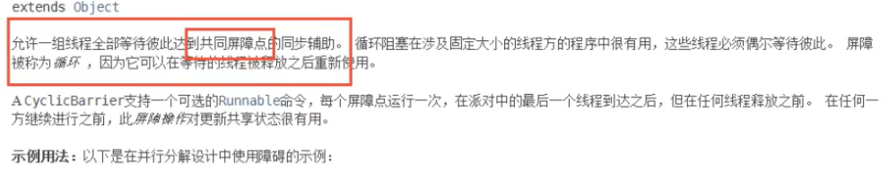

如果说countDownLatch是减法计数器，那么CyclicBarrier就是加法计数器

```java
package com.zmy.Demo6;


import java.util.concurrent.BrokenBarrierException;
import java.util.concurrent.CyclicBarrier;


public class CyclicBarrierTest {
    public static void main(String[] args) {
        /*
        * 集齐七龙珠召唤神龙
        * */
        CyclicBarrier cyclicBarrier = new CyclicBarrier(7,()->{
            System.out.println("召唤神龙成功");
        });
        for (int i = 1; i <= 7; i++) {
            final int temp = i;
            //Lambda能操作到i么？ 不能，只能通过final类型的中间变量传达
            new Thread(()->{
                System.out.println(Thread.currentThread().getName()+"收集"+temp+"龙珠");
                try {
                    cyclicBarrier.await();
                } catch (InterruptedException e) {
                    e.printStackTrace();
                } catch (BrokenBarrierException e) {
                    e.printStackTrace();
                }
            },String.valueOf(i)).start();
        }
    }
}
```

要当加法计数器达到7时，才会输出召唤神龙成功的字符串。

结果显示

```java
5收集5龙珠
4收集4龙珠
1收集1龙珠
3收集3龙珠
7收集7龙珠
2收集2龙珠
6收集6龙珠
召唤神龙成功
```

##Semaphore(信号量)

```java
package com.zmy.Demo6;


import java.util.concurrent.Semaphore;
import java.util.concurrent.TimeUnit;


public class SemaphoreTest {


    public static void main(String[] args) {
        //线程数量 ： 停车位! 限流！
        Semaphore semaphore = new Semaphore(3); //限定三个停车位


        for (int i = 1; i <= 6; i++) {  //六辆车
            new Thread(()->{


                try {
                    //acquire() 得到
                    semaphore.acquire();
                    System.out.println(Thread.currentThread().getName()+"抢到车位");
                    TimeUnit.SECONDS.sleep(2);
                    System.out.println(Thread.currentThread().getName()+"离开车位");


                } catch (InterruptedException e) {
                    e.printStackTrace();
                }finally {
                    //release() 释放
                    semaphore.release();
                }


            },String.valueOf(i)).start();
        }
    }
}
```

结果：

```java
3抢到车位
2抢到车位
3离开车位
2离开车位
1离开车位
4抢到车位
5抢到车位
6抢到车位
4离开车位
5离开车位
6离开车位
```

原理:

- semaphore.acquire();  得到 如果已经满了，等待，等待被释放为止
- semaphore.release();   释放 将当前的信号量释放+1，然后唤醒等待的线程!


# 读写锁

```java
package com.zmy.Demo7;


import java.util.HashMap;
import java.util.Map;
import java.util.concurrent.locks.Lock;
import java.util.concurrent.locks.ReentrantLock;
import java.util.concurrent.locks.ReentrantReadWriteLock;


/*
* ReadWriteLock
* 独占锁（写锁）   一次只能被一个线程占有
* 共享锁（读锁）   多个线程可以同时占有
* 读-读   可以共存
* 读-写   不能共存
* 写-写   不能共存
* */
public class ReadWriteLockTest {


    public static void main(String[] args) {
        MyCacheLock cache = new MyCacheLock();


        //写入
        for (int i = 0; i < 6; i++) {
            final  int temp = i;
            new Thread(()->{
              cache.put(temp+"",temp);
            },String.valueOf(i)).start();
        }


        //读取
        for (int i = 0; i < 6; i++) {
            final  int temp = i;
            new Thread(()->{
                cache.get(temp+"");
            },String.valueOf(i)).start();
        }


    }


}


/*
* 未加锁的自定义缓存
* */


class MyCache1{
    private volatile Map<String,Object> map = new HashMap<>();


    //存
    public void put(String key,Object value){
        System.out.println(Thread.currentThread().getName()+"写入"+key);
        map.put(key, value);
        System.out.println(Thread.currentThread().getName()+"写入OK");
    }


    //取
    public void get(String key){
        System.out.println(Thread.currentThread().getName()+"读取"+key);
        Object o = map.get(key);
        System.out.println(Thread.currentThread().getName()+"读取OK");
    }


}


/*
* 加锁的自定义缓存
* */
class MyCacheLock{
    private volatile Map<String,Object> map = new HashMap<>();
    //读写锁:更加细粒度的控制
    private ReentrantReadWriteLock lock = new ReentrantReadWriteLock();


    //存,写入的时候，只希望同时只有一个线程再操作
    public void put(String key,Object value){
        lock.writeLock().lock();//先拿写锁
        try {
            System.out.println(Thread.currentThread().getName()+"写入"+key);
            map.put(key, value);
            System.out.println(Thread.currentThread().getName()+"写入OK");
        } catch (Exception e) {
            e.printStackTrace();
        } finally {
            lock.writeLock().unlock();
        }


    }


    //取,所有人都可以读
    public void get(String key){
        lock.readLock().lock();


        try {
            System.out.println(Thread.currentThread().getName()+"读取"+key);
            Object o = map.get(key);
            System.out.println(Thread.currentThread().getName()+"读取OK");
        } catch (Exception e) {
            e.printStackTrace();
        } finally {
            lock.readLock().unlock();
        }


    }


}
```


# 阻塞队列

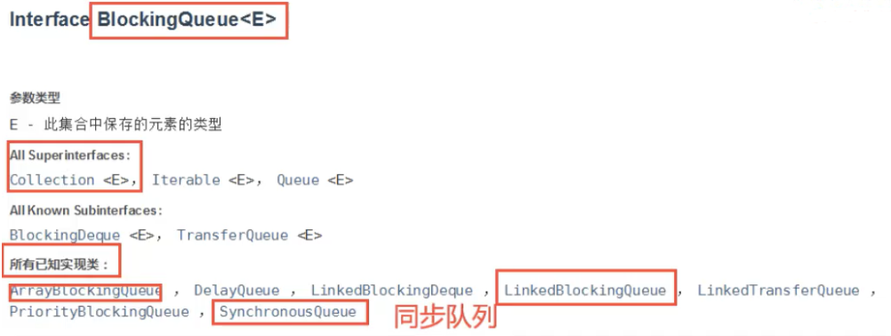

什么情况下会使用到阻塞队列？：

- 多线程并发处理
- 线程池

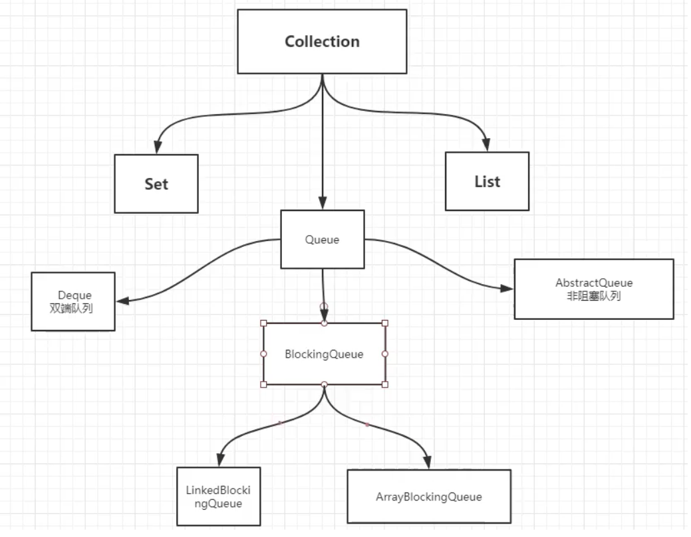

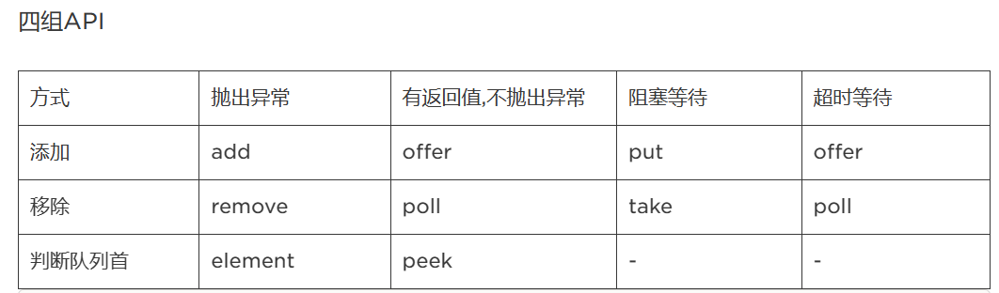

```java
//四组API的实现
package com.zmy.Demo8;


import java.util.Collection;
import java.util.concurrent.ArrayBlockingQueue;
import java.util.concurrent.TimeUnit;


/*
* 阻塞队列
* BlockingQueue的父类是Queue，而Queue的父类就是Collection
* */
public class BlockingQueueTest {


    public static void main(String[] args) {
        test3();
    }


    /*
    * 抛出异常
    * */
    public static void test1(){
        //此处不写泛型，而是队列的大小
        ArrayBlockingQueue arrayBlockingQueue = new ArrayBlockingQueue<>(3);
         System.out.println(arrayBlockingQueue.add("a"));
         System.out.println(arrayBlockingQueue.add("b"));
         System.out.println(arrayBlockingQueue.add("c"));


        //查看队首元素
        System.out.println(arrayBlockingQueue.element());


         //再添加一个?
         //java.lang.IllegalStateException: Queue full  队列满异常
         //System.out.println(arrayBlockingQueue.add("d"));
          System.out.println("-----------------------------分割线");


         //取出所有元素
          System.out.println(arrayBlockingQueue.remove());
          System.out.println(arrayBlockingQueue.remove());
          System.out.println(arrayBlockingQueue.remove());


          //再移除一个？
          //java.util.NoSuchElementException  队空异常
          System.out.println(arrayBlockingQueue.remove());
    }


    /*
    * 有返回值,不抛出异常
    * */
    public static void test2(){
        //此处不写泛型，而是队列的大小
        ArrayBlockingQueue arrayBlockingQueue = new ArrayBlockingQueue<>(3);
        System.out.println(arrayBlockingQueue.offer("a"));
        System.out.println(arrayBlockingQueue.offer("b"));
        System.out.println(arrayBlockingQueue.offer("c"));


        //查看队首元素
        System.out.println(arrayBlockingQueue.peek());


        //再添加一个?
        //不抛出异常，返回false
        //System.out.println(arrayBlockingQueue.add("d"));
        System.out.println("-----------------------------分割线");


        //取出所有元素
        System.out.println(arrayBlockingQueue.poll());
        System.out.println(arrayBlockingQueue.poll());
        System.out.println(arrayBlockingQueue.poll());


        //再移除一个？
        //不抛出异常，返回null
        //System.out.println(arrayBlockingQueue.poll());


    }


    /*
    * 等待,阻塞(一直阻塞)
    * */
    public static void test3() {
        ArrayBlockingQueue arrayBlockingQueue = new ArrayBlockingQueue<>(3);


        try {
            arrayBlockingQueue.put("a");
            arrayBlockingQueue.put("b");
            arrayBlockingQueue.put("c");


            //再添加一个？
            //arrayBlockingQueue.put("d");    //一直等待，程序不会结束


            arrayBlockingQueue.take();
            arrayBlockingQueue.take();
            arrayBlockingQueue.take();


        } catch (InterruptedException e) {
            e.printStackTrace();
        }


    }


    /*
     * 等待,阻塞(超时退出)
     * */
    public static void test4(){
        ArrayBlockingQueue arrayBlockingQueue = new ArrayBlockingQueue<>(3);


        arrayBlockingQueue.offer("a");
        arrayBlockingQueue.offer("b");
        arrayBlockingQueue.offer("c");


        try {
            arrayBlockingQueue.offer("d", 2,TimeUnit.SECONDS); //2秒之后，如果还没有位置让给d，就放弃加入队列
        } catch (InterruptedException e) {
            e.printStackTrace();
        }


        arrayBlockingQueue.poll();
        arrayBlockingQueue.poll();
        arrayBlockingQueue.poll();


        try {
            arrayBlockingQueue.poll(2,TimeUnit.SECONDS);
        } catch (InterruptedException e) {
            e.printStackTrace();
        }


    }


}
```

## SynchronousQueue 同步队列

没有容量,进去一个元素，必须等待取出来之后，才能再往里面放一个元素。

```java
package com.zmy.Demo8;


import java.util.concurrent.SynchronousQueue;
import java.util.concurrent.TimeUnit;


/*
* 同步队列
* 和其他的BlockingQueue不一样，同步队列不存储元素
* 存入了一个元素，你必须先取出来，才能继续存进去值
* */
public class SynchronousQueueTest {
    public static void main(String[] args) {
        SynchronousQueue<String> queue = new SynchronousQueue<>();  //同步队列


        //T1取
        new Thread(()->{
            try {
                System.out.println(Thread.currentThread().getName()+" put 1");
                queue.put("1");
                System.out.println(Thread.currentThread().getName()+" put 2");
                queue.put("2");
                System.out.println(Thread.currentThread().getName()+" put 3");
                queue.put("3");
            } catch (InterruptedException e) {
                e.printStackTrace();
            }
        },"T1").start();


        //T2拿
        new Thread(()->{
            try {
                TimeUnit.SECONDS.sleep(3);
                System.out.println(Thread.currentThread().getName()+" get "+queue.take());
                TimeUnit.SECONDS.sleep(3);
                System.out.println(Thread.currentThread().getName()+" get "+queue.take());
                TimeUnit.SECONDS.sleep(3);
                System.out.println(Thread.currentThread().getName()+" get "+queue.take());
            } catch (InterruptedException e) {
                e.printStackTrace();
            }


        },"T2").start();


    }
}
```

代码结果：

```java
T1 put 1
T2 get 1
T1 put 2
T2 get 2
T1 put 3
T2 get 3
```


# 线程池(三大方法，七大参数，四种拒绝策略)

优点：

- 降低资源消耗
- 提高响应速度
- 方便管理


## 三大方法

```java
package com.zmy.Demo9;


import java.util.concurrent.ExecutorService;
import java.util.concurrent.Executors;


// Executors就是工具类  但是注意：一般项目开发一般线程池不用Executors创建,而是使用ThreadPoolExecutor创建！！！
//使用线程池之后，要使用线程池创建线程
/*
* Executors.newSingleThreadExecutor(); //单个线程
* Executors.newFixedThreadPool(5); //固定线程池大小
* Executors.newCachedThreadPool(); //可伸缩的
* */
public class ExecutorsTest {
    public static void main(String[] args) {
        //ExecutorService threadPool = Executors.newSingleThreadExecutor();//单个线程 相当于单例
        //ExecutorService threadPool = Executors.newFixedThreadPool(5); //固定线程池大小 本例中一共五个
        ExecutorService threadPool = Executors.newCachedThreadPool();//可伸缩的 根据CPU性能来取
        try {
            for (int i = 0; i < 10; i++) {
                threadPool.execute(()->{
                    System.out.println(Thread.currentThread().getName()+" ok");
                });
            }
        } catch (Exception e) {
            e.printStackTrace();
        } finally {
            //线程池用完需要关闭线程池
            threadPool.shutdown();
        }


    }
}
```

## 七大参数

三大方法

```java
public static ExecutorService newSingleThreadExecutor() {
    return new FinalizableDelegatedExecutorService
        (new ThreadPoolExecutor(1, 1,
                                0L, TimeUnit.MILLISECONDS,
                                new LinkedBlockingQueue<Runnable>()));
}

public static ExecutorService newFixedThreadPool(int nThreads) {
    return new ThreadPoolExecutor(nThreads, nThreads,
                                  0L, TimeUnit.MILLISECONDS,
                                  new LinkedBlockingQueue<Runnable>());
}

public static ExecutorService newCachedThreadPool() {
    return new ThreadPoolExecutor(0, Integer.MAX_VALUE,
                                  60L, TimeUnit.SECONDS,
                                  new SynchronousQueue<Runnable>());
}
```

通过观察发现三大方法都是调用ThreadPoolExecutor方法

```java
public ThreadPoolExecutor(int corePoolSize,        //核心线程池大小
                          int maximumPoolSize,     //最大核心线程池大小
                          long keepAliveTime,      //超时了没有人调用就会释放
                          TimeUnit unit,           //超时单位
                          BlockingQueue<Runnable> workQueue, //阻塞队列
                          ThreadFactory threadFactory,  //线程工厂  用来创建线程  一般不用动
                          RejectedExecutionHandler handler // 拒绝策略
      ) {
    if (corePoolSize < 0 ||
        maximumPoolSize <= 0 ||
        maximumPoolSize < corePoolSize ||
        keepAliveTime < 0)
        throw new IllegalArgumentException();
    if (workQueue == null || threadFactory == null || handler == null)
        throw new NullPointerException();
    this.acc = System.getSecurityManager() == null ?
            null :
            AccessController.getContext();
    this.corePoolSize = corePoolSize;
    this.maximumPoolSize = maximumPoolSize;
    this.workQueue = workQueue;
    this.keepAliveTime = unit.toNanos(keepAliveTime);
    this.threadFactory = threadFactory;
    this.handler = handler;
}
```

所谓的七大参数就都是ThreadPoolExecutor的构造方法所需要的参数

==注意：只有当线程需求量>默认线程池大小+阻塞队列的时候，线程池中的线程数量才会超过默认线程池大小，但是最大只能达到设定的最大线程池大小，当线程需求量超过最大线程池大小（即最大并发量）+阻塞队列的时候就会执行拒绝策略！==

手动创建一个线程池(自定义线程池)

```java
package com.zmy.Demo9;


import java.util.concurrent.*;


public class ExecutorsTest2 {
    public static void main(String[] args) {


        ExecutorService threadPool = new ThreadPoolExecutor(2, //默认线程池大小
                                                            5, //最大线程池大小
                                                            3, //超时时间
                                                            TimeUnit.SECONDS, //超时单位
                                                            new LinkedBlockingQueue<>(3), //阻塞队列，即等待调用线程池中线程的程序
                                                            Executors.defaultThreadFactory(), //线程工厂  用来创建线程  一般不用动
                                                            new ThreadPoolExecutor.AbortPolicy() //一般默认的拒绝策略，当阻塞队列和并发量达到最大时，还有线程需求，就会抛出异常  //java.util.concurrent.RejectedExecutionException
                );
        try {
            for (int i = 0; i < 10; i++) {
                threadPool.execute(()->{
                    System.out.println(Thread.currentThread().getName()+" ok");
                });
            }
        } catch (Exception e) {
            e.printStackTrace();
        } finally {
            //线程池用完需要关闭线程池
            threadPool.shutdown();
        }


    }
}
```

## 四种拒绝策略

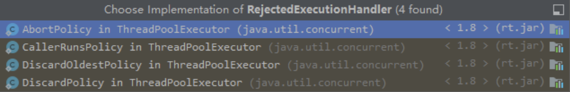

- **AbortPolicy:当需求线程数超过最大并发量+阻塞队列的时候抛出异常:java.util.concurrent.RejectedExecutionException**
- **CallerRunsPolicy:哪来的去哪里，在本例中，是main方法要线程，故而就让main执行打印语句，而不是线程池中的线程了**
- **DiscardPolicy:需求线程数超过最大并发量+阻塞队列的时候不会抛出异常,但是会把多的任务丢掉，意思就是不执行**
- **DiscardOldestPolicy:需求线程数超过最大并发量+阻塞队列的时候会尝试和最早执行的线程竞争，竞争成功就执行，不成功就不执行，不会抛出异常**

```java
package com.zmy.Demo9;


import java.util.concurrent.*;


/*
* 四种拒绝策略:
* AbortPolicy:当需求线程数超过最大并发量+阻塞队列的时候抛出异常:java.util.concurrent.RejectedExecutionException
* CallerRunsPolicy:哪来的去哪里，在本例中，是main方法要线程，故而就让main执行打印语句，而不是线程池中的线程了
* DiscardPolicy:需求线程数超过最大并发量+阻塞队列的时候不会抛出异常,但是会把多的任务丢掉，意思就是不执行
* DiscardOldestPolicy:需求线程数超过最大并发量+阻塞队列的时候会尝试和最早执行的线程竞争，竞争成功就执行，不成功就不执行，不会抛出异常
*
* */
public class ExecutorsTest2 {
    public static void main(String[] args) {


        ExecutorService threadPool = new ThreadPoolExecutor(2,
                                                        5,
                                                            3,
                                                            TimeUnit.SECONDS,
                                                            new LinkedBlockingQueue<>(3),
                                                            Executors.defaultThreadFactory(),
                                                            new ThreadPoolExecutor.DiscardOldestPolicy()
                );
        try {
            for (int i = 0; i < 9; i++) {
                threadPool.execute(()->{
                    System.out.println(Thread.currentThread().getName()+" ok");
                });
            }
        } catch (Exception e) {
            e.printStackTrace();
        } finally {
            //线程池用完需要关闭线程池
            threadPool.shutdown();
        }


    }
}
```


最大线程池大小该如何定义？(调优)

- CPU密集型，几核CPU就定义多少，可以保证CPU的效率最高

- - Runtime.getRuntime().availableProcessors(); //动态获取电脑的CPU核数！

- IO密集型，判断你程序中十分耗IO的线程有多少个，只要大于这个数就可以了，一般设置为两倍。


# 四大函数式接口

新程序员应该懂得四大：

- lambda表达式
- 链式编程
- 函数式接口
- Stream流式计算


什么是函数式接口(FunctionalInterface)？

只有一个方法的接口(Runnable)


## 函数式接口：Function

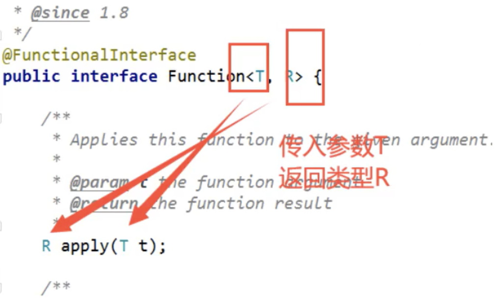

代码实现：

```java
package com.zmy.Demo10;
import java.util.function.Function;

/*
* Function 函数型接口,有一个输入参数，有一个输出
* 只要是函数型接口，就可以用lambda表达式简化
* */
public class FunctionTest1 {


    public static void main(String[] args) {


        //输出输入的值
        /*Function<String, String> function = new Function<String, String>() {
            @Override
            public String apply(String s) {
                return s;
            }
        };*/

        //用lambda表达式实现
        Function function = (str)->{
            return str;
        };
        System.out.println(function.apply("asd"));
    }
}

```


## 断定型接口：Predicate

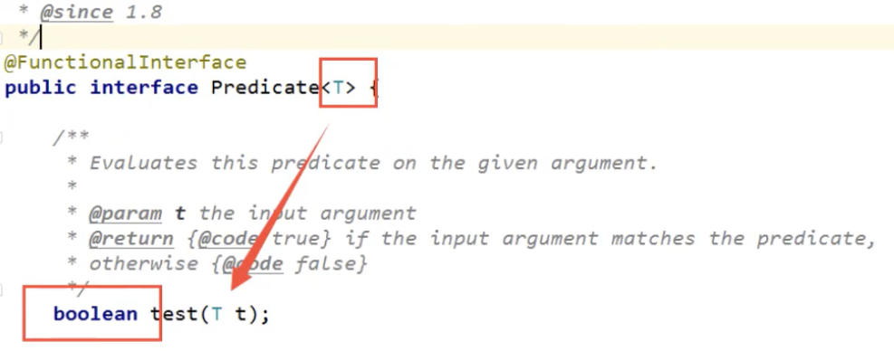

代码实现：

```java
package com.zmy.Demo10;


import java.util.function.Predicate;


/*
* 断定型接口Predicate：有一个输入参数，返回值是布尔值
* */
public class PredicateTest {


    public static void main(String[] args) {


        //判断字符串是否为空?
        /*Predicate<String> predicate = new Predicate<String>() {
            @Override
            public boolean test(String s) {
                return s.isEmpty();
            }
        };*/


        //lambda表达式实现
        Predicate<String> predicate = (str)->{
            return str.isEmpty();
        };
                System.out.println(predicate.test("1"));


    }

}
```


## 消费型接口：Consumer

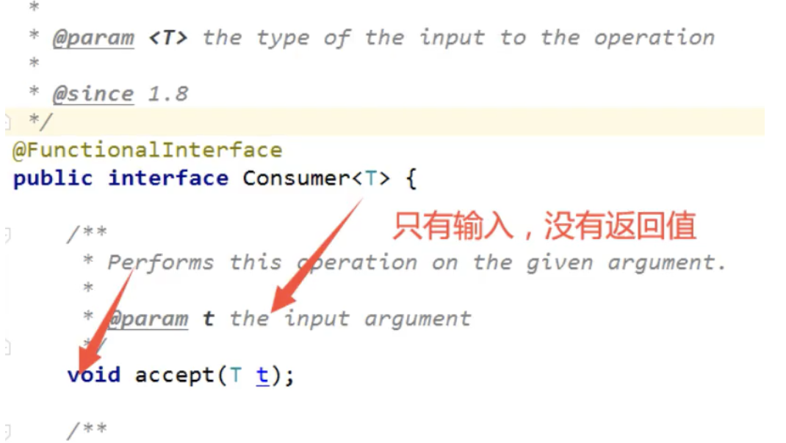

代码实现：

```java
package com.zmy.Demo10;


import java.util.function.Consumer;


/*
* 消费型接口：Consumer，只有输入，没有返回值
* */
public class ConsumerTest {
    public static void main(String[] args) {


        //打印输入的字符串
        /*Consumer<String> consumer = new Consumer<String>() {
            @Override
            public void accept(String s) {
                System.out.println(s);
            }
        };*/


        //lambda实现
        Consumer<String> consumer = (str)->{
            System.out.println(str);
            return;
        };
        consumer.accept("1231231");
    }
}
```


##供给型接口：Supplier

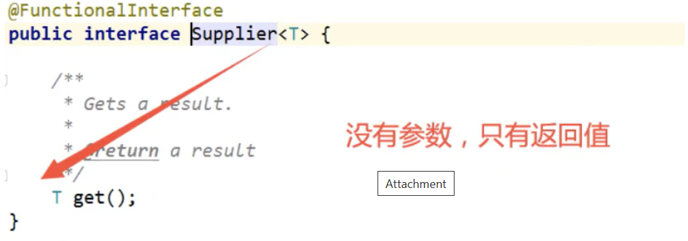

代码实现：

```java
package com.zmy.Demo10;


import java.util.function.Supplier;


/*
* 供给型接口Supplier：没有输入，有返回值
* */
public class SupplierTest {


    public static void main(String[] args) {


        //输出get方法中的字符
        /*Supplier<String> supplier = new Supplier<String>() {
            @Override
            public String get() {
                return "周某帅炸裂";
            }
        };*/
        //lambda表达式实现
        Supplier<String> supplier = ()->{return "周某帅啊";};


        System.out.println(supplier.get());
        
    }


}
```


# Stream流式计算

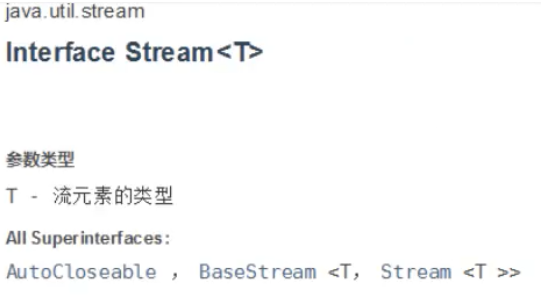

```java
package com.zmy.Demo11;


import java.util.Arrays;
import java.util.List;


/*
* 输出ID为偶数的用户
* 年龄大于23的用户
* 用户名转为大写字母
* 用户名字母倒叙输出
* 只输出一个用户
* */
public class Test1 {
    public static void main(String[] args) {
        User u1 = new User(1, "a", 21);
        User u2 = new User(2, "b", 22);
        User u3 = new User(3, "c", 23);
        User u4 = new User(4, "d", 24);
        User u5 = new User(5, "e", 25);


        //集合就是存储
        List<User> users = Arrays.asList(u1, u2, u3, u4, u5);


        //计算交给steam流
        /*users.stream().filter((u) -> {
            return u.getId() % 2 == 0;  //过滤ID为偶数的用户
            //u.getAge()>23  过滤年龄大于23的用户
        }).forEach(System.out::println);*/


        //将用户名设置为大写
        //users.stream().map((u)->{return u.getName().toUpperCase();}).forEach(System.out::println);


        //倒置排序
        //users.stream().sorted((uu1,uu2)->{return uu1.})


        //只输出一个
        users.stream().limit(1);


    }
}
```


# ForkJoin(分支合并)

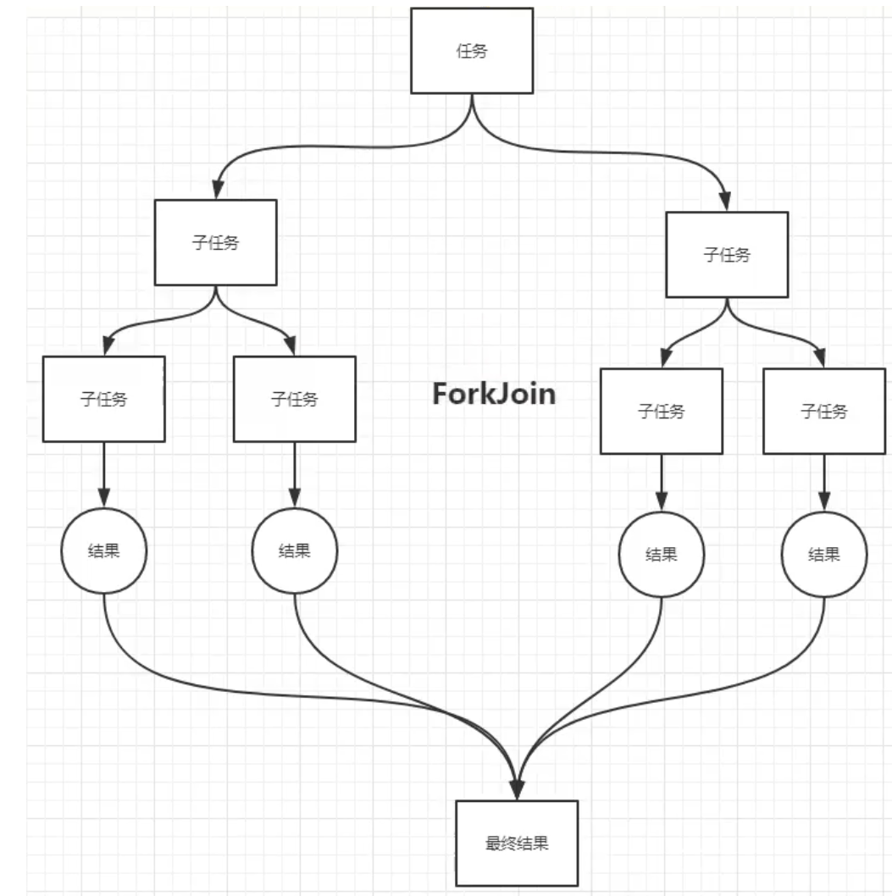

==特点：工作窃取(假设A线程执行到第二个任务，B线程执行完了，B线程就回去窃取A线程的任务执行，进而提高效率)==

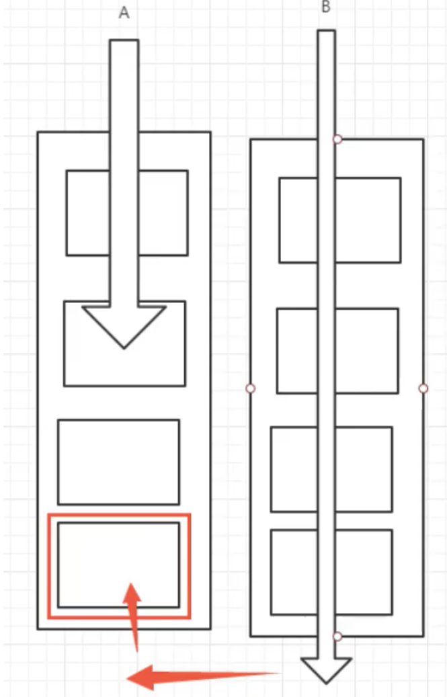

如何使用forkjoin？

- ForkJoinPool 通过这个类来执行
- ForkJoinPool.execute(ForkJoinTask task) 然后执行
- 算类必须继承ForkJoinTask

```java
package com.zmy.Demo12;


import java.util.concurrent.RecursiveTask;


/*
* 求和计算的任务
*
* //如何使用forkjoin？
* 1.ForkJoinPool 通过这个类来执行
* 2.ForkJoinPool.execute(ForkJoinTask task) 然后执行
* 3.计算类必须继承ForkJoinTask
* */
public class ForkJoinDemo extends RecursiveTask<Long> {


    private Long start;
    private Long end;
    //临界值 超过此值就把任务分割
    private Long temp = 10000L;


    public ForkJoinDemo(Long start, Long end) {
        this.start = start;
        this.end = end;
    }


    @Override
    protected Long compute() {
        if ((end-start)<temp){
            long sum = 0;
            for (Long i = start; i <= end; i++) {
                sum+=i;
            }
            return sum;
        }else {
            //超过临界值使用forkjoin计算
            long mid = (start + end) / 2; //中间值
            ForkJoinDemo task1 = new ForkJoinDemo(start, mid);
            task1.fork();   //拆分任务，把任务压入线程队列
            ForkJoinDemo task2 = new ForkJoinDemo(mid + 1, end);
            task2.fork();   //拆分任务，把任务压入线程队列


            return task1.join()+task2.join();
        }
    }
}
```

```java
package com.zmy.Demo12;


import java.util.concurrent.ForkJoinPool;
import java.util.concurrent.ForkJoinTask;
import java.util.stream.LongStream;


public class Test {
    public static void main(String[] args) {
        //test1();  //结果：sum = 500000000500000000 时间: 4850


        //test2();  //sum = 500000000500000000 时间: 4125       //虽然效率只提升了一点点，但是临界值可以设置的更小，就更加灵活！


        //test3();  //sum = 500000000500000000 时间: 234         //效率提升了几十倍！


    }


    //普通程序员
    public static void test1(){
        long start = System.currentTimeMillis();
        long sum = 0L;
        for (Long i = 1L; i <= 10_0000_0000L; i++) {
            sum+=i;
        }
        long end = System.currentTimeMillis();
        System.out.println("sum = " +sum+ " 时间: "+(end-start));
    }


    //使用forkjoin的程序员
    public static void test2(){
        long start = System.currentTimeMillis();
        ForkJoinPool forkJoinPool = new ForkJoinPool();
        ForkJoinTask<Long> task = new ForkJoinDemo(0L, 10_0000_0000L);
        ForkJoinTask<Long> submit = forkJoinPool.submit(task);
        try {
            Long sum = submit.get();
            long end = System.currentTimeMillis();
            System.out.println("sum = " +sum+ " 时间: "+(end-start));
        }catch (Exception e){
            e.printStackTrace();
        }


    }


    //stream并行流
    public static void test3(){
        long start = System.currentTimeMillis();
        long sum = LongStream.rangeClosed(0L, 10_0000_0000L).parallel().reduce(0, Long::sum);
        long end = System.currentTimeMillis();
        System.out.println("sum = " +sum+ " 时间: "+(end-start));
    }
}
```


# 异步回调

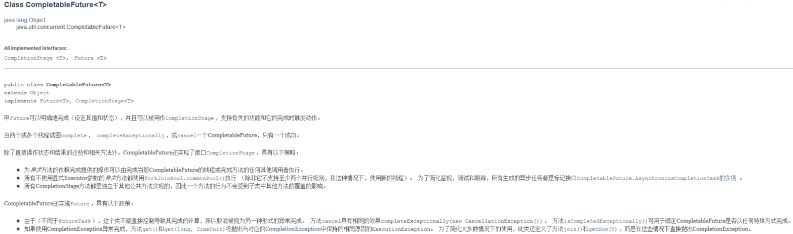

```java
package com.zmy.Demo13;


import java.util.concurrent.CompletableFuture;
import java.util.concurrent.ExecutionException;
import java.util.concurrent.TimeUnit;


/*
* 异步调用：CompletableFuture
* //成功回调
* //失败回调
* */


public class FutureTest1 {
    public static void main(String[] args) throws Exception{


        //发起一个请求 无返回值的异步回调 runAsync
       /* CompletableFuture<Void> completableFuture = CompletableFuture.runAsync(()->{
            try {
                TimeUnit.SECONDS.sleep(2);
            } catch (Exception e){
                e.printStackTrace();
            }
            System.out.println(Thread.currentThread().getName()+"runAsync => void ");
        });
        System.out.println(111);
        try {
            Void aVoid = completableFuture.get();   //获取阻塞执行结果
        } catch (InterruptedException e) {
            e.printStackTrace();
        } catch (ExecutionException e) {
            e.printStackTrace();
        }*/


       //有返回值的异步回调 supplyAsync
        /*
        * 成功和失败的回调
        *
        * 返回的是错误信息
        * */
        CompletableFuture<Integer> completableFuture = CompletableFuture.supplyAsync(()->{
            //int a = 1/0;    //故意设置异常  此时 下面的u会打印异常信息,当成功执行时，u返回null，即没有错误消息
            return 1024;
        });


        System.out.println(completableFuture.whenComplete((t,u)->{ //当成功执行时 get方法就返回 1024  失败时get方法返回233
            System.out.println("t=>" + t);
            System.out.println("u=>" + u);
        }).exceptionally((e)->{
            e.printStackTrace();
            return 233;
        }).get());


    }
}
```


#JMM

==Volatile是JAVA虚拟机提供的轻量级的同步机制==

- **保证可见性**
- **不保证原子性**
- **禁止指令重排**


什么是JMM?

JMM：java内存模型，只是一个概念！


关于JMM的一些同步约定:

1. **线程解锁前，必须把共享变量立刻刷回主存!**
2. **线程加锁前，必须读取主存中的最新值到工作内存中！**
3. **加锁和解锁是同一把锁**


8种操作：

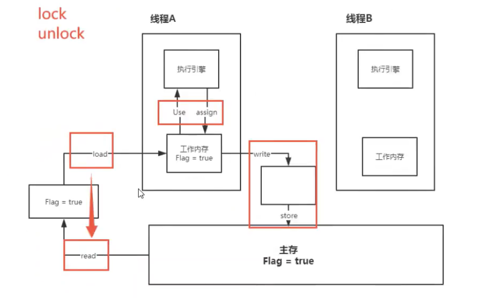

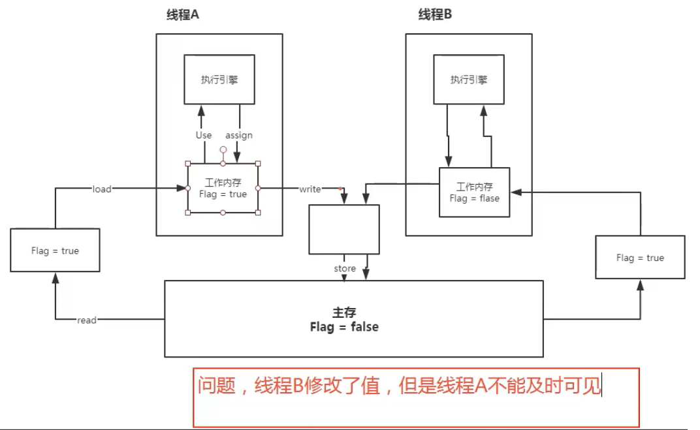

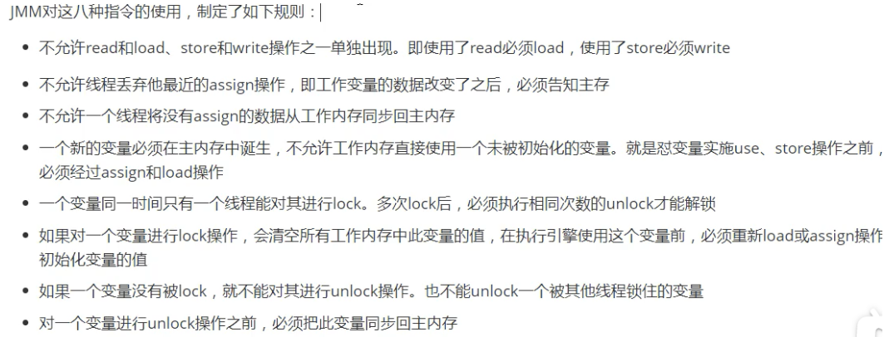

上述问题的代码实现:

```java
package com.zmy.Demo14;


import java.util.concurrent.TimeUnit;


public class VolatileTest {


    private static  int num = 0;
    public static void main(String[] args) {    //main线程


        new Thread(()->{    //线程1
            while(num==0){


            }
        }).start();


        try {
            TimeUnit.SECONDS.sleep(2);
        } catch (InterruptedException e) {
            e.printStackTrace();
        }


        num = 1;


        System.out.println(num);


    }


}
```

**结果是：main线程输出了1，但是整个程序并没有停止，也就是代表，在main线程的工作内存中，num已经等于1了，但是线程1的内存中num并没有等于1，还是等于0，这就是上述问题的实现(线程1不知道主内存中的num值已经改变),引出下文：volatile**

# volatile

- 保证可见性:

​		在上述JMM出现的问题代码中，把num值加入关键字volatile，JMM的问题得到解决.

- 不保证原子性：

```java
package com.zmy.Demo14;


import java.util.concurrent.TimeUnit;


//volatile不保证原子性
public class VolatileTest2 {


    private static volatile int num = 0;    //加入volatile关键字之后，结果依旧不正确,故而说volatile并不保证原子性


    public static void add(){   //此方法加synchronized可以保证原子性
        num++;
    }


    public static void main(String[] args) {    //main线程


        //理论上num的结果应该为20000
        for (int i = 0; i < 20; i++) {
            new Thread(()->{
                for (int i1 = 0; i1 < 1000; i1++) {
                    add();
                }
            }).start();
        }


        while(Thread.activeCount()>2){
            Thread.yield();
        }


        System.out.println(Thread.currentThread().getName()+" num = " + num);


    }


}
```

如何在不加synchronized和lock锁的情况下保证原子性？

使用原子类：

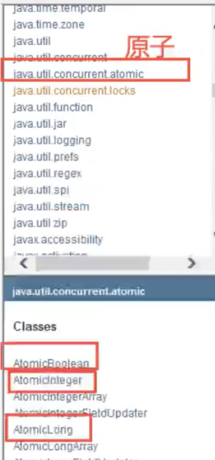

代码实现：

```java
package com.zmy.Demo14;


import java.util.concurrent.TimeUnit;
import java.util.concurrent.atomic.AtomicInteger;


//原子类引用
public class VolatileTest2 {


    private static volatile AtomicInteger num = new AtomicInteger(0);   //将num设置为原子类integer


    public static void add(){
        num.getAndIncrement();  //原子类integer的自增1操作  CAS
    }


    public static void main(String[] args) {    //main线程


        //理论上num的结果应该为20000
        for (int i = 0; i < 20; i++) {
            new Thread(()->{
                for (int i1 = 0; i1 < 1000; i1++) {
                    add();
                }
            }).start();
        }
        while(Thread.activeCount()>2){
            Thread.yield();
        }
        System.out.println(Thread.currentThread().getName()+" num = " + num);
    }


}
```

**这些原子类的底层都直接和操作系统挂钩的，直接在内存中修改值。**


# 单例模式(构造器私有)


## 饿汉式单例

直接加载资源，可能造成资源浪费

```java
package com.zmy.Demo15;


//饿汉式单例 构造器私有
public class SingleHungry {

    //可能会浪费空间
    private byte[] data1 = new byte[1024*1024];
    private byte[] data2 = new byte[1024*1024];
    private byte[] data3 = new byte[1024*1024];
    private byte[] data4 = new byte[1024*1024];


    private SingleHungry(){


    }
    private final static SingleHungry hungry = new SingleHungry();


    public static  SingleHungry getInstance(){
        return hungry;
    }

}
```


## 懒汉式单例

用到单例时才加载资源

```java
package com.zmy.Demo15;


import java.lang.reflect.Constructor;


//懒汉式单例
public class SingleLazy {


    private static boolean flag = false;


    private SingleLazy() {
        synchronized (SingleLazy.class){
            if (!flag){
                flag = true;
            }else {
                throw new RuntimeException("不要试图通过反射破坏单例");
            }


           /* if (lazy!=null){
                throw new RuntimeException("不要试图通过反射破坏单例");
            }*/
        }
        System.out.println(Thread.currentThread().getName()+"OK");
    }


    private volatile static SingleLazy lazy; //注意此处并未直接实例化


    //普通懒汉式单例
    public static SingleLazy getInstance1(){
        if (lazy==null){
            lazy = new SingleLazy();
                }
        return lazy;
    }


    //双重检测锁模式的 懒汉式单例 DCL懒汉式
    public static SingleLazy getInstance(){
        if (lazy==null){
            synchronized (SingleLazy.class){
                if (lazy==null){
                    lazy = new SingleLazy();    //不是原子性操作
                    /*
                    * 1.分配内存空间
                    * 2.执行构造方法，初始化对象
                    * 3.将此对象指向这个空间
                    *
                    * 上述三个操作可能会发生重排，从而导致出现问题，所以 上述lazy的定义中要加上volatile关键字！
                    * */
                }
            }
        }
        return lazy;
    }


    //普通懒汉式在单线程之下，确实单例OK


    //多线程并发下呢？并发下有问题
    //采用DCL懒汉式单例之后 问题解决


    //新问题：反射能够破坏DCL懒汉式单例
    //解决：在无参构造中锁住整个类


    //新问题：当两个对象都是通过反射创建的时候，DCL又被破坏！
    //解决添加关键字flag，只要调用了一次构造方法 就将flag置true


    //新问题：反射能够获取字段并且设置字段的权力，然后将flag又置false....
        //无论如何 总有方法破坏单例- -
    public static void main(String[] args) throws Exception{
        /*for (int i = 0; i < 10; i++) {
            new Thread(()->{
                SingleLazy lazy = SingleLazy.getInstance();
            }).start();
        }*/


        //反射创建对象！破坏了DCL懒汉式单例
        //SingleLazy lazy1 = SingleLazy.getInstance();
        Constructor<SingleLazy> declaredConstructor = SingleLazy.class.getDeclaredConstructor(null);
        declaredConstructor.setAccessible(true);
        SingleLazy lazy1 = declaredConstructor.newInstance();
        SingleLazy lazy2 = declaredConstructor.newInstance();
        System.out.println(lazy1+"   "+lazy2);


    }


}
```

但是在上述两种单例代码中，我们发现，不论怎么写都是有问题的！，也就是说上述单例模式都是不安全的！怎么办？：真正的单例：使用枚举类！

枚举类实现单例

```java
package com.zmy.Demo15;


import java.lang.reflect.Constructor;


//enum 是一个什么？ 它本身也是一个Class类
//反射不能破坏枚举单例！！！！！
public enum SingleLazyEnum {


    INSTANCE;
    public SingleLazyEnum getInstance(){
        return INSTANCE;
    }


}


class Test{
    public static void main(String[] args) throws Exception{
        //创建两个对象 发现是一样的
        /*SingleLazyEnum singleLazy1 =  SingleLazyEnum.INSTANCE;
        SingleLazyEnum singleLazy2 =  SingleLazyEnum.INSTANCE;*/


        //通过反射创建一个对象，另一个直接调用，看看结果如何？
        /*
        * 发现下列代码执行抛出异常：Exception in thread "main" java.lang.NoSuchMethodException：com.zmy.Demo15.SingleLazyEnum.<init>()
        * 意思是没有发现SingleLazyEnum的无参构造？
        * 但是本例中默认是有无参构造的，而且通过反编译我们发现也是有无参构造的
        * */
        /*SingleLazyEnum singleLazy1 =  SingleLazyEnum.INSTANCE;
        Constructor<SingleLazyEnum> declaredConstructor = SingleLazyEnum.class.getDeclaredConstructor(null);
        declaredConstructor.setAccessible(true);
        SingleLazyEnum singleLazy2 = declaredConstructor.newInstance();*/


        /*
        * 针对上述问题，通过把class文件转换成java文件后发现，无参构造变成了有参构造
        * 那就针对有参构造进行实例对象的获取？
        * 结果：Exception in thread "main" java.lang.IllegalArgumentException: Cannot reflectively create enum objects
        * 意思是，不能通过反射破坏枚举的单例！
        * 这个就是完整的单例
        * */
        SingleLazyEnum singleLazy1 =  SingleLazyEnum.INSTANCE;
        Constructor<SingleLazyEnum> declaredConstructor = SingleLazyEnum.class.getDeclaredConstructor(String.class,int.class);
        declaredConstructor.setAccessible(true);
        SingleLazyEnum singleLazy2 = declaredConstructor.newInstance();


        System.out.println(singleLazy1);
        System.out.println(singleLazy2);
    }
}
```

枚举类型的最终反编译中是有参构造！通过反射进行有参构造获取新对象的时候就会抛出异常！


# 深入理解CAS


什么是CAS？

CAS:比较当前工作内存中的值和主内存的值，如果这个值是期望的，那么就执行操作！如果不是就一直循环。


缺点：

- 由于底层是自旋锁，循环会耗时
- 一次性只能保证一个共享变量的原子性。
- ABA问题

```java
package com.zmy.Demo16;


import java.util.concurrent.atomic.AtomicInteger;


public class CASTest {


    /*
    * CAS：compareAndSet  比较并交换
    * */
    public static void main(String[] args) {
        AtomicInteger atomicInteger = new AtomicInteger(2020);
        /*
        * public final boolean compareAndSet(int expect, int update)
        * expect:期望
        * update：更新
        * 如果达到了期望值，就更新为更新的值,CAS是CPU的并发原语
        * */
        System.out.println(atomicInteger.compareAndSet(2020,2021)); //修改成功返回true
        System.out.println(atomicInteger.get());


        System.out.println(atomicInteger.compareAndSet(2020,2021)); //修改失败返回false
        System.out.println(atomicInteger.get());


    }


}
```

Unsafe类：

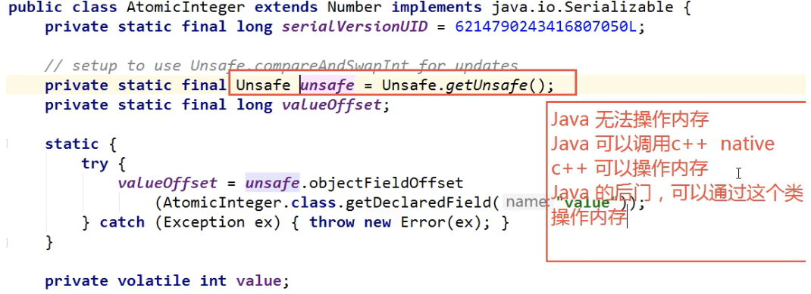

原子类Integer的+1操作原理:

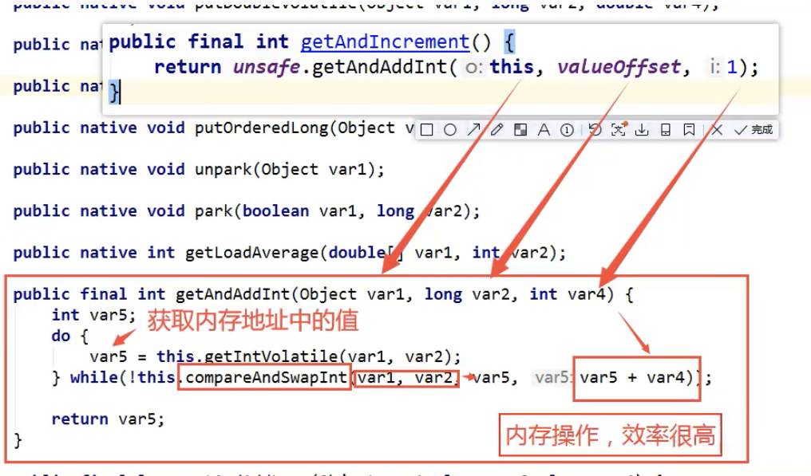

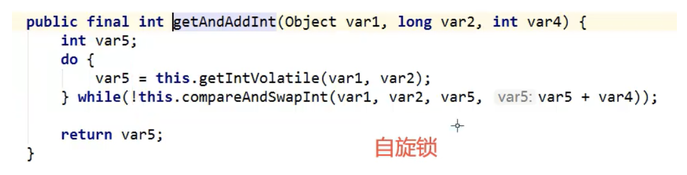

##CAS:ABA问题(狸猫换太子)

如下图所示：右边的线程修改了主存中A的值，但是又把主存中A的值修改为了原值，此时左边线程调用时还是正确调用的

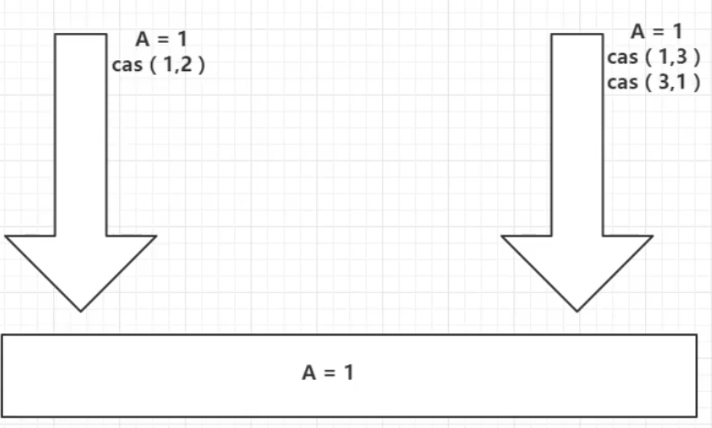

ABA问题代码实现:

```java
package com.zmy.Demo16;

import java.util.concurrent.atomic.AtomicInteger;

public class CASTest {

    /*
    * CAS：compareAndSet  比较并交换
    * */
    public static void main(String[] args) {
        AtomicInteger atomicInteger = new AtomicInteger(2020);
        /*
        * public final boolean compareAndSet(int expect, int update)
        * expect:期望
        * update：更新
        * 如果达到了期望值，就更新为更新的值,CAS是CPU的并发原理
        * */
        //=============捣乱线程=============
        System.out.println(atomicInteger.compareAndSet(2020,2021)); //修改成功返回true
        System.out.println(atomicInteger.get());


        System.out.println(atomicInteger.compareAndSet(2021,2020)); //修改成功返回true
        System.out.println(atomicInteger.get());


        //=============期望线程=============


        System.out.println(atomicInteger.compareAndSet(2020,6666)); //修改成功返回true
        System.out.println(atomicInteger.get());


    }


}
```

由此引出下文：原子引用

## 原子引用

带版本号的原子操作(解决ABA问题)

```java
package com.zmy.Demo16;


import java.util.concurrent.TimeUnit;
import java.util.concurrent.atomic.AtomicStampedReference;


public class CASTest1 {


    /*
    * 原子引用
    * */
    public static void main(String[] args) {


        //注意：如果泛型是包装类，注意对象的引用问题
        AtomicStampedReference<Integer> atomicInteger = new AtomicStampedReference<>(1,1);


        new Thread(()->{
            int stamp = atomicInteger.getStamp(); //获得版本号
            System.out.println("a1=>"+stamp);
            try {
                TimeUnit.SECONDS.sleep(2);
            } catch (InterruptedException e) {
                e.printStackTrace();
            }
            //拿到期望值修改为更新值，然后拿到最新的版本号，更新到最新的版本号
            System.out.println("a1 set "+atomicInteger.compareAndSet(1, 2, atomicInteger.getStamp(), atomicInteger.getStamp() + 1));
            System.out.println("a2=>"+atomicInteger.getStamp());
            System.out.println("a2 set "+atomicInteger.compareAndSet(2, 1, atomicInteger.getStamp(), atomicInteger.getStamp() + 1));
            System.out.println("a3=>"+atomicInteger.getStamp());


        },"A").start();


        //与乐观锁原理相同
        new Thread(()->{
            int stamp = atomicInteger.getStamp(); //获得版本号
            System.out.println("b1=>"+stamp);
            try {
                TimeUnit.SECONDS.sleep(2);
            } catch (InterruptedException e) {
                e.printStackTrace();
            }
            System.out.println("b1 set "+atomicInteger.compareAndSet(1, 6, stamp, stamp + 1));


            System.out.println("b2=>"+atomicInteger.getStamp());


        },"B").start();


    }


}
```

代码运行结果：

```java
a1=>1
b1=>1
b1 set false
a1 set true
b2=>2
a2=>2
a2 set true
a3=>3
```

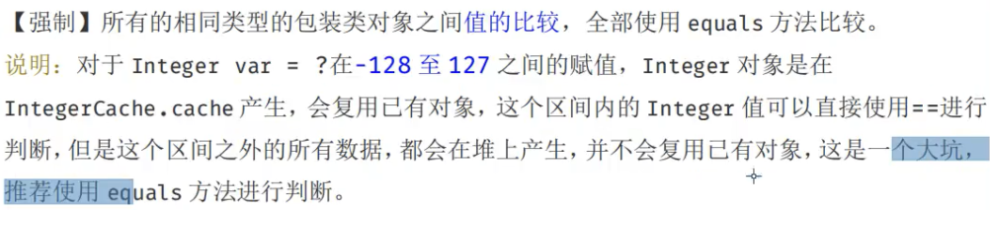


# 各种锁的理解


## 可重入锁(递归锁)

拿到外面的锁就拿到了里面的锁


## 自旋锁

自定义自旋锁：

```java
package com.zmy.Demo17;


import java.util.concurrent.atomic.AtomicReference;


/*
* 自旋锁
* */
public class SpinlockDemo {


    AtomicReference<Thread> atomicReference = new AtomicReference<>();


    //加锁
    public void myLock(){
        Thread thread = Thread.currentThread();
        System.out.println(Thread.currentThread().getName()+"==>mylock");


        //自旋锁
        while(!atomicReference.compareAndSet(null, thread)){


        }
    }


    //解锁
    public void myUnLock(){
        Thread thread = Thread.currentThread();
        System.out.println(Thread.currentThread().getName()+"==>myunlock");
        atomicReference.compareAndSet(thread, null);


    }


}
```

测试：

```java
package com.zmy.Demo17;


import java.util.concurrent.TimeUnit;


public class Test {


    public static void main(String[] args) {
        //自己写的锁，底层用的自旋锁CAS
        SpinlockDemo lock = new SpinlockDemo();


        new Thread(()->{
            lock.myLock();
            try {
                TimeUnit.SECONDS.sleep(3);
            } catch (Exception e) {
                e.printStackTrace();
            } finally {
                lock.myUnLock();
            }


        },"A").start();


        try {
            TimeUnit.SECONDS.sleep(1);
        } catch (InterruptedException e) {
            e.printStackTrace();
        }
        
        new Thread(()->{
            lock.myLock();
            try {
                TimeUnit.SECONDS.sleep(3);
            } catch (Exception e) {
                e.printStackTrace();
            } finally {
                lock.myUnLock();
            }


        },"B").start();
    }
}
```

结果：

```java
A==>mylock
B==>mylock
A==>myunlock
B==>myunlock
```


