<<<<<<< HEAD
#JVM的位置
=======
# JVM的位置
>>>>>>> 0ed1666 (提交更新)

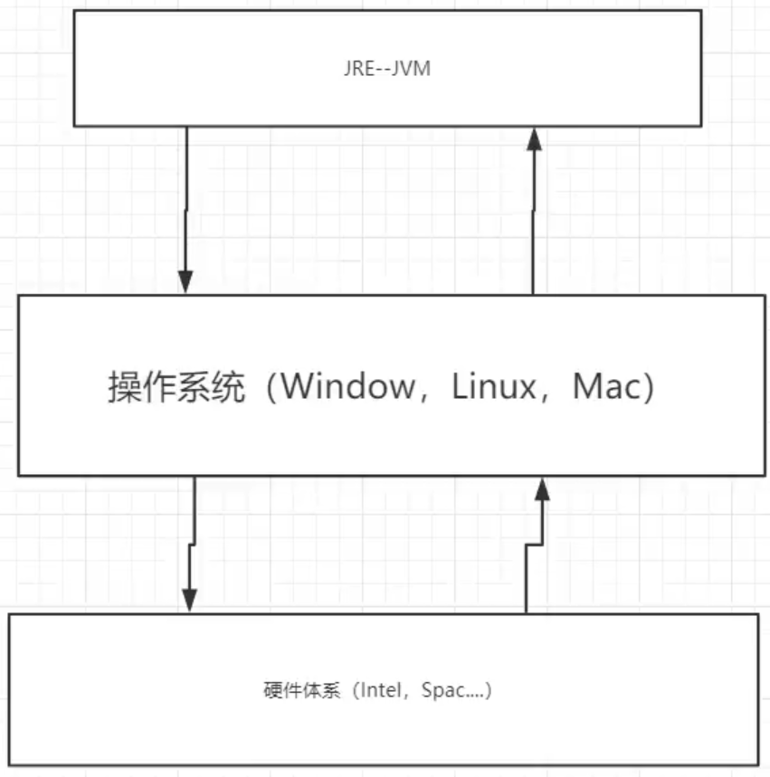

# JVM体系结构

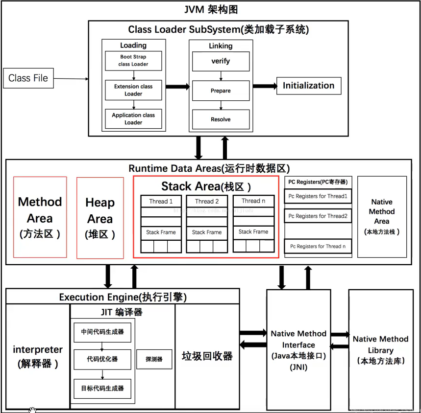

# 类加载器

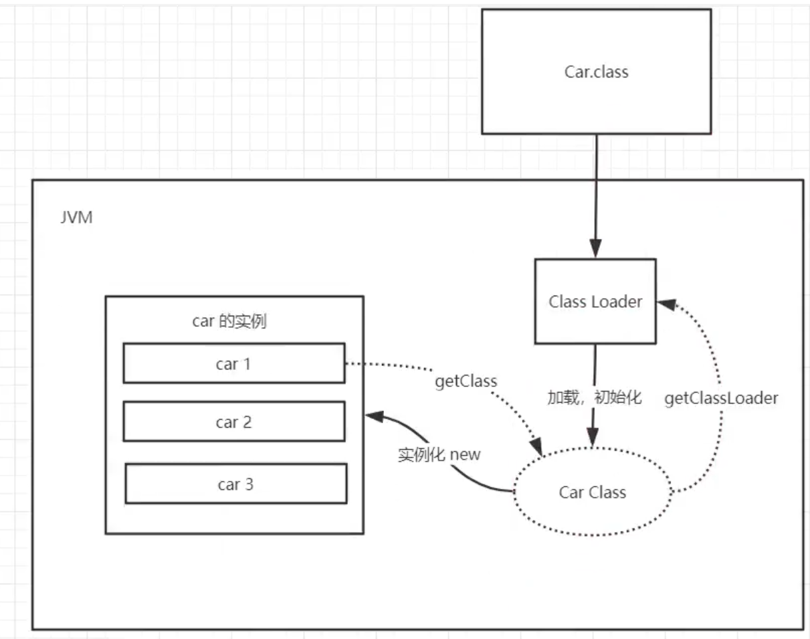

- 虚拟机自带加载器
- 启动类（根）加载器
- 拓展类加载器
- 应用程序（系统类）加载器

<<<<<<< HEAD
#双亲委派机制：安全
=======
# 双亲委派机制：安全
>>>>>>> 0ed1666 (提交更新)

假设在当前目录下编写一个java.lang.String的类，然后new String对象的时候，会发现根本不是自己写的String类

在程序执行的时候，类加载器先会去当前应用程序加载器下找String，然后去扩展类加载器下找String，然后去根加载器下String，假设三个途径都有名为String的类，则会执行根加载器下的String，若根加载器无，则加载拓展类加载下的String

<<<<<<< HEAD
#沙箱安全机制
=======
# 沙箱安全机制
>>>>>>> 0ed1666 (提交更新)

Java安全模型的核心就是Java沙箱（sandbox），什么是沙箱？沙箱是一个限制程序运行的环境。沙箱机制就是将 Java 代码限定在虚拟机(JVM)特定的运行范围中，并且严格限制代码对本地系统资源访问，通过这样的措施来保证对代码的有效隔离，防止对本地系统造成破坏。沙箱主要限制系统资源访问，那系统资源包括什么？——CPU、内存、文件系统、网络。不同级别的沙箱对这些资源访问的限制也可以不一样。

所有的Java程序运行都可以指定沙箱，可以定制安全策略。

### 组成沙箱的基本组件

字节码校验器（bytecode verifier）：确保Java类文件遵循Java语言规范。这样可以帮助Java程序实现内存保护。但并不是所有的类文件都会经过字节码校验，比如核心类。

类装载器（class loader）：其中类装载器在3个方面对Java沙箱起作用

1. 它防止恶意代码去干涉善意的代码；//双亲委派机制

2. 它守护了被信任的类库边界；

3. 它将代码归入保护域，确定了代码可以进行哪些操作。

虚拟机为不同的类加载器载入的类提供不同的命名空间，命名空间由一系列唯一的名称组成，每一个被装载的类将有一个名字，这个命名空间是由Java虚拟机为每一个类装载器维护的，它们互相之间甚至不可见。

**类装载器采用的机制是双亲委派模式。**

从最内层JVM自带类加载器开始加载，外层恶意同名类得不到加载从而无法使用；

由于严格通过包来区分了访问域，外层恶意的类通过内置代码也无法获得权限访问到内层类，破坏代码就自然无法生效。

存取控制器（access controller）：存取控制器可以控制核心API对操作系统的存取权限，而这个控制的策略设定，可以由用户指定。

安全管理器（security manager）：是核心API和操作系统之间的主要接口。实现权限控制，比存取控制器优先级高。

安全软件包（security package）：java.security下的类和扩展包下的类，允许用户为自己的应用增加新的安全特性，包括：

+  安全提供者

+ 消息摘要

+ 数字签名

+ 加密

+ 鉴别

# Native

```java
package com.zmy.Demo1;


public class NativeTest1 {


    public static void main(String[] args) {
        new Thread(()->{


        },"A").start();
    }


    /*
    * native：凡是带了native关键字的，说明java的作用范围到达不了了，会去调用底层C语言的库
    * 会进入本地方法栈
    * 调用本地方法接口 JNI
    * JNI作用：拓展JAVA的使用，融合不同的编程语言为JAVA所用
    * */
    private native void hello();


    //调用其他接口 ：Socket,WebService

}
```

# PC寄存器

叫做程序计数器

每个线程都有一个程序计数器，是线程私有的，就是一个指针，指向方法区中的方法字节码（用来存储指向像一条指令的地址，即将要执行的指令代码），在执行引擎读取下一条指令，是一个非常小的内存空间，几乎可以忽略不计。

<<<<<<< HEAD
#方法区
=======
# 方法区
>>>>>>> 0ed1666 (提交更新)

**jdk1.7以前是叫做永久代(存储在堆中间)，现在叫做元空间**

方法区是被所有线程共享的，所有字段和方法字节码，以及一些特殊方法，如构造函数，接口代码也在此定义，简单说，所有定义的方法的信息都保存在该区域，此区域属于共享区间。

静态变量，常量，类信息（构造方法，接口定义），运行时的常量池存在方法区中，但是实例变量存在堆内存中，和方法区无关

# 栈

即栈内存，主管程序的运行，生命周期，线程同步；

线程结束，栈内存释放，对于栈来说，不存在垃圾回收问题

一旦线程结束，栈就Over

8大基本类型+对象引用+实例的方法

# 堆

一个JVM只有一个堆内存，而且堆内存的大小是可以调节的。

## 堆内存结构示意

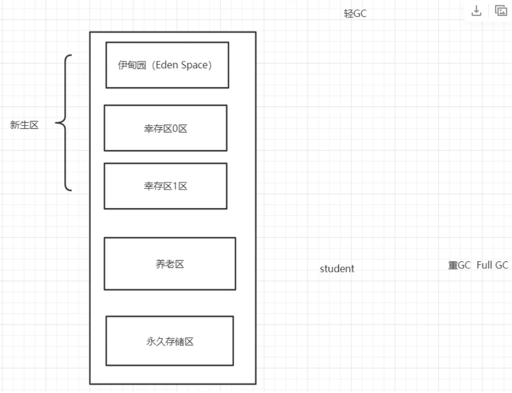

GC垃圾回收主要是在，伊甸园区和养老区

- 轻GC是指清除新生区的一些无用数据
- 重GC（FULL GC）是指当新生区和老年区都满了的情况下，进行一次大的数据清除。

假设内存满了，会抛出OOM异常，就是堆内存满了！

永久存储区也叫（元空间）


## 新生区

- 类：诞生和成长，可能死亡；
- 伊甸园区：所有的对象都是在伊甸园区new出来的
- 幸存0区(from区)：当伊甸园区满触发轻GC之后，还有活下来的对象，就到了幸存0区
- 幸存1区(to区)：同伊甸园区和幸存0区的关系，幸存0满之后，放到幸存1区。
- 注意：from区和to区随时可能交换，所以一般判别它们的方法就是：谁空谁是to区

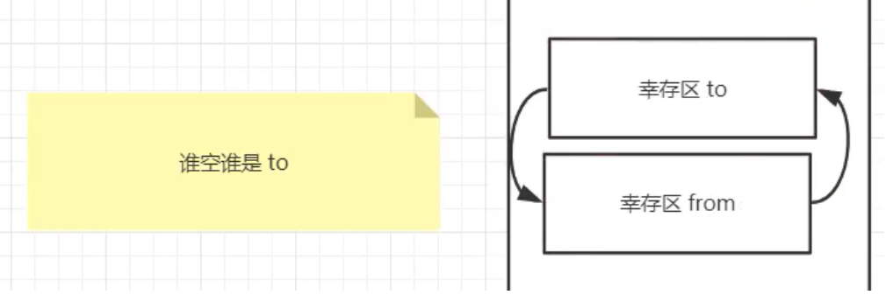

+ 新生区由伊甸园区和幸存0，1区满了之后触发重GC，这个之后还幸存下来的对象就进入了养老区


## 老年区

  如上,但是一般程序都是临时调用对象，几乎很少有对象进入养老区，当新生区和养老区以及元空间满了之后就会抛OOM异常


## 永久区

JDK1.8之后改名为元空间，也就是方法区，非堆，此处方法区就是对应上面的大字标题方法区

这个区域是常驻内存的。用来存放JDK自身携带的Class对象。Interface元数据，存储的是Java运行时的一些环境或者类信息。这个区域不存在垃圾回收，关闭虚拟机就会释放这个区域的内存。

**注意：在JDK1.8之前，是在堆区中存在永久代(物理上存在于堆结构中)用来实现方法区的作用，而1.8之后，摒弃了永久代的概念，引入了元空间来实现方法区的作用，而此时元空间物理上并未在堆结构中，而是成了独立的方法区！,这样做是为了让方法区的大小不再受限于堆。**

# GC

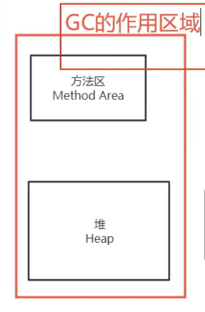

- 轻GC（只针对于新生区，或者偶尔去幸存区）
- 重GC


## 常用算法


### 引用计数器

给每个对象设置一个计数器

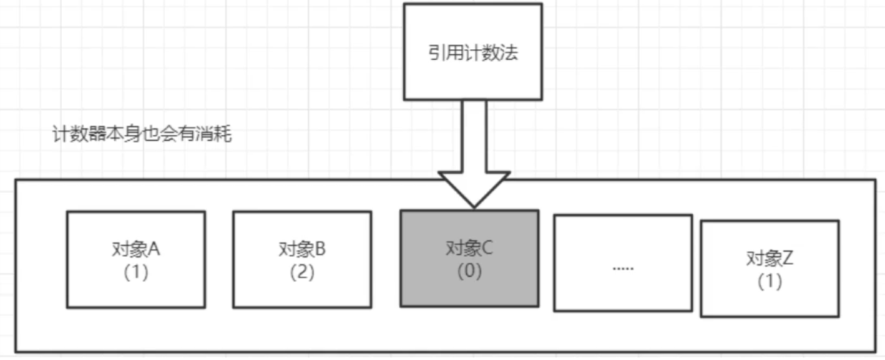


<<<<<<< HEAD
###复制算法
=======
### 复制算法
>>>>>>> 0ed1666 (提交更新)

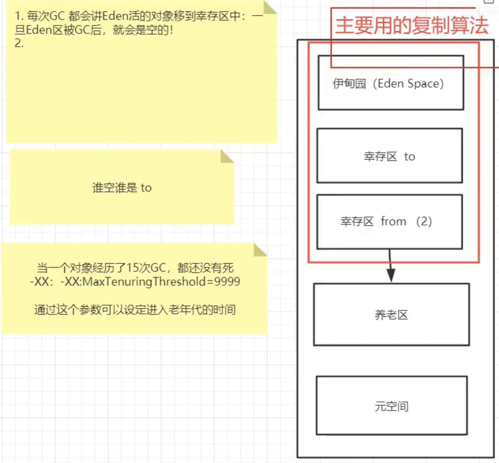

注意：15次是默认的

一次轻GC发生的事：新生区幸存下来的对象和原来from区存留下来的对象都会进入到to区，此时to区变成了新的from区，而原来的from区变成了to区，如果有对象经过15GC依旧活了下来，它就会进入养老区。

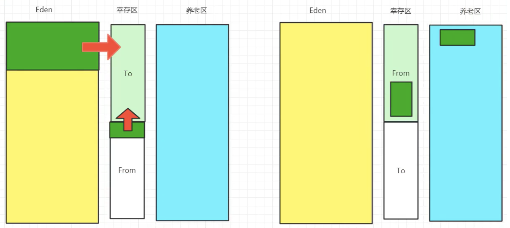

- 优点：没有内存碎片
- 缺点：浪费内存空间

最佳适应场景：对象存活度较低


<<<<<<< HEAD
###标记清除算法
=======
### 标记清除算法
>>>>>>> 0ed1666 (提交更新)

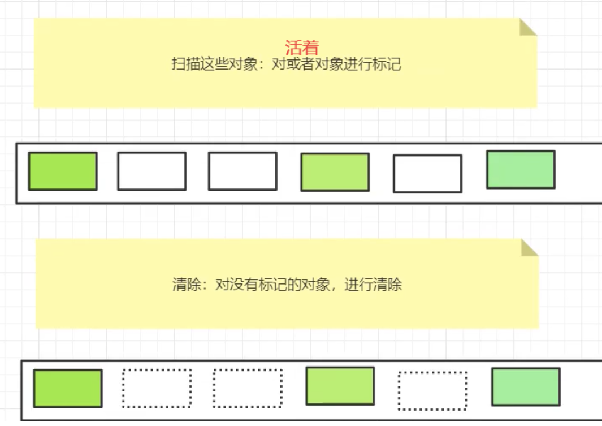

- 优点: 不需要额外空间
- 缺点：两次扫描比较浪费时间，会产生内存碎片


<<<<<<< HEAD
###标记压缩算法
=======
### 标记压缩算法
>>>>>>> 0ed1666 (提交更新)

在标记的基础上把清除替换为压缩操作

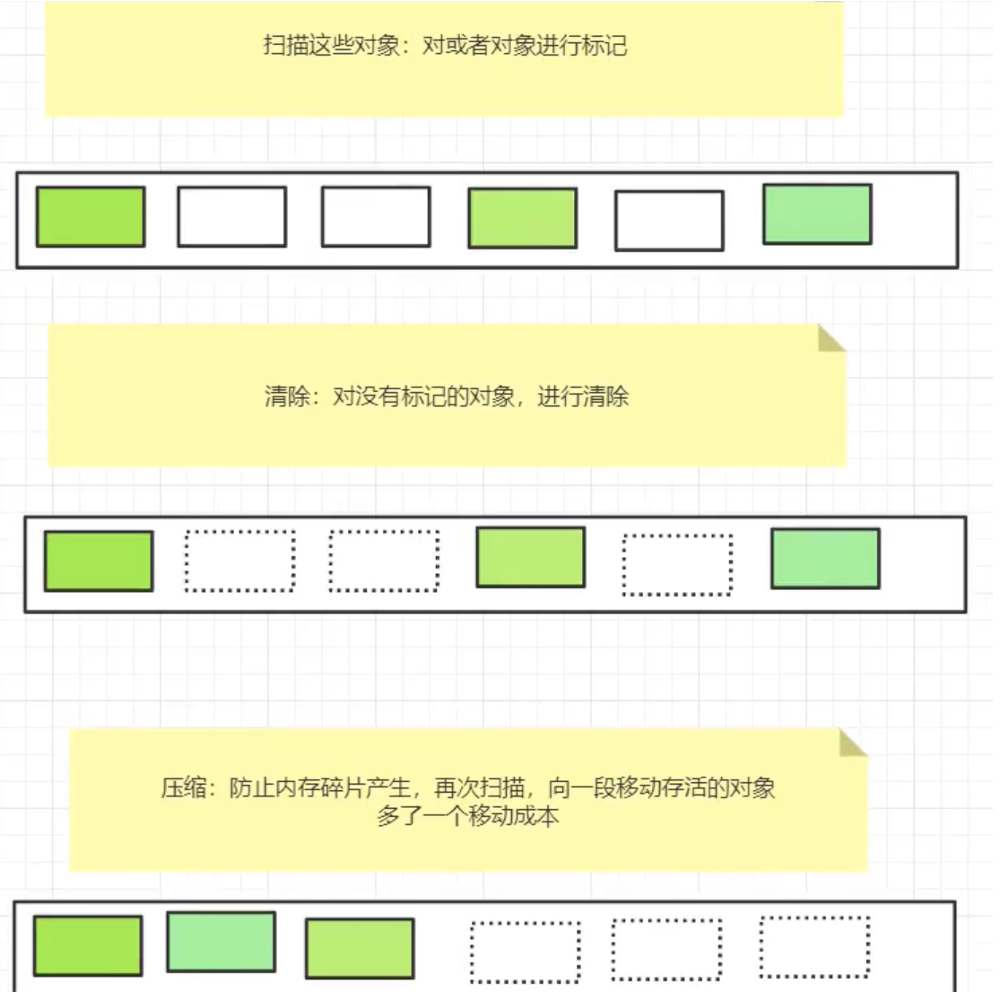

先清除了未标记的对象，然后将标记的对象压缩到一起

- 优点：不会产生内存碎片
- 缺点: 多出了对象移动的成本


<<<<<<< HEAD
##GC算法小结
=======
## GC算法小结
>>>>>>> 0ed1666 (提交更新)

- 时间复杂度：复制算法>标记清除>标记清除压缩(压缩清除)算法
- 内存整齐度：复制算法=标记压缩清除>标记清除
- 内存利用率：标记压缩清除=标记清除>复制算法

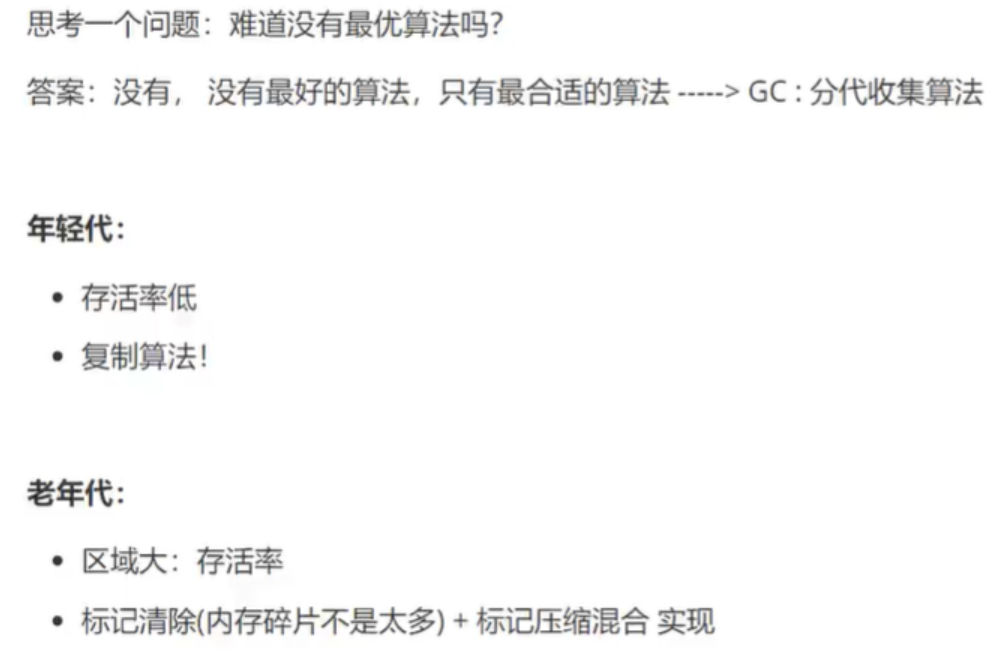