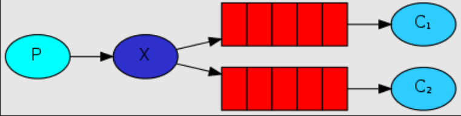

# 什么是中间件

个人理解：**中间件就是用来解决两个不同系统之间的通讯差异的沟通工具(类似通讯协议)**


# 消息中间件

**消息中间件是一种接收数据，接受请求，存储数据，发送数据等功能的技术服务**

+ 利用可靠的消息传递机制进行系统和系统直接的通讯
+ 通过提供消息传递和消息的排队机制，它可以在分布式系统环境下扩展进程间的通讯

消息中间件的核心组成部分

+ 消息的协议
+ 消息的持久化机制
+ 消息的分发策略
+ 消息的高可用，高可靠
+ 消息的容错机制

# 消息队列协议

消息中间件不全部是采用TCP/IP协议，而是位于传输层的一些自己的协议

协议三要素：

+ 语法
+ 语义
+ 同步

**面试题：为什么消息中间件不直接使用http协议呢**

1. 因为http请求报文头和响应报文头是比较复杂的，包含了cookie，数据的加密解密，状态码，响应码等附加的功能，但是对于一个消息而言，我们并不需要这么复杂，也没有这个必要性，它其实就是负责数据传递，存储，分发就行，要追求高性能，简洁，快捷。
2. 大部分情况下http大部分都是短链接，在实际的交互过程中，一个请求到响应可能会中断，中断后就不会持久化，就会造成请求的丢失，不利于消息中间件的业务场景，消息中间件可能是要给长期的获取消息的过程，出现问题和故障要对数据或消息进行持久化等，目的是为了保证消息和数据的高可靠性和稳健的运行。

常见的消息中间件协议：OpenWire，AMQP，MQTT，Kafka，OpenMessage等。

#消息队列持久化

简而言之就是将数据存入磁盘，而不是存在内存中。

+ 文件存储
+ 数据库

# 消息的分发策略

MQ消息队列有如下几个角色：

+ 生产者
+ 存储消息
+ 消费者

消费者获取消息一般是通过推和拉获得的，参考Git。


# 消息队列的高可用和高可靠

高可用：是指产品在规定的条件和规定的时刻或时间内处于可执行规定功能状态的能力

高可靠：是指系统无故障持续运行。

# RabbitMQ

概述：RabbitMQ是一个开源的遵循AMQO协议实现的基于Erlang语言编写，支持多种客户端（语言）的中间件，用于在分布式系统中存储消息，转发消息，具有高可用，高可扩，易用性等特征。


##RabbitMQ安装

推荐使用Docker安装（Dokcer安装详见Dokcer笔记，Win下Docker安装自行百度）

```shell
docker run -di --name myrabbit -e RABBITMQ_DEFAULT_USER=admin -e RABBITMQ_DEFAULT_PASS=admin -p 15672:15672 -p 5672:5672 -p 25672:25672 -p 61613:61613 -p 1883:1883 rabbitmq:management
```

安装完成后，浏览器下输入localhost:15672输入admin，admin即可访问。

#RabbitMQ角色分类

##none

- 不能访问management plugin

##management：查看自己相关节点信息

- 列出自己可以通过AMQP登入的虚拟机
- 查看自己的虚拟机节点 virtual hosts的queues,exchanges和bindings信息
- 查看和关闭自己的channels和connections
- 查看有关自己的虚拟机节点virtual hosts的统计信息。包括其他用户在这个节点virtual hosts中的活动信息。

##Policymaker

- 包含management所有权限
- 查看和创建和删除自己的virtual hosts所属的policies和parameters信息。

##Monitoring

- 包含management所有权限
- 罗列出所有的virtual hosts，包括不能登录的virtual hosts。
- 查看其他用户的connections和channels信息
- 查看节点级别的数据如clustering和memory使用情况
- 查看所有的virtual hosts的全局统计信息。

##Administrator

- 最高权限
- 可以创建和删除virtual hosts
- 可以查看，创建和删除users
- 查看创建permisssions
- 关闭所有用户的connections

# 快速入门


## 步骤

1：jdk1.8
2：构建一个maven工程
3：导入rabbitmq的maven依赖
4：启动rabbitmq-server服务
5：定义生产者
6：定义消费者
7：观察消息的在rabbitmq-server服务中的过程


## 创建maven项目


##导入maven依赖

```xml
<dependency>
    <groupId>com.rabbitmq</groupId>
    <artifactId>amqp-client</artifactId>
    <version>5.10.0</version>
</dependency>
```


## 启动rabbitmq-sever服务

```
systemctl start rabbitmq-server
或者
docker start myrabbit
```


## 定义生产者

```java
package com.xuexiangban.rabbitmq.simple;
import com.rabbitmq.client.Channel;
import com.rabbitmq.client.Connection;
import com.rabbitmq.client.ConnectionFactory;
/**
 * @author: 万宇
 * @description: Producer 简单队列生产者
 * @Date : 
 */
public class Producer {
    public static void main(String[] args) {
        // 1: 创建连接工厂
        ConnectionFactory connectionFactory = new ConnectionFactory();
        // 2: 设置连接属性
        connectionFactory.setHost("47.104.141.27");
        connectionFactory.setPort(5672);
        connectionFactory.setVirtualHost("/");
        connectionFactory.setUsername("admin");
        connectionFactory.setPassword("admin");
        Connection connection = null;
        Channel channel = null;
        try {
            // 3: 从连接工厂中获取连接
            connection = connectionFactory.newConnection("生产者");
            // 4: 从连接中获取通道channel
            channel = connection.createChannel();
            // 5: 申明队列queue存储消息
            /*
             *  如果队列不存在，则会创建
             *  Rabbitmq不允许创建两个相同的队列名称，否则会报错。
             *
             *  @params1： queue 队列的名称
             *  @params2： durable 队列是否持久化
             *  @params3： exclusive 是否排他，即是否私有的，如果为true,会对当前队列加锁，其他的通道不能访问，并且连接自动关闭
             *  @params4： autoDelete 是否自动删除，当最后一个消费者断开连接之后是否自动删除消息。
             *  @params5： arguments 可以设置队列附加参数，设置队列的有效期，消息的最大长度，队列的消息生命周期等等。
             * */
            channel.queueDeclare("queue1", false, false, false, null);
            // 6： 准备发送消息的内容
            String message = "你好，学相伴！！！";
            // 7: 发送消息给中间件rabbitmq-server
            // @params1: 交换机exchange
            // @params2: 队列名称/routing
            // @params3: 属性配置
            // @params4: 发送消息的内容
            channel.basicPublish("", "queue1", null, message.getBytes());
            System.out.println("消息发送成功!");
        } catch (Exception ex) {
            ex.printStackTrace();
            System.out.println("发送消息出现异常...");
        } finally {
            // 7: 释放连接关闭通道
            if (channel != null && channel.isOpen()) {
                try {
                    channel.close();
                } catch (Exception ex) {
                    ex.printStackTrace();
                }
            }
            if (connection != null) {
                try {
                    connection.close();
                } catch (Exception ex) {
                    ex.printStackTrace();
                }
            }
        }
    }
}
```

### 执行发送

这个时候可以在web控制台查看到这个队列queue的信息


###队列消息预览测试


##定义消费者

```java
package com.xuexiangban.rabbitmq.simple;
import com.rabbitmq.client.Channel;
import com.rabbitmq.client.Connection;
import com.rabbitmq.client.ConnectionFactory;
/**
 * @author: 学相伴-飞哥
 * @description: Producer 简单队列生产者
 * @Date : 2021/3/2
 */
public class Producer {
    public static void main(String[] args) {
        // 1: 创建连接工厂
        ConnectionFactory connectionFactory = new ConnectionFactory();
        // 2: 设置连接属性
        connectionFactory.setHost("47.104.141.27");
        connectionFactory.setPort(5672);
        connectionFactory.setVirtualHost("/");
        connectionFactory.setUsername("admin");
        connectionFactory.setPassword("admin");
        Connection connection = null;
        Channel channel = null;
        try {
            // 3: 从连接工厂中获取连接
            connection = connectionFactory.newConnection("生产者");
            // 4: 从连接中获取通道channel
            channel = connection.createChannel();
            // 5: 申明队列queue存储消息
            /*
             *  如果队列不存在，则会创建
             *  Rabbitmq不允许创建两个相同的队列名称，否则会报错。
             *
             *  @params1： queue 队列的名称
             *  @params2： durable 队列是否持久化
             *  @params3： exclusive 是否排他，即是否私有的，如果为true,会对当前队列加锁，其他的通道不能访问，并且连接自动关闭
             *  @params4： autoDelete 是否自动删除，当最后一个消费者断开连接之后是否自动删除消息。
             *  @params5： arguments 可以设置队列附加参数，设置队列的有效期，消息的最大长度，队列的消息生命周期等等。
             * */
            channel.queueDeclare("queue1", false, false, false, null);
            // 6： 准备发送消息的内容
            String message = "你好，学相伴！！！";
            // 7: 发送消息给中间件rabbitmq-server
            // @params1: 交换机exchange
            // @params2: 队列名称/routing
            // @params3: 属性配置
            // @params4: 发送消息的内容
            channel.basicPublish("", "queue1", null, message.getBytes());
            System.out.println("消息发送成功!");
        } catch (Exception ex) {
            ex.printStackTrace();
            System.out.println("发送消息出现异常...");
        } finally {
            // 7: 释放连接关闭通道
            if (channel != null && channel.isOpen()) {
                try {
                    channel.close();
                } catch (Exception ex) {
                    ex.printStackTrace();
                }
            }
            if (connection != null) {
                try {
                    connection.close();
                } catch (Exception ex) {
                    ex.printStackTrace();
                }
            }
        }
    }
}
```

# AMQP

AMQP全称：Advanced Message Queuing Protocol(**高级消息队列协议**)。是应用层协议的一个开发标准，为面向消息的中间件设计。


##AMQP生产者流转过程


##AMQP消费者流转过程


#RabbitMQ的核心组成部分


核心概念：
**Server**：又称Broker ,接受客户端的连接，实现AMQP实体服务。 安装rabbitmq-server
**Connection**：连接，应用程序与Broker的网络连接 TCP/IP/ 三次握手和四次挥手
**Channel**：网络信道，几乎所有的操作都在Channel中进行，Channel是进行消息读写的通道，客户端可以建立对各Channel，每个Channel代表一个会话任务。
**Message** :消息：服务与应用程序之间传送的数据，由Properties和body组成，Properties可是对消息进行修饰，比如消息的优先级，延迟等高级特性，Body则就是消息体的内容。
**Virtual Host** 虚拟地址，用于进行逻辑隔离，最上层的消息路由，一个虚拟主机理由可以有若干个Exhange和Queueu，同一个虚拟主机里面不能有相同名字的Exchange
**Exchange**：交换机，接受消息，根据路由键发送消息到绑定的队列。(==不具备消息存储的能力==)
**Bindings**：Exchange和Queue之间的虚拟连接，binding中可以保护多个routing key.
**Routing key**：是一个路由规则，虚拟机可以用它来确定如何路由一个特定消息。
**Queue**：队列：也成为Message Queue,消息队列，保存消息并将它们转发给消费者。


## RabbitMQ整体架构


##RabbitMQ的运行流程


## RabbitMQ支持消息的模式

### 简单模式 Simple

- 参考前面写的简单样例

### 工作模式 Work

- web操作查看视频
- 类型：无
- 特点：分发机制

### 发布订阅模式

- web操作查看视频
- 类型：fanout
- 特点：Fanout—发布与订阅模式，是一种广播机制，它是没有路由key的模式。

### 路由模式

- web操作查看视频
- 类型：direct
- 特点：有routing-key的匹配模式

### 主题Topic模式

- web操作查看视频
- 类型：topic
- 特点：模糊的routing-key的匹配模式

### 参数模式

- web操作查看视频
- 类型：headers
- 特点：参数匹配模式

## 小结

- rabbitmq发送消息一定有一个交换机
- 


# RabbitMQ入门案例


## RabbitMQ支持的消息模式

参考官网：https://www.rabbitmq.com/getstarted.html


##Fanout模式



- 类型：fanout
- 特点：Fanout—发布与订阅模式，是一种广播机制，它是没有路由key的模式。

生产者：

```java
package com.xuexiangban.rabbitmq.routing;
import com.rabbitmq.client.Channel;
import com.rabbitmq.client.Connection;
import com.rabbitmq.client.ConnectionFactory;
/**
 * @author: 学相伴-飞哥
 * @description: Producer 简单队列生产者
 * @Date : 2021/3/2
 */
public class Producer {
    public static void main(String[] args) {
        // 1: 创建连接工厂
        ConnectionFactory connectionFactory = new ConnectionFactory();
        // 2: 设置连接属性
        connectionFactory.setHost("47.104.141.27");
        connectionFactory.setPort(5672);
        connectionFactory.setVirtualHost("/");
        connectionFactory.setUsername("admin");
        connectionFactory.setPassword("admin");
        Connection connection = null;
        Channel channel = null;
        try {
            // 3: 从连接工厂中获取连接
            connection = connectionFactory.newConnection("生产者");
            // 4: 从连接中获取通道channel
            channel = connection.createChannel();
            // 6： 准备发送消息的内容
            String message = "你好，学相伴！！！";
            String  exchangeName = "fanout-exchange";
            String routingKey = "";
            // 7: 发送消息给中间件rabbitmq-server
            // @params1: 交换机exchange
            // @params2: 队列名称/routingkey
            // @params3: 属性配置
            // @params4: 发送消息的内容
            channel.basicPublish(exchangeName, routingKey, null, message.getBytes());
            System.out.println("消息发送成功!");
        } catch (Exception ex) {
            ex.printStackTrace();
            System.out.println("发送消息出现异常...");
        } finally {
            // 7: 释放连接关闭通道
            if (channel != null && channel.isOpen()) {
                try {
                    channel.close();
                } catch (Exception ex) {
                    ex.printStackTrace();
                }
            }
            if (connection != null) {
                try {
                    connection.close();
                } catch (Exception ex) {
                    ex.printStackTrace();
                }
            }
        }
    }
}
```

消费者：

```java
package com.xuexiangban.rabbitmq.routing;
import com.rabbitmq.client.*;
import java.io.IOException;
/**
 * @author: 学相伴-飞哥
 * @description: Consumer
 * @Date : 2021/3/2
 */
public class Consumer {
    private static Runnable runnable = () -> {
        // 1: 创建连接工厂
        ConnectionFactory connectionFactory = new ConnectionFactory();
        // 2: 设置连接属性
        connectionFactory.setHost("47.104.141.27");
        connectionFactory.setPort(5672);
        connectionFactory.setVirtualHost("/");
        connectionFactory.setUsername("admin");
        connectionFactory.setPassword("admin");
        //获取队列的名称
        final String queueName = Thread.currentThread().getName();
        Connection connection = null;
        Channel channel = null;
        try {
            // 3: 从连接工厂中获取连接
            connection = connectionFactory.newConnection("生产者");
            // 4: 从连接中获取通道channel
            channel = connection.createChannel();
            // 5: 申明队列queue存储消息
            /*
             *  如果队列不存在，则会创建
             *  Rabbitmq不允许创建两个相同的队列名称，否则会报错。
             *
             *  @params1： queue 队列的名称
             *  @params2： durable 队列是否持久化
             *  @params3： exclusive 是否排他，即是否私有的，如果为true,会对当前队列加锁，其他的通道不能访问，并且连接自动关闭
             *  @params4： autoDelete 是否自动删除，当最后一个消费者断开连接之后是否自动删除消息。
             *  @params5： arguments 可以设置队列附加参数，设置队列的有效期，消息的最大长度，队列的消息生命周期等等。
             * */
            // 这里如果queue已经被创建过一次了，可以不需要定义
            //channel.queueDeclare("queue1", false, false, false, null);
            // 6： 定义接受消息的回调
            Channel finalChannel = channel;
            finalChannel.basicConsume(queueName, true, new DeliverCallback() {
                @Override
                public void handle(String s, Delivery delivery) throws IOException {
                    System.out.println(queueName + "：收到消息是：" + new String(delivery.getBody(), "UTF-8"));
                }
            }, new CancelCallback() {
                @Override
                public void handle(String s) throws IOException {
                }
            });
            System.out.println(queueName + "：开始接受消息");
            System.in.read();
        } catch (Exception ex) {
            ex.printStackTrace();
            System.out.println("发送消息出现异常...");
        } finally {
            // 7: 释放连接关闭通道
            if (channel != null && channel.isOpen()) {
                try {
                    channel.close();
                } catch (Exception ex) {
                    ex.printStackTrace();
                }
            }
            if (connection != null && connection.isOpen()) {
                try {
                    connection.close();
                } catch (Exception ex) {
                    ex.printStackTrace();
                }
            }
        }
    };
    public static void main(String[] args) {
        // 启动三个线程去执行
        new Thread(runnable, "queue-1").start();
        new Thread(runnable, "queue-2").start();
        new Thread(runnable, "queue-3").start();
    }
}
```


##Direct模式


- 类型：direct
- 特点：Direct模式是fanout模式上的一种叠加，增加了路由RoutingKey的模式。

生产者：

```java
package com.xuexiangban.rabbitmq.routing;
import com.rabbitmq.client.Channel;
import com.rabbitmq.client.Connection;
import com.rabbitmq.client.ConnectionFactory;
/**
 * @author: 学相伴-飞哥
 * @description: Producer 简单队列生产者
 * @Date : 2021/3/2
 */
public class Producer {
    public static void main(String[] args) {
        // 1: 创建连接工厂
        ConnectionFactory connectionFactory = new ConnectionFactory();
        // 2: 设置连接属性
        connectionFactory.setHost("47.104.141.27");
        connectionFactory.setPort(5672);
        connectionFactory.setVirtualHost("/");
        connectionFactory.setUsername("admin");
        connectionFactory.setPassword("admin");
        Connection connection = null;
        Channel channel = null;
        try {
            // 3: 从连接工厂中获取连接
            connection = connectionFactory.newConnection("生产者");
            // 4: 从连接中获取通道channel
            channel = connection.createChannel();
            // 6： 准备发送消息的内容
            String message = "你好，学相伴！！！";
            String  exchangeName = "direct-exchange";
            String routingKey1 = "testkey";
            String routingKey2 = "testkey2";
            // 7: 发送消息给中间件rabbitmq-server
            // @params1: 交换机exchange
            // @params2: 队列名称/routingkey
            // @params3: 属性配置
            // @params4: 发送消息的内容
            channel.basicPublish(exchangeName, routingKey1, null, message.getBytes());
            channel.basicPublish(exchangeName, routingKey2, null, message.getBytes());
            System.out.println("消息发送成功!");
        } catch (Exception ex) {
            ex.printStackTrace();
            System.out.println("发送消息出现异常...");
        } finally {
            // 7: 释放连接关闭通道
            if (channel != null && channel.isOpen()) {
                try {
                    channel.close();
                } catch (Exception ex) {
                    ex.printStackTrace();
                }
            }
            if (connection != null) {
                try {
                    connection.close();
                } catch (Exception ex) {
                    ex.printStackTrace();
                }
            }
        }
    }
}
```

消费者：

```java
package com.xuexiangban.rabbitmq.routing;
import com.rabbitmq.client.*;
import java.io.IOException;
/**
 * @author: 学相伴-飞哥
 * @description: Consumer
 * @Date : 2021/3/2
 */
public class Consumer {
    private static Runnable runnable = () -> {
        // 1: 创建连接工厂
        ConnectionFactory connectionFactory = new ConnectionFactory();
        // 2: 设置连接属性
        connectionFactory.setHost("47.104.141.27");
        connectionFactory.setPort(5672);
        connectionFactory.setVirtualHost("/");
        connectionFactory.setUsername("admin");
        connectionFactory.setPassword("admin");
        //获取队列的名称
        final String queueName = Thread.currentThread().getName();
        Connection connection = null;
        Channel channel = null;
        try {
            // 3: 从连接工厂中获取连接
            connection = connectionFactory.newConnection("生产者");
            // 4: 从连接中获取通道channel
            channel = connection.createChannel();
            // 5: 申明队列queue存储消息
            /*
             *  如果队列不存在，则会创建
             *  Rabbitmq不允许创建两个相同的队列名称，否则会报错。
             *
             *  @params1： queue 队列的名称
             *  @params2： durable 队列是否持久化
             *  @params3： exclusive 是否排他，即是否私有的，如果为true,会对当前队列加锁，其他的通道不能访问，并且连接自动关闭
             *  @params4： autoDelete 是否自动删除，当最后一个消费者断开连接之后是否自动删除消息。
             *  @params5： arguments 可以设置队列附加参数，设置队列的有效期，消息的最大长度，队列的消息生命周期等等。
             * */
            // 这里如果queue已经被创建过一次了，可以不需要定义
            //channel.queueDeclare("queue1", false, false, false, null);
            // 6： 定义接受消息的回调
            Channel finalChannel = channel;
            finalChannel.basicConsume(queueName, true, new DeliverCallback() {
                @Override
                public void handle(String s, Delivery delivery) throws IOException {
                    System.out.println(queueName + "：收到消息是：" + new String(delivery.getBody(), "UTF-8"));
                }
            }, new CancelCallback() {
                @Override
                public void handle(String s) throws IOException {
                }
            });
            System.out.println(queueName + "：开始接受消息");
            System.in.read();
        } catch (Exception ex) {
            ex.printStackTrace();
            System.out.println("发送消息出现异常...");
        } finally {
            // 7: 释放连接关闭通道
            if (channel != null && channel.isOpen()) {
                try {
                    channel.close();
                } catch (Exception ex) {
                    ex.printStackTrace();
                }
            }
            if (connection != null && connection.isOpen()) {
                try {
                    connection.close();
                } catch (Exception ex) {
                    ex.printStackTrace();
                }
            }
        }
    };
    public static void main(String[] args) {
        // 启动三个线程去执行
        new Thread(runnable, "queue-1").start();
        new Thread(runnable, "queue-2").start();
        new Thread(runnable, "queue-3").start();
    }
}
```


## Topic模式


- 类型：topic
- 特点：Topic模式是direct模式上的一种叠加，增加了模糊路由RoutingKey的模式。

生产者：

```java
package com.xuexiangban.rabbitmq.routing;
import com.rabbitmq.client.Channel;
import com.rabbitmq.client.Connection;
import com.rabbitmq.client.ConnectionFactory;
/**
 * @author: 学相伴-飞哥
 * @description: Producer 简单队列生产者
 * @Date : 2021/3/2
 */
public class Producer {
    public static void main(String[] args) {
        // 1: 创建连接工厂
        ConnectionFactory connectionFactory = new ConnectionFactory();
        // 2: 设置连接属性
        connectionFactory.setHost("47.104.141.27");
        connectionFactory.setPort(5672);
        connectionFactory.setVirtualHost("/");
        connectionFactory.setUsername("admin");
        connectionFactory.setPassword("admin");
        Connection connection = null;
        Channel channel = null;
        try {
            // 3: 从连接工厂中获取连接
            connection = connectionFactory.newConnection("生产者");
            // 4: 从连接中获取通道channel
            channel = connection.createChannel();
            // 6： 准备发送消息的内容
            String message = "你好，学相伴！！！";
            String  exchangeName = "topic-exchange";
            String routingKey1 = "com.course.order";//都可以收到 queue-1 queue-2
            String routingKey2 = "com.order.user";//都可以收到 queue-1 queue-3
            // 7: 发送消息给中间件rabbitmq-server
            // @params1: 交换机exchange
            // @params2: 队列名称/routingkey
            // @params3: 属性配置
            // @params4: 发送消息的内容
            channel.basicPublish(exchangeName, routingKey1, null, message.getBytes());
            System.out.println("消息发送成功!");
        } catch (Exception ex) {
            ex.printStackTrace();
            System.out.println("发送消息出现异常...");
        } finally {
            // 7: 释放连接关闭通道
            if (channel != null && channel.isOpen()) {
                try {
                    channel.close();
                } catch (Exception ex) {
                    ex.printStackTrace();
                }
            }
            if (connection != null) {
                try {
                    connection.close();
                } catch (Exception ex) {
                    ex.printStackTrace();
                }
            }
        }
    }
}
```

消费者：

```java
package com.xuexiangban.rabbitmq.routing;
import com.rabbitmq.client.*;
import java.io.IOException;
/**
 * @author: 学相伴-飞哥
 * @description: Consumer
 * @Date : 2021/3/2
 */
public class Consumer {
    private static Runnable runnable = () -> {
        // 1: 创建连接工厂
        ConnectionFactory connectionFactory = new ConnectionFactory();
        // 2: 设置连接属性
        connectionFactory.setHost("47.104.141.27");
        connectionFactory.setPort(5672);
        connectionFactory.setVirtualHost("/");
        connectionFactory.setUsername("admin");
        connectionFactory.setPassword("admin");
        //获取队列的名称
        final String queueName = Thread.currentThread().getName();
        Connection connection = null;
        Channel channel = null;
        try {
            // 3: 从连接工厂中获取连接
            connection = connectionFactory.newConnection("生产者");
            // 4: 从连接中获取通道channel
            channel = connection.createChannel();
            // 5: 申明队列queue存储消息
            /*
             *  如果队列不存在，则会创建
             *  Rabbitmq不允许创建两个相同的队列名称，否则会报错。
             *
             *  @params1： queue 队列的名称
             *  @params2： durable 队列是否持久化
             *  @params3： exclusive 是否排他，即是否私有的，如果为true,会对当前队列加锁，其他的通道不能访问，并且连接自动关闭
             *  @params4： autoDelete 是否自动删除，当最后一个消费者断开连接之后是否自动删除消息。
             *  @params5： arguments 可以设置队列附加参数，设置队列的有效期，消息的最大长度，队列的消息生命周期等等。
             * */
            // 这里如果queue已经被创建过一次了，可以不需要定义
            //channel.queueDeclare("queue1", false, false, false, null);
            // 6： 定义接受消息的回调
            Channel finalChannel = channel;
            finalChannel.basicConsume(queueName, true, new DeliverCallback() {
                @Override
                public void handle(String s, Delivery delivery) throws IOException {
                    System.out.println(queueName + "：收到消息是：" + new String(delivery.getBody(), "UTF-8"));
                }
            }, new CancelCallback() {
                @Override
                public void handle(String s) throws IOException {
                }
            });
            System.out.println(queueName + "：开始接受消息");
            System.in.read();
        } catch (Exception ex) {
            ex.printStackTrace();
            System.out.println("发送消息出现异常...");
        } finally {
            // 7: 释放连接关闭通道
            if (channel != null && channel.isOpen()) {
                try {
                    channel.close();
                } catch (Exception ex) {
                    ex.printStackTrace();
                }
            }
            if (connection != null && connection.isOpen()) {
                try {
                    connection.close();
                } catch (Exception ex) {
                    ex.printStackTrace();
                }
            }
        }
    };
    public static void main(String[] args) {
        // 启动三个线程去执行
        new Thread(runnable, "queue-1").start();
        new Thread(runnable, "queue-2").start();
        new Thread(runnable, "queue-3").start();
    }
}
```


## 完整的代码创建

生产者：

```java
package com.zmy.rabbitmq.all;

import com.rabbitmq.client.Channel;
import com.rabbitmq.client.Connection;
import com.rabbitmq.client.ConnectionFactory;

import java.util.Scanner;

public class ProducerAll {

    public static void main(String[] args) {
        //所有的中间件技术都是基于tcp/ip协议基础之上构建新型的协议规范，只不过rabbitmq遵循的是amqp
        //ip port

        //1.创建连接工厂
        ConnectionFactory connectionFactory = new ConnectionFactory();
        connectionFactory.setHost("192.168.1.11");
        connectionFactory.setPort(5672);
        connectionFactory.setUsername("admin");
        connectionFactory.setPassword("admin");
        connectionFactory.setVirtualHost("/");

        Connection connection = null;
        Channel channel =null;

        Scanner scanner = new Scanner(System.in);


        try {
            //2.创建连接connection
            connection = connectionFactory.newConnection("生产者");

            //3.通过连接获取通道channel
            channel = connection.createChannel();

            /*//4.声明队列，绑定关系，路由key，发送消息和接收消息
            String queueName = "queue1";
            channel.queueDeclare(queueName,false,false,false,null);//四个参数 1：队列名，2：是否持久化，3：排他性，是否是独占队列，4：是否自动删除，5：附属参数*/


            //5.1 交换机,此时这个交换机并未创建。
            String exchangeName = "direct_message_exchange";
            //5.2 交换机类型 direct work topic fanout
            String exchangeType = "direct";
            //5.3 通过channel定义交换机
            channel.exchangeDeclare(exchangeName,exchangeType,true);

            //4->5.4 声明队列

            channel.queueDeclare("queue666",true,false,false,null); //参考上面
            channel.queueDeclare("queue777",true,false,false,null); //参考上面
            channel.queueDeclare("queue888",true,false,false,null); //参考上面

            //5.5 绑定队列  队列名，交换机名，routeKey
            channel.queueBind("queue666",exchangeName,"six");
            channel.queueBind("queue777",exchangeName,"seven");
            channel.queueBind("queue888",exchangeName,"eight");

            //5.6 准备消息内容
            String message =  "";

            while(!"quit".equals(message)){
                message =  scanner.nextLine();
                //6.发送消息给队列queue
                channel.basicPublish(exchangeName,"six",null,message.getBytes());
                channel.basicPublish(exchangeName,"seven",null,message.getBytes());
                channel.basicPublish(exchangeName,"eight",null,message.getBytes());
                System.out.println("消息发送成功");
            }


        } catch (Exception e) {
            e.printStackTrace();
        } finally {
            //7.关闭连接
            if (channel!=null && channel.isOpen()){
                try {
                    channel.close();
                }catch (Exception e){
                    e.printStackTrace();
                }
            }

            //8.关闭通道
            if (connection!=null && connection.isOpen()){
                try {
                    connection.close();
                }catch (Exception e){
                    e.printStackTrace();
                }
            }
        }


    }
}
```

消费者:

```java
package com.zmy.rabbitmq.all;

import com.rabbitmq.client.*;

import java.io.IOException;

public class ConsumerAll {

    public static  Runnable runnable = new Runnable() {
        @Override
        public void run() {
            //所有的中间件技术都是基于tcp/ip协议基础之上构建新型的协议规范，只不过rabbitmq遵循的是amqp
            //ip port

            //1.创建连接工厂
            ConnectionFactory connectionFactory = new ConnectionFactory();
            connectionFactory.setHost("192.168.1.11");
            connectionFactory.setPort(5672);
            connectionFactory.setUsername("admin");
            connectionFactory.setPassword("admin");
            connectionFactory.setVirtualHost("/");
            final String queueName = Thread.currentThread().getName();

            Connection connection = null;
            Channel channel =null;


            try {
                //2.创建连接connection
                connection = connectionFactory.newConnection("消费者");

                //3.通过连接获取通道channel
                channel = connection.createChannel();

                //4.通过创建交换机，声明队列，绑定关系，路由key，发送消息和接收消息

                channel.basicConsume(queueName, true, new DeliverCallback() {
                    @Override
                    public void handle(String s, Delivery delivery) throws IOException {
                        System.out.println(queueName+"收到的消息是" + new String(delivery.getBody(), "UTF-8"));
                    }
                }, new CancelCallback() {
                    @Override
                    public void handle(String s) throws IOException {
                        System.out.println("接收失败");
                    }
                });

                System.out.println("开始接收消息");
                System.in.read();

          /*  //5.准备消息内容
            String message =  "万宇nb";

            //6.发送消息给队列queue
            channel.basicPublish("",queueName,null,message.getBytes());
            System.out.println("消息发送成功");*/


            } catch (Exception e) {
                e.printStackTrace();
                System.out.println("消息发送出现异常");
            } finally {
                //7.关闭连接
                if (channel!=null && channel.isOpen()){
                    try {
                        channel.close();
                    }catch (Exception e){
                        e.printStackTrace();
                    }
                }

                //8.关闭通道
                if (connection!=null && connection.isOpen()){
                    try {
                        connection.close();
                    }catch (Exception e){
                        e.printStackTrace();
                    }
                }
            }
        }
    };

    public static void main(String[] args) {

        // queue2-yes   queue3-no
        new Thread(runnable,"queue666").start();
        new Thread(runnable,"queue777").start();
        new Thread(runnable,"queue888").start();


    }
}
```


##Work模式

当有多个消费者时，我们的消息会被哪个消费者消费呢，我们又该如何均衡消费者消费信息的多少呢?
主要有两种模式：
1、轮询模式的分发：一个消费者一条，按均分配；
2、公平分发：根据消费者的消费能力进行公平分发，处理快的处理的多，处理慢的处理的少；按劳分配；


###Work模式-轮询

- 类型：无
- 特点：该模式接收消息是当有多个消费者接入时，消息的分配模式是一个消费者分配一条，直至消息消费完成；


生产者：

```java
package com.xuexiangban.rabbitmq.work.lunxun;
import com.rabbitmq.client.Channel;
import com.rabbitmq.client.Connection;
import com.rabbitmq.client.ConnectionFactory;
/**
 * @author: 学相伴-飞哥
 * @description: Producer 简单队列生产者
 * @Date : 2021/3/2
 */
public class Producer {
    public static void main(String[] args) {
        // 1: 创建连接工厂
        ConnectionFactory connectionFactory = new ConnectionFactory();
        // 2: 设置连接属性
        connectionFactory.setHost("47.104.141.27");
        connectionFactory.setPort(5672);
        connectionFactory.setVirtualHost("/");
        connectionFactory.setUsername("admin");
        connectionFactory.setPassword("admin");
        Connection connection = null;
        Channel channel = null;
        try {
            // 3: 从连接工厂中获取连接
            connection = connectionFactory.newConnection("生产者");
            // 4: 从连接中获取通道channel
            channel = connection.createChannel();
            // 6： 准备发送消息的内容
            //===============================end topic模式==================================
            for (int i = 1; i <= 20; i++) {
                //消息的内容
                String msg = "学相伴:" + i;
                // 7: 发送消息给中间件rabbitmq-server
                // @params1: 交换机exchange
                // @params2: 队列名称/routingkey
                // @params3: 属性配置
                // @params4: 发送消息的内容
                channel.basicPublish("", "queue1", null, msg.getBytes());
            }
            System.out.println("消息发送成功!");
        } catch (Exception ex) {
            ex.printStackTrace();
            System.out.println("发送消息出现异常...");
        } finally {
            // 7: 释放连接关闭通道
            if (channel != null && channel.isOpen()) {
                try {
                    channel.close();
                } catch (Exception ex) {
                    ex.printStackTrace();
                }
            }
            if (connection != null) {
                try {
                    connection.close();
                } catch (Exception ex) {
                    ex.printStackTrace();
                }
            }
        }
    }
}
```

消费者：

Work1

```java
package com.xuexiangban.rabbitmq.work.lunxun;
import com.rabbitmq.client.*;
import java.io.IOException;
/**
 * @author: 学相伴-飞哥
 * @description: Consumer
 * @Date : 2021/3/2
 */
public class Work1 {
    public static void main(String[] args) {
        // 1: 创建连接工厂
        ConnectionFactory connectionFactory = new ConnectionFactory();
        // 2: 设置连接属性
        connectionFactory.setHost("47.104.141.27");
        connectionFactory.setPort(5672);
        connectionFactory.setVirtualHost("/");
        connectionFactory.setUsername("admin");
        connectionFactory.setPassword("admin");
        Connection connection = null;
        Channel channel = null;
        try {
            // 3: 从连接工厂中获取连接
            connection = connectionFactory.newConnection("消费者-Work1");
            // 4: 从连接中获取通道channel
            channel = connection.createChannel();
            // 5: 申明队列queue存储消息
            /*
             *  如果队列不存在，则会创建
             *  Rabbitmq不允许创建两个相同的队列名称，否则会报错。
             *
             *  @params1： queue 队列的名称
             *  @params2： durable 队列是否持久化
             *  @params3： exclusive 是否排他，即是否私有的，如果为true,会对当前队列加锁，其他的通道不能访问，并且连接自动关闭
             *  @params4： autoDelete 是否自动删除，当最后一个消费者断开连接之后是否自动删除消息。
             *  @params5： arguments 可以设置队列附加参数，设置队列的有效期，消息的最大长度，队列的消息生命周期等等。
             * */
            // 这里如果queue已经被创建过一次了，可以不需要定义
//            channel.queueDeclare("queue1", false, false, false, null);
            // 同一时刻，服务器只会推送一条消息给消费者
            // 6： 定义接受消息的回调
            Channel finalChannel = channel;
            //finalChannel.basicQos(1);
            finalChannel.basicConsume("queue1", true, new DeliverCallback() {
                @Override
                public void handle(String s, Delivery delivery) throws IOException {
                    try{
                        System.out.println("Work1-收到消息是：" + new String(delivery.getBody(), "UTF-8"));
                        Thread.sleep(2000);
                    }catch(Exception ex){
                        ex.printStackTrace();
                    }
                }
            }, new CancelCallback() {
                @Override
                public void handle(String s) throws IOException {
                }
            });
            System.out.println("Work1-开始接受消息");
            System.in.read();
        } catch (Exception ex) {
            ex.printStackTrace();
            System.out.println("发送消息出现异常...");
        } finally {
            // 7: 释放连接关闭通道
            if (channel != null && channel.isOpen()) {
                try {
                    channel.close();
                } catch (Exception ex) {
                    ex.printStackTrace();
                }
            }
            if (connection != null && connection.isOpen()) {
                try {
                    connection.close();
                } catch (Exception ex) {
                    ex.printStackTrace();
                }
            }
        }
    }
}
```

Work2

```java
package com.xuexiangban.rabbitmq.work.lunxun;
import com.rabbitmq.client.*;
import java.io.IOException;
/**
 * @author: 学相伴-飞哥
 * @description: Consumer
 * @Date : 2021/3/2
 */
public class Work2 {
    public static void main(String[] args) {
        // 1: 创建连接工厂
        ConnectionFactory connectionFactory = new ConnectionFactory();
        // 2: 设置连接属性
        connectionFactory.setHost("47.104.141.27");
        connectionFactory.setPort(5672);
        connectionFactory.setVirtualHost("/");
        connectionFactory.setUsername("admin");
        connectionFactory.setPassword("admin");
        Connection connection = null;
        Channel channel = null;
        try {
            // 3: 从连接工厂中获取连接
            connection = connectionFactory.newConnection("消费者-Work2");
            // 4: 从连接中获取通道channel
            channel = connection.createChannel();
            // 5: 申明队列queue存储消息
            /*
             *  如果队列不存在，则会创建
             *  Rabbitmq不允许创建两个相同的队列名称，否则会报错。
             *
             *  @params1： queue 队列的名称
             *  @params2： durable 队列是否持久化
             *  @params3： exclusive 是否排他，即是否私有的，如果为true,会对当前队列加锁，其他的通道不能访问，并且连接自动关闭
             *  @params4： autoDelete 是否自动删除，当最后一个消费者断开连接之后是否自动删除消息。
             *  @params5： arguments 可以设置队列附加参数，设置队列的有效期，消息的最大长度，队列的消息生命周期等等。
             * */
            // 这里如果queue已经被创建过一次了，可以不需要定义
            //channel.queueDeclare("queue1", false, true, false, null);
            // 同一时刻，服务器只会推送一条消息给消费者
            //channel.basicQos(1);
            // 6： 定义接受消息的回调
            Channel finalChannel = channel;
            //finalChannel.basicQos(1);
            finalChannel.basicConsume("queue1", true, new DeliverCallback() {
                @Override
                public void handle(String s, Delivery delivery) throws IOException {
                    try{
                        System.out.println("Work2-收到消息是：" + new String(delivery.getBody(), "UTF-8"));
                        Thread.sleep(200);
                    }catch(Exception ex){
                        ex.printStackTrace();
                    }
                }
            }, new CancelCallback() {
                @Override
                public void handle(String s) throws IOException {
                }
            });
            System.out.println("Work2-开始接受消息");
            System.in.read();
        } catch (Exception ex) {
            ex.printStackTrace();
            System.out.println("发送消息出现异常...");
        } finally {
            // 7: 释放连接关闭通道
            if (channel != null && channel.isOpen()) {
                try {
                    channel.close();
                } catch (Exception ex) {
                    ex.printStackTrace();
                }
            }
            if (connection != null && connection.isOpen()) {
                try {
                    connection.close();
                } catch (Exception ex) {
                    ex.printStackTrace();
                }
            }
        }
    }
}
```

work1和work2的消息处理能力不同，但是最后处理的消息条数相同，是“按均分配”。


###Work模式-公平

- 类型：无
- 特点：由于消息接收者处理消息的能力不同，存在处理快慢的问题，我们就需要能者多劳，处理快的多处理，处理慢的少处理；

生产者：

```JAVA
package com.xuexiangban.rabbitmq.work.fairr;
import com.rabbitmq.client.Channel;
import com.rabbitmq.client.Connection;
import com.rabbitmq.client.ConnectionFactory;
/**
 * @author: 学相伴-飞哥
 * @description: Producer 简单队列生产者
 * @Date : 2021/3/2
 */
public class Producer {
    public static void main(String[] args) {
        // 1: 创建连接工厂
        ConnectionFactory connectionFactory = new ConnectionFactory();
        // 2: 设置连接属性
        connectionFactory.setHost("47.104.141.27");
        connectionFactory.setPort(5672);
        connectionFactory.setVirtualHost("/");
        connectionFactory.setUsername("admin");
        connectionFactory.setPassword("admin");
        Connection connection = null;
        Channel channel = null;
        try {
            // 3: 从连接工厂中获取连接
            connection = connectionFactory.newConnection("生产者");
            // 4: 从连接中获取通道channel
            channel = connection.createChannel();
            // 6： 准备发送消息的内容
            //===============================end topic模式==================================
            for (int i = 1; i <= 20; i++) {
                //消息的内容
                String msg = "学相伴:" + i;
                // 7: 发送消息给中间件rabbitmq-server
                // @params1: 交换机exchange
                // @params2: 队列名称/routingkey
                // @params3: 属性配置
                // @params4: 发送消息的内容
                channel.basicPublish("", "queue1", null, msg.getBytes());
            }
            System.out.println("消息发送成功!");
        } catch (Exception ex) {
            ex.printStackTrace();
            System.out.println("发送消息出现异常...");
        } finally {
            // 7: 释放连接关闭通道
            if (channel != null && channel.isOpen()) {
                try {
                    channel.close();
                } catch (Exception ex) {
                    ex.printStackTrace();
                }
            }
            if (connection != null) {
                try {
                    connection.close();
                } catch (Exception ex) {
                    ex.printStackTrace();
                }
            }
        }
    }
}
```

消费者：

Work1

```java
package com.xuexiangban.rabbitmq.work.fairr;
import com.rabbitmq.client.*;
import java.io.IOException;
/**
 * @author: 学相伴-飞哥
 * @description: Consumer
 * @Date : 2021/3/2
 */
public class Work1 {
    public static void main(String[] args) {
        // 1: 创建连接工厂
        ConnectionFactory connectionFactory = new ConnectionFactory();
        // 2: 设置连接属性
        connectionFactory.setHost("47.104.141.27");
        connectionFactory.setPort(5672);
        connectionFactory.setVirtualHost("/");
        connectionFactory.setUsername("admin");
        connectionFactory.setPassword("admin");
        Connection connection = null;
        Channel channel = null;
        try {
            // 3: 从连接工厂中获取连接
            connection = connectionFactory.newConnection("消费者-Work1");
            // 4: 从连接中获取通道channel
            channel = connection.createChannel();
            // 5: 申明队列queue存储消息
            /*
             *  如果队列不存在，则会创建
             *  Rabbitmq不允许创建两个相同的队列名称，否则会报错。
             *
             *  @params1： queue 队列的名称
             *  @params2： durable 队列是否持久化
             *  @params3： exclusive 是否排他，即是否私有的，如果为true,会对当前队列加锁，其他的通道不能访问，并且连接自动关闭
             *  @params4： autoDelete 是否自动删除，当最后一个消费者断开连接之后是否自动删除消息。
             *  @params5： arguments 可以设置队列附加参数，设置队列的有效期，消息的最大长度，队列的消息生命周期等等。
             * */
            // 这里如果queue已经被创建过一次了，可以不需要定义
//            channel.queueDeclare("queue1", false, false, false, null);
            // 同一时刻，服务器只会推送一条消息给消费者
            // 6： 定义接受消息的回调
            Channel finalChannel = channel;
            finalChannel.basicQos(1);
            finalChannel.basicConsume("queue1", false, new DeliverCallback() {
                @Override
                public void handle(String s, Delivery delivery) throws IOException {
                    try{
                        System.out.println("Work1-收到消息是：" + new String(delivery.getBody(), "UTF-8"));
                        Thread.sleep(2000);
                        finalChannel.basicAck(delivery.getEnvelope().getDeliveryTag(),false);
                    }catch(Exception ex){
                        ex.printStackTrace();
                    }
                }
            }, new CancelCallback() {
                @Override
                public void handle(String s) throws IOException {
                }
            });
            System.out.println("Work1-开始接受消息");
            System.in.read();
        } catch (Exception ex) {
            ex.printStackTrace();
            System.out.println("发送消息出现异常...");
        } finally {
            // 7: 释放连接关闭通道
            if (channel != null && channel.isOpen()) {
                try {
                    channel.close();
                } catch (Exception ex) {
                    ex.printStackTrace();
                }
            }
            if (connection != null && connection.isOpen()) {
                try {
                    connection.close();
                } catch (Exception ex) {
                    ex.printStackTrace();
                }
            }
        }
    }
}
```

Work2

```java
package com.xuexiangban.rabbitmq.work.fairr;
import com.rabbitmq.client.*;
import java.io.IOException;
/**
 * @author: 学相伴-飞哥
 * @description: Consumer
 * @Date : 2021/3/2
 */
public class Work2 {
    public static void main(String[] args) {
        // 1: 创建连接工厂
        ConnectionFactory connectionFactory = new ConnectionFactory();
        // 2: 设置连接属性
        connectionFactory.setHost("47.104.141.27");
        connectionFactory.setPort(5672);
        connectionFactory.setVirtualHost("/");
        connectionFactory.setUsername("admin");
        connectionFactory.setPassword("admin");
        Connection connection = null;
        Channel channel = null;
        try {
            // 3: 从连接工厂中获取连接
            connection = connectionFactory.newConnection("消费者-Work2");
            // 4: 从连接中获取通道channel
            channel = connection.createChannel();
            // 5: 申明队列queue存储消息
            /*
             *  如果队列不存在，则会创建
             *  Rabbitmq不允许创建两个相同的队列名称，否则会报错。
             *
             *  @params1： queue 队列的名称
             *  @params2： durable 队列是否持久化
             *  @params3： exclusive 是否排他，即是否私有的，如果为true,会对当前队列加锁，其他的通道不能访问，并且连接自动关闭
             *  @params4： autoDelete 是否自动删除，当最后一个消费者断开连接之后是否自动删除消息。
             *  @params5： arguments 可以设置队列附加参数，设置队列的有效期，消息的最大长度，队列的消息生命周期等等。
             * */
            // 这里如果queue已经被创建过一次了，可以不需要定义
            //channel.queueDeclare("queue1", false, true, false, null);
            // 同一时刻，服务器只会推送一条消息给消费者
            //channel.basicQos(1);
            // 6： 定义接受消息的回调
            Channel finalChannel = channel;
            finalChannel.basicQos(1);
            finalChannel.basicConsume("queue1", false, new DeliverCallback() {
                @Override
                public void handle(String s, Delivery delivery) throws IOException {
                    try{
                        System.out.println("Work2-收到消息是：" + new String(delivery.getBody(), "UTF-8"));
                        Thread.sleep(200);
                        finalChannel.basicAck(delivery.getEnvelope().getDeliveryTag(),false);
                    }catch(Exception ex){
                        ex.printStackTrace();
                    }
                }
            }, new CancelCallback() {
                @Override
                public void handle(String s) throws IOException {
                }
            });
            System.out.println("Work2-开始接受消息");
            System.in.read();
        } catch (Exception ex) {
            ex.printStackTrace();
            System.out.println("发送消息出现异常...");
        } finally {
            // 7: 释放连接关闭通道
            if (channel != null && channel.isOpen()) {
                try {
                    channel.close();
                } catch (Exception ex) {
                    ex.printStackTrace();
                }
            }
            if (connection != null && connection.isOpen()) {
                try {
                    connection.close();
                } catch (Exception ex) {
                    ex.printStackTrace();
                }
            }
        }
    }
}
```

###总结

从结果可以看到，消费者1在相同时间内，处理了更多的消息；以上代码我们实现了公平分发模式；

- 消费者一次接收一条消息，代码

  ```java
  channel.BasicQos(0, 1, false);
  ```

  

- 公平分发需要消费者开启手动应答，关闭自动应答

- 关闭自动应答代码

  ```java
  channel.BasicConsume(“queue_test”, false, consumer);
  ```

  

- 消费者开启手动应答代码：

  ```java
  channel.BasicAck(ea.DeliveryTag, false);
  ```

  

（1）当队列里消息较多时，我们通常会开启多个消费者处理消息；公平分发和轮询分发都是我们经常使用的模式。

（2）轮询分发的主要思想是“按均分配”，不考虑消费者的处理能力，所有消费者均分；这种情况下，处理能力弱的服务器，一直都在处理消息，而处理能力强的服务器，在处理完消息后，处于空闲状态；

  (3) 公平分发的主要思想是”能者多劳”，按需分配，能力强的干的多
