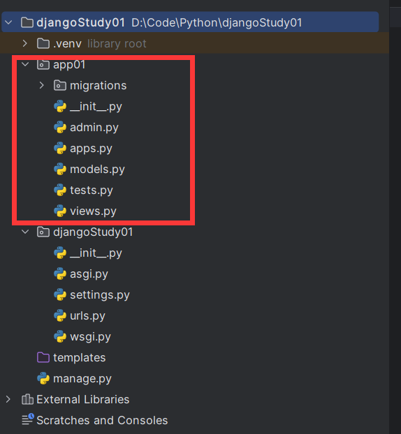
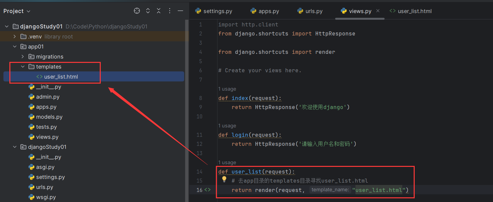

# 一 项目结构


1. manage.py

   用于项目的管理，启动项目，创建APP，数据管理。不需要动。

2. settings.py

   项目配置，常需要操作。

3. urls.py

   URL和函数的对应关系，常需要操作。

4. asgi.py和wsgi.py

   都是用于接收网络请求，不需要动，却别是asgi.py可以异步。

# 二 APP

```text
项目
	app,用户管理
	app,订单管理
	app,后台管理
	...
```

## app结构



1. apps.py 

   固定不动。

2. admin.py

   固定不动。

3. migrations

   固定不动。

4. test.py

   固定不动。单元测试

5. **views.py**

   重要，函数。

6. **models.py**

   重要，对数据库操作。

# 三 快速上手


## 1 确保APP已注册

注册位置


填入INSTALLED_APPS


## 2 编写URL和视图函数对应关系


## 3 编写视图函数

 


## 4 启动项目并访问


# 四 模板和静态文件


## 1 模板



通过url去访问静态资源的时候，会自动去app或者根目录的templates下去搜寻。

注意：


上图中，如果DIRS有做如上修改，资源的搜索优先级就是先搜寻根目录的templates然后才是各级app中的templates，如果没有则是先搜索app中的templates。


## 2 静态文件


同样存放在app下，命名必须为static，结构如上图所示。


# 五 请求和响应

```python
def something(request):
    # request是一个对象，封装了用户通过浏览器发过来的请求数据

    # 1.获取请求方式
    print(request.method)

    # 2.在URL上传递值
    print(request.GET)

    # 3.在请求体中提交数据
    print(request.POST)

    return HttpResponse('返回内容')
```


# 六 链接Mysql


## MySQL+pymysql

```python
import pymysql

# 1.连接Mysql
conn = pymysql.connect(host='127.0.0.1', port=3306, user='root', passwd='qaz5094515', charset='utf8', db='test')
cursor = conn.cursor(cursor=pymysql.cursors.DictCursor)

# 2.发送指令
cursor.excute('insert into admin(username,password,mobile)' values('test', 'test', 'test'))
conn.commit()

# 3.关闭
cursor.close()
conn.close()

```


## Django链接数据库

安装第三方模块

```bash
pip install mysqlclient
```

创建数据库后修改成如下所示。


至此，django会自行链接数据库。


# 七 ORM操作


## 1.通过类创建表


## 2.crud

```python
from app01.models import UserInfo # 请一定注意这里要使用app01.models 不能直接models不然直接报错

def orm(request):

    # 1.新建
    # UserInfo.objects.create('zmy')

    # 2.删除表 filter是筛选条件
    # UserInfo.objects.filter(id=1).delete()

    # 3.查询表 filter是筛选条件
    # UserInfo.objects.all()  获取所有数据
    # UserInfo.objects.filter(id=1).first()

    # 4.更新表
    UserInfo.objects.all().update(password='111')

    return HttpResponse('成功')
```


# 八 总结

在django中，大的功能模块通过app去划分，app都需要在settings中进行注册，然后再app中，urls相当于视图层，请求首先要去urls里面查找路径对应的接口，views相当于应用层，可以编写相应的业务逻辑代码，models相当于pojo实体类和持久层，django通过models创建对应实体类的数据库表格。
