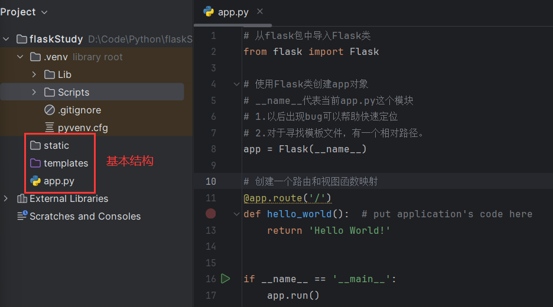
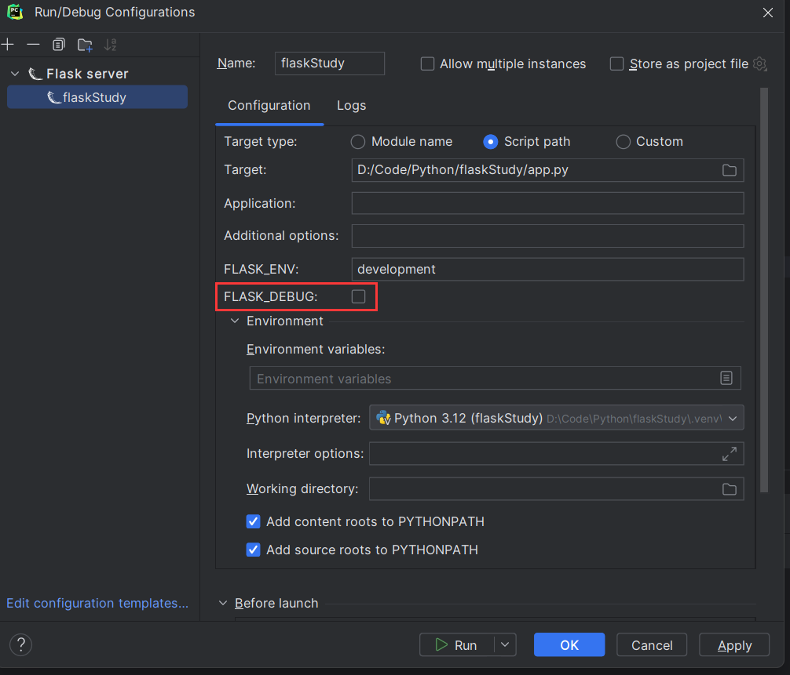
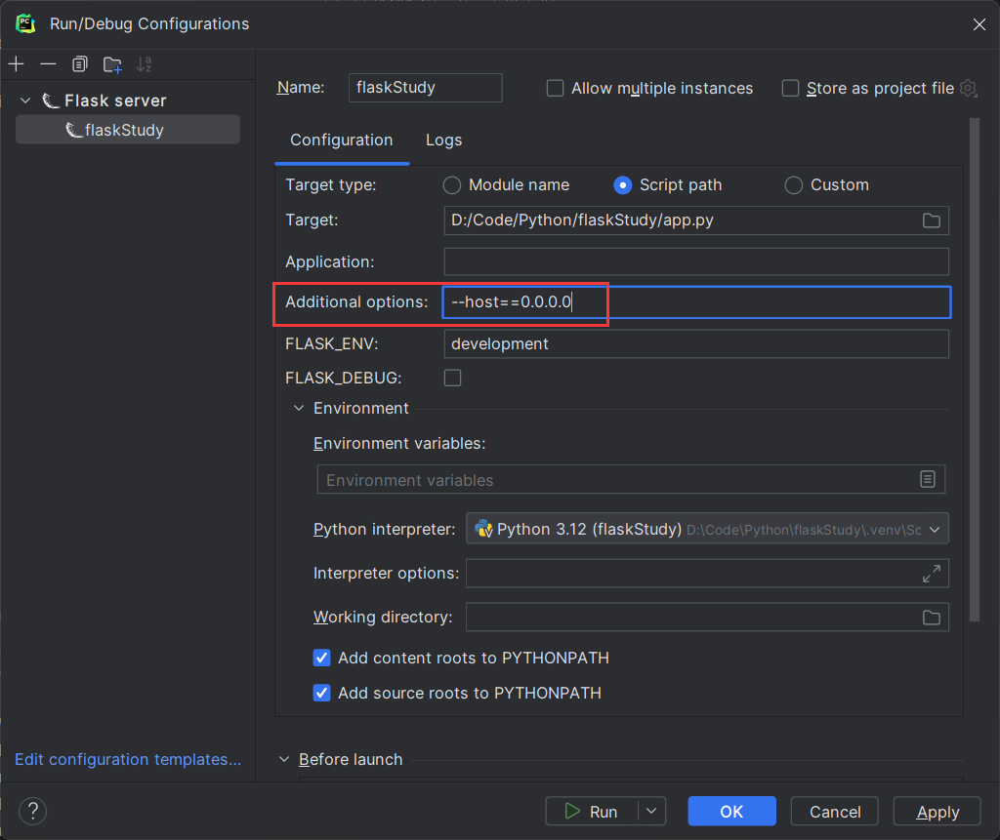
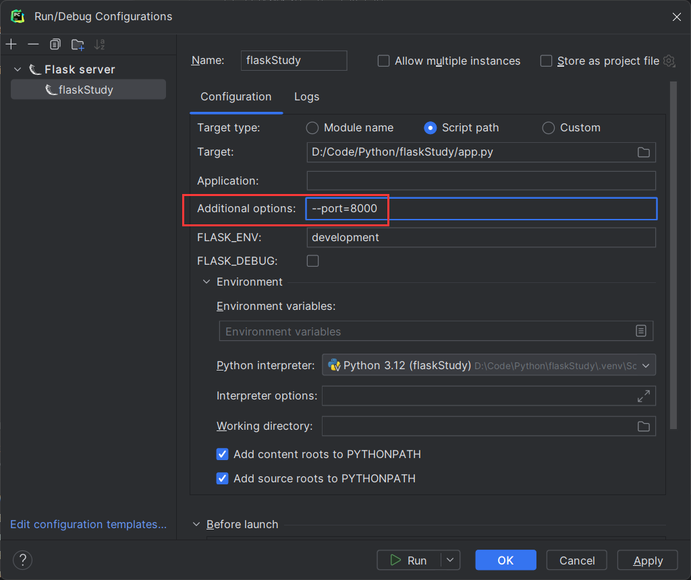

# 一 Flask入门




## 1 debug模式开启




## 2 修改host




## 3 修改端口




# 二 URL与视图

```python
# 带参数的url
# <>表示接受的参数，int表示定义参数类型。
# methods表示该路径能接受的类型请求。
#
@app.route('/smt/<int:smt_id>',methods=['GET','POST'], endpoint='smt')
def smt(smt_id):
    return f'something:{smt_id}'
```

代码中已经包含了URL的一些相关信息，浓缩自行提取。


## 1 自定义转换器

```python
from flask import Flask,request,render_template

# 自定义转换器
class RegexConverter(BaseConverter):

    def __init__(self, url_map, regex):
        # 调用父类方法
        super(RegexConverter,self).__init__(url_map)
        self.regex = regex

    def to_python(self, value):
        # 实现父类方法
        print('to_python方法被调用')
        return value

# 将自定义的转换器类添加到flask应用中
app.url_map.converters['re'] = RegexConverter

# re中可以填入正则表达式 定义规则
@app.route('/hello/<re("1\d{10}"):value>')
def hello(value):
    print(value)
    return "hello Nihao"

```


## 2 访问静态资源

```python
from flask import Flask,request,render_template

@app.route('/index',methods=['GET','POST'])
def index():
    return render_template('index.html')
```


# 三 请求和响应

index.html

```html
<!DOCTYPE html>
<html lang="en">
<head>
    <meta charset="UTF-8">
    <title>Title</title>
</head>
<body>
<form action="" method="post">
    账号：<br/>
    <input type="text" name="name">
    <br/>
    密码：<br/>
    <input type="password" name="pwd">
    <br/>
    <br/>
    <input type="submit" name="submit">
</form>
</body>
</html>
```

## 1 获取请求中的数据

```python
from flask import Flask,request

@app.route('/index',methods=['GET','POST'])
def index():
    if request.method == 'GET':
        return render_template('index.html')
    else:
        name = request.form.get('name')
        pwd = request.form.get('pwd')
        print(name,pwd)
        return "this is post"
```


## 2 重定向

```python
from flask import Flask,request,render_template,redirect

@app.route('/baidu')
def baidu():
    return redirect('https://www.baidu.com/')
```


## 3 响应

```python
from flask import Flask,jsonify

@app.route('/testResponse')
def testResponse():
    return jsonify({
        'name':'zmy'
    })

```

