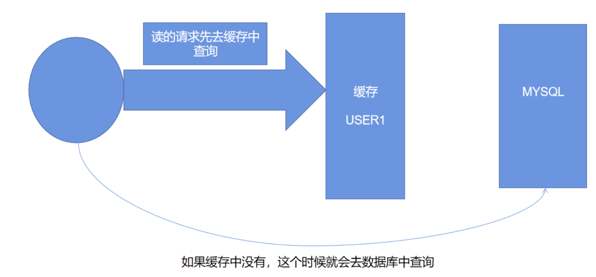

#NoSQL


## 什么是NoSQL

NoSQL = Not Only SQL（不仅仅是SQL）

泛指非关系型数据库，随着互联网的发展，传统的关系型数据库很难应付。

- Nosql的特点

- - 方便拓展（数据之间没有关系，很好拓展）

  - 大数据量高性能（Redis一秒写8万次，读取11万次,NoSQL的缓存记录级，是一种细粒度）

  - 数据类型是多样的（不需要事先设计数据库 随取随用）

  - 传统的RDBMS和NoSQL

  - - 传统的RDBMS

    - - 结构化组织
      - SQL
      - 数据和关系都存在单独表中 row colunm
      - 数据定义语言
      - 严格的一致性
      - 基础的事务
      - 。。。

    - NoSQL

    - - 不仅仅是数据
      - 没有固定的查询语言
      - 键值对存储，列存储，文档存储，图形数据库（社交关系）
      - 最终一致性
      - CAP定理 和 BASE（异地多活！）
      - 高性能，高可用，高拓展性
      - ...


##NoSQL的四大分类

###KV键值对

- 新浪：Redis
- 美团：Redis+Tair
- 阿里，百度：Redis+memecache

###文档行数据库

- MongoDB（一般必须要掌握）

- - 是一个基于分布式文件存储的数据库，C++编写，主要用来处理大量的文档。
  - 是一个介于关系型数据库和非关系型数据库中中间的产品
  - 是非关系型数据库中功能最丰富，最像关系习型数据库的

- ConthDB

###列存储数据库

- HBase
- 分布式文件系统

###图关系数据库

#Redis入门


##什么是Redis

Redis（Remote Dictionary Server )，即远程字典服务

Key-Value型数据库 免费 开源

redis会周期性的把更新的数据写入磁盘或者把修改操作写入追加的记录文件，并且在此基础上实现了master-slave(主从)同步


##Redis能干吗

- 内存存储，持久化
- 效率高，可以用于高速缓存
- 发布订阅系统
- 地图信息分析
- 计时器，计数器
- 。。。。。。


##Redis特性

- 多样的数据类型
- 持久化
- 集群
- 事务
- 。。。

#Redis 基础知识


使用16个数据库 默认使用第0个数据库


切换到第3个数据库 和 查看数据库大小


给3号数据库添加数据之后，查看大小为1


查看数据库中所有的key


清空当前数据库


清空所有数据库


#小结

**redis是单线程的！**

**redis是基于内存操作的，CPU不是redis的性能瓶颈**

**它的瓶颈是根据机器的内存和网络带宽，既然可以使用单线程就使用单线程了！**

Redis为什么单线程还这么快？（面试题）

核心：redis是将所有的数据全部放在内存中的，所以说使用单线程操作效率就是最高的（而CPU切换线程是要消耗时间的）多次读写都是在一个CPU上面的。

#**Redis-Key**

- keys * 查看所有key
- exist key 判断当前key是否存在
- move key 1 移除当前key
- expire key second 倒计时移除
- ttl key 查看当前key的剩余时间
- type key 查看当前key的一个类型

#**五大数据类型**

- 字符串（String）
- 散列（hashes）
- 列表（lists）
- 集合（sets）
- 有序集合（sorted sets）


##字符串类型（String）

- strlen key 查看key的长度
- append key "..." 往某个key中添加字符串“。。。” 如果key不存在 相当于创建key即set key
- incr key key的value值自增1
- decr key key的value值自减1
- del key 删除key-value
- incrby key num 可以设置步长，指定增量
- decrby key num 设置步长，指定减量
- getrange key start end 查看key的start下标到end下标范围内的值（截取字符串）
- setrange key offset xx 替代指定位置开始的字符串
- setex key 30 "hello" 设置key值为"hello" 30s后过期
- setnx key value 不存在设置，如果key已经存在就不会创建key(在分布式锁中常常使用)
- mset 批量设置key-value
- msetnx 即mset和setnx的合体效果
- set user:1 {name:zhangsan,age:3} 存储一个对象，以json字符串的格式
- getset db redis 先获取再去设置
- String类似的使用场景：value除了是字符串还可以是数字，计数器，统计多单位的数量


##列表类型（List）

- 所有的List命令都是以L开头的
- LPUSH key values 将一个值或者多个值，插入列表头部，（左边进栈）
- LRANGE key start end 范围内取值，当end=-1时相当于取出全部值
- LPOP 出栈
- Lindex 通过下标获得list中的某个值
- Llen key 返回列表的长度
- Lrem 移除指定值
- Rpush （右边进栈）
- Rpop （右边出栈）
- Ltrim 去除头尾元素
- Linsert 往某个key的前面或者后面插入一个值


## 集合类型（Set）

- Set命令都是以S开头的，并且set中的值是不能重读的
- Sadd set集合中添加元素
- smembers 查看指定set的所有值
- sismember 判断某一个值是不是在set集合中
- srem 移除指定元素
- scard 获取集合中元素个数
- srandmember 随机取出set集合中的一个元素
- smove key1 key2 将key1的值移动到key2
- sdiff key1 key2 将两个集合做差集
- sinter 交集
- sunion 并集


## 哈希（Hash）

- 它存储的是Map的集合，指令时H开头的
- hset Map key value 设定一个Map并存入key value
- hget map key 获取map里面的key的value值
- hmset 批量设定
- hmget 批量获取
- hgetall 获取所有的key-value
- hdel map key 删除map中指定的key的value
- hkeys 获得所有的key
- hvals 获得多有的value
- 本质上和String类型没有太多区别，只是从key-value形式编程key-Map形式,然后在Map中村keyvalue值


## 有序集合（ZSet）

- 在set的基础上,增加了一个值,指令以Z开头 
- 可以对数据进行排序
- zadd 设置
- zget 获取
- zrange 范围内获取
- zrangebyscore 
- zrem 移除集合中的指定元素
- zcard 获取集合中的个数
- zcount4

#**三种特殊数据类型**


##geospatial 地理位置

- 命令都是以geo开头的
- geoadd 添加位置
- geopos 获取位置
- geodist 计算两个key之间的距离
- georadius 以给定的经纬度为中心，找出范围内的元素
- georadiusbumember 以某个成员为中心，给定半径，查询以这个程
- GEO的底层就是Zset，可以用zset的命令来操作geo


##Hyperloglog 基数统计的算法 数据结构

- 网页的UV（一个人访问一个网站多次，但还是算作一个人个）
- 占用的内存比较小
- 所有指令以PF开头
- PFADD 添加元素，添加的元素不能是重复的
- PFcount 查询元素基数数量
- pfmerge 合并两个集合，并去重
- 有容错率！


##Bitmaps 位图

- 占用内存小
- setbit
- getbit
- bitcount

#事务

**Redis单条命令是保存原子性的，但是事务不保证原子性**

Redis事务没有隔离级别的概念

Redis事务的本质：一组命令的集合！

Redis的事务：

- 开启事务(multi)
- 命令入队(...)
- 执行事务(exec)
- 取消事务（discard）

```shell
127.0.0.1:6379> multi    //开启事务
OK
127.0.0.1:6379> set k1 v1
QUEUED
127.0.0.1:6379> set k2 v2    //执行操作
QUEUED
127.0.0.1:6379> set k3 v3
QUEUED
127.0.0.1:6379> exec    //执行事务
1) OK
2) OK
3) OK
```

```shell
127.0.0.1:6379> multi
OK
127.0.0.1:6379> set k1 v1
QUEUED
127.0.0.1:6379> set k2 v2
QUEUED
127.0.0.1:6379> getset k3    //错误命令
(error) ERR wrong number of arguments for 'getset' command
127.0.0.1:6379> set k3 v3
QUEUED
127.0.0.1:6379> exec    //事务执行失败
(error) EXECABORT Transaction discarded because of previous errors.
```

```shell
127.0.0.1:6379> multi
OK
127.0.0.1:6379> set k1 v1
QUEUED
127.0.0.1:6379> set k2 v2
QUEUED
127.0.0.1:6379> set k3 v3
QUEUED
127.0.0.1:6379> incr k1
QUEUED
127.0.0.1:6379> exec
1) OK
2) OK
3) OK
4) (error) ERR value is not an integer or out of range    //虽然事务中有错误，但是第1，2，3条命令还是执行了
```


悲观锁：默认什么条件下都会出问题，无论做什么都会加锁。

乐观锁：默认什么条件下都不会出现问题，所以不会上锁，更新数据的时候去判断一下，在此期间是否有人修改过这个数据。

# Redis监视

watch命令

```shell
127.0.0.1:6379> set money 100
OK
127.0.0.1:6379> set out 0
OK
127.0.0.1:6379> watch money    //监视money对象
OK
127.0.0.1:6379> multi    //事务正常结束，数据期间没有发生变动，这个时候就正常执行成功！
OK
127.0.0.1:6379> decrby money 20
QUEUED
127.0.0.1:6379> incrby out 20
QUEUED
127.0.0.1:6379> exec
1) (integer) 80
2) (integer) 20
```

测试多线程修改值，监视失败！

线程1：

```shell
127.0.0.1:6379> watch money
OK
127.0.0.1:6379> multi
OK
127.0.0.1:6379> decrby money 20
QUEUED
127.0.0.1:6379> incrby out 20
QUEUED
//此时并没有执行exec提交事务    第一步


//此时提交事务    第三步
127.0.0.1:6379> exec
(nil)    //显示修改失败

```

线程2：

```shell
127.0.0.1:6379> get money
"80"
127.0.0.1:6379> set money 1000    //直接修改money的值，此时线程1并没有提交事务    第二步
OK
```

# Jedis

Jedis是redis官方推荐的java连接开发工具，使用java操作Redis中间件！如果你要使用java操作Redis，那么一定要对jedis十分熟悉。

Redis的配置文件 redis.conf

```xml
# 1k => 1000 bytes
# 1kb => 1024 bytes
# 1m => 1000000 bytes
# 1mb => 1024*1024 bytes
# 1g => 1000000000 bytes
# 1gb => 1024*1024*1024 bytes

配置文件unit单位对大小写不敏感

# include /path/to/local.conf
# include /path/to/other.conf

包含的其他的配置文件

# IF YOU ARE SURE YOU WANT YOUR INSTANCE TO LISTEN TO ALL THE INTERFACES
# JUST COMMENT THE FOLLOWING LINE.
# ~~~~~~~~~~~~~~~~~~~~~~~~~~~~~~~~~~~~~~~~~~~~~~~~~~~~~~~~~~~~~~~~~~~~~~~~
bind 127.0.0.1

绑定的IP

# Accept connections on the specified port, default is 6379 (IANA #815344).
# If port 0 is specified Redis will not listen on a TCP socket.
port 6379

绑定的端口

# Accept connections on the specified port, default is 6379 (IANA #815344).
# If port 0 is specified Redis will not listen on a TCP socket.
port 6379

绑定的端口

# By default Redis does not run as a daemon. Use 'yes' if you need it.
# Note that Redis will write a pid file in /var/run/redis.pid when daemonized.
daemonize yes

以守护进程的方式进行，默认是开启的

# Creating a pid file is best effort: if Redis is not able to create it
# nothing bad happens, the server will start and run normally.
pidfile /var/run/redis_6379.pid

如果以后台的方式运行，就需要指定一个pid文件

# Set the number of databases. The default database is DB 0, you can select
# a different one on a per-connection basis using SELECT <dbid> where
# dbid is a number between 0 and 'databases'-1
databases 16

默认数据库数量 默认16个

#
#   In the example below the behaviour will be to save:
#   after 900 sec (15 min) if at least 1 key changed
#   after 300 sec (5 min) if at least 10 keys changed
#   after 60 sec if at least 10000 keys changed
#
#   Note: you can disable saving completely by commenting out all "save" lines.
#
#   It is also possible to remove all the previously configured save
#   points by adding a save directive with a single empty string argument
#   like in the following example:
#
#   save ""


save 900 1        //如果900秒内，有1个key进行了修改，就进行持久化操作 ，下同
save 300 10
save 60 10000

# By default Redis will stop accepting writes if RDB snapshots are enabled
# (at least one save point) and the latest background save failed.
# This will make the user aware (in a hard way) that data is not persisting
# on disk properly, otherwise chances are that no one will notice and some
# disaster will happen.
#
# If the background saving process will start working again Redis will
# automatically allow writes again.
#
# However if you have setup your proper monitoring of the Redis server
# and persistence, you may want to disable this feature so that Redis will
# continue to work as usual even if there are problems with disk,
# permissions, and so forth.
stop-writes-on-bgsave-error yes        //若持久化出错了是否继续工作 默认是继续工作的
    
    # Compress string objects using LZF when dump .rdb databases?
# For default that's set to 'yes' as it's almost always a win.
# If you want to save some CPU in the saving child set it to 'no' but
# the dataset will likely be bigger if you have compressible values or keys.
rdbcompression yes

是否压缩rdb文件

rdbchecksum yes

是否检查rdb文件

# The working directory.
#
# The DB will be written inside this directory, with the filename specified
# above using the 'dbfilename' configuration directive.
#
# The Append Only File will also be created inside this directory.
#
# Note that you must specify a directory here, not a file name.
dir ./

rdb文件保存目录
```

# Redis持久化

在指定的时间间隔内将内存中的数据集快照（Snapshot快照）写入磁盘，它恢复时是将快照文件直接读到内存里面。

Redis会单独创建一个子进程来进行持久化，会先将数据写入到一个临时文件中，待持久化过程都结束了，再用这个临时文件替换上次持久化好的文件，整个过程中，主进程是不进行任何IO操作的。这就确保了极高的性能。如果需要进行大规模数据的恢复，且对于数据恢复的完整性不是非常敏感，那RDB方式要比AOF方式更加的高校。RDB的缺点是最后一次持久化后的数据可能丢失。

rdb保存的文件时dump.rdb

再配置文件中，下面这段代码可以修改文件名

```xml
# The filename where to dump the DB
dbfilename dump.rdb
```

在配置文件中，下面表示只要60s内修改了5次key，就会触发rdb操作

```xml
#   It is also possible to remove all the previously configured save
#   points by adding a save directive with a single empty string argument
#   like in the following example:
#
#   save ""


# save 900 1
# save 300 10
# save 60 10000
save 60 5
```

还有aof，aof是通过保存服务器所执行过的所有命令，将这些命令打包成一个aof文件，然后给其他服务器执行，默认情况下aof服务一般不开启，aof是每隔1秒记录一次。

#**Redis主从复制**

**概念**

主从复制，是指将一台Redis服务器的数据，复制到其他的Redis服务器，前者称为主节点，后者称为从节点：**数据的复制是单向的，只能由主节点到从节点！**，主节点以写为主，从节点以读为主。**最基础都是一主二从**

主从复制的作用：

- 数据冗余：主从复制实现了数据的热备份，是持久化之外的一种数据冗余方式。
- 故障恢复：当主节点出现问题时，可以由从节点提供服务，实现快速的故障恢复，实际上是一种服务的冗余。
- 负载均衡：在主从复制的基础上，配合读写分离，可以由主节点提供写服务，由从节点提供读服务（即写Redis数据时应用连接主节点，读Redis数据时应用连接从节点），分担服务器负载，尤其是在写少读多的场景下，通过多个从节点分担读负载，可以大大提高Redis服务器的并发量
- 高可用（集群）基石：除了上述作用以外：主从复制还是哨兵和集群能够实施的基础。因此说主从复制是Redis高可用的基础。

在连接client之后输入info-replication指令，可以查看当前角色时主机还是从机

数据如slaveof命令可以改变当前角色

主机中所有的数据都会被从机自动复制

主机断开连接，从机依旧连接到主机，但是没有写操作，如果主机断开之后又重新上线，从机依旧可以直接获取到主机写的信息

如果是使用命令行配置的主从机，当从机重启之后，从机又变成了主机，但是如果此时再把它设为从机，主机的数据又会写回此时的从机。

Slave启动成功连接到master后会发送一个sync同步命令，master接到命令，启动后台的存盘进程，同时收集所有接收到的用于修改数据集命令，在后台进程执行完毕之后，master将传送整个数据文件到slave，并完成一次完全同步

全量复制：salve服务在接搜到数据库文件数据后，将其存盘并加载到内存中。

增量复制：主节点继续将新的所有收集到的修改命令依次传给slave，完成同步

如果主机断开连接，我们可以使用 slaveof no one 使自己成为主机。（哨兵模式之前都是手动选择老大master），之前的master如果此时回来了，那之前的master就不是老大了。

**哨兵模式（面试问题，自动选举老大）**

主从切换技术的方法是：当主服务器宕机后，需要手动把一台从服务器切换为主服务器，这就需要人工干预，费时费力，还会造成一段时间内服务不可用，这不是一种推荐的方式，更多时候，我们优先考虑哨兵模式，Redis从2.8来时正式提供了Sentinel（哨兵）架构来解决这个问题。

哨兵模式是一种特殊的模式，首先Redis提供了哨兵的命令，**哨兵是一个独立的进程，作为进程，他会独立的运行**。其原理是**哨兵通过发送命令，等待Redis服务器响应，从而监控运行多个Redis实例**。

然而，一个哨兵进程对Redis服务器进行监控可能会出现问题，为此，我们可以使用多个哨兵进行监控，各个哨兵之间还会进行监控，这样就形成了多哨兵模式。


假设主服务器宕机，哨兵1首先检测到这个结果，系统并不会马上进行failover过程，仅仅是哨兵1主观的认为服务器不可用，这个现象称为**主观下线**，当后面的哨兵也检测到主服务器不可用时，并且数量达到一定值时，那么哨兵之间就会进行一次投票，投票的结果由一个哨兵发起，进行failover（故障转移）操作，切换成功后，就会通过发布订阅模式，让各个哨兵把自己监控的服务器实现切换主机，这个过程称为**客观下线**。


1.配置哨兵配置文件：

```
#sentinel monitor 被检控的名称 host port 1

sentinel monitor myredis 127.0.0.1 6379 1
```

后面的这个数字1，代表主机挂了，salve投票看让谁接替成为主机，票数最多的，就会成为主机。

2.启动哨兵

redis-sentinel 配置文件夹/sentinel.conf

投票有投票算法

在哨兵模式下，主机A宕机之后，在哨兵选出新的主机B，然后原来的主机A回来了，此时主机A不会是主机了，但是当哨兵扫描到主机A的话，会让主机A成为主机B的从机，此时老大变成主机B。

优点

- 哨兵集群式基于主从复制模式。
- 主从可以自动切换，故障可以转移，系统可用性更好，健壮性高。

缺点：不好在线拓容。

#**Redis缓存穿透和雪崩**



==**缓存穿透（查不到）**==：如上图，用户想要查询一个数据，发现redis内存数据库没有这项数据，也就是缓存没有命中，于是向持久层数据库查询，发现也没有，于是本次查询失败，当用户很多的时候，缓存都没有命中，于是都去请求了持久层数据库。这会给持久层数据库造成很大的压力，这时候就相当于出现了缓存穿透。

简言之：用户请求的数据由于缓存没有命中，致使所有请求此数据的请求全部前往了持久层的数据库，就是缓存穿透。

解决方案：

- 布隆过滤器：布隆过滤器是一种数据结构，对所有可能查询的参数以hash形式存储，在控制层先进行校验，不符合则丢弃。
- 缓存空对象：当存储层不命中后，即使返回的空对象也将其缓存起来，同时会设置一i个过期时间，之后在访问这个数据将会从缓存中获取。

**==缓存击穿==（量太大，缓存过期！**）：缓存击穿，是指一个key非常热点，在不停的扛着大并发，大并发集中对着一个点进行访问，当这个key在失效的瞬息间，持续的大并发就穿破缓存，直接请求数据库。

解决方案：

- 设置热点永不过期
- 分布式锁：加锁保证只有一个

**==缓存雪崩==**：是指在某一个时间段，缓存集中过期失效，Redis服务器宕机！