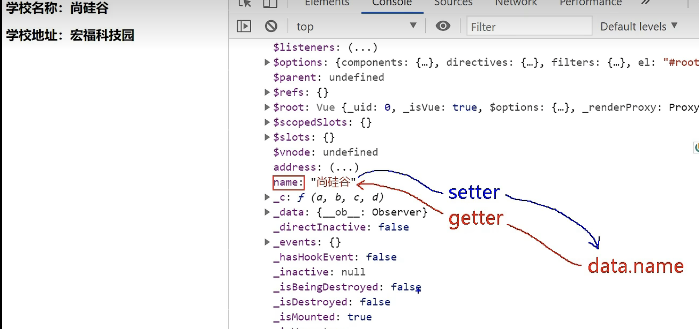

# Vue


## vue-1 初识Vue

### vue实例

    	初始Vue：
        1. 想让Vue工作，就必须创建一个Vue实例，且要传入一个配置对象
        2. root容器里的代码依然符合html规范，只不过混入了一些特殊的vue语法
        3. root容器里面的代码被称为Vue模板

~~~html
<!DOCTYPE html>
<html>
    <head>
        <meta charset="UTF-8" />
        <title>初始Vue</title>
        <script src="https://cdn.jsdelivr.net/npm/vue@2.7.14/dist/vue.js"></script>
    </head>
    <body>
        <!--
        初始Vue：
        想让Vue工作，就必须创建一个Vue实例，且要传入一个配置对象
        root容器里的代码依然符合html规范，只不过混入了一些特殊的vue语法
        root容器里面的代码被称为Vue模板
        Vue实例和容器是一一对应的
        真实开发中只有一个Vue实例，且xxx可以自动读取到data中所有的属性
        -->

        <!--准备好一个容器-->
        <div id="root">
            <h1>hello, {{name}}</h1>
            <h1>我的年龄是：{{age}}</h1>
        </div>

        <script type="text/javascript">
            Vue.config.productionTip = false // 阻止Vue在启动时生成生产提示

            // 创建vue实例
            const x = new Vue({
                el: '#root', //el用于指定当前vue实例为哪个容器服务，值通常为css选择器字符串，用于与容器建立联系
                data: { //data中用于存储数据，数据供el所指定的容器去使用
                    name: 'zmy',
                    age: 18
                }
            })

        </script>
    </body>

</html>
~~~

```
Vue实例和容器是一一对应的
真实开发中只有一个Vue实例，且xxx可以自动读取到data中所有的属性
```


## vue-2 Vue模板语法

### 插值语法

### 指令语法

    1. 插值语法
        功能：用于解析标签体内容。
        写法：{{xxx}} ，xxx是js表达式，且可以直接读取到data中的所有属性。
    2. 指令语法
        功能：用于解析标签（包括：标签属性，标签体内容，绑定事件。。。）
        举例：v-bind:href='xxx' 或 简写为:href='xxx' xxx同样是js表达式，且可以直接读取到data中的所有属性
        备注：Vue中有很多指令，且形式都是v-???，此处只拿v-bind举例子

```html
<!DOCTYPE html>
<html>
<head>
    <meta charset="UTF-8" />
    <title>模板语法</title>
    <script src="https://cdn.jsdelivr.net/npm/vue@2.7.14/dist/vue.js"></script>
</head>
<body>
<!--
    1. 插值语法
        功能：用于解析标签体内容。
        写法：{{xxx}} ，xxx是js表达式，且可以直接读取到data中的所有属性。
    2. 指令语法
        功能：用于解析标签（包括：标签属性，标签体内容，绑定事件。。。）
        举例：v-bind:href='xxx' 或 简写为:href='xxx' xxx同样是js表达式，且可以直接读取到data中的所有属性
        备注：Vue中有很多指令，且形式都是v-???，此处只拿v-bind举例子
-->

<!--准备好一个容器-->
<div id="root">
    <h1>插值语法</h1>
    <h1>你好，{{name}}</h1>


    <h1>指令语法</h1>
    <a v-bind:href='url' >点我去百度</a>
    <a :href='url' >点我去百度2</a>
    <!--
    使用了v-bind绑定之后就会把引号里面的url当成表达式执行，而url的表达式在下面的vue_data里面
    同时v-bind ===>  : 可以简写成冒号
    -->
</div>

<script type="text/javascript">
    Vue.config.productionTip = false // 阻止Vue在启动时生成生产提示

    // 创建vue实例
    const x = new Vue({
        el: '#root', //el用于指定当前vue实例为哪个容器服务，值通常为css选择器字符串，用于与容器建立联系
        data: { //data中用于存储数据，数据供el所指定的容器去使用
            name: '周谋远',
            url: 'https://www.baidu.com'
        }
    })

</script>
</body>

</html>
```


## vue-3 数据绑定

### 数据单向绑定

### 数据双向绑定

```html
<!DOCTYPE html>
<html>
<head>
  <meta charset="UTF-8" />
  <title>数据绑定</title>
  <script src="https://cdn.jsdelivr.net/npm/vue@2.7.14/dist/vue.js"></script>
</head>
<body>
<!--

-->

<!--准备好一个容器-->
<div id="root">
  单向数据绑定：<input type="text" v-bind:value="name" />  <br/>
  单向数据绑定(简写)：<input type="text" v-bind:value="name" /><br/>
<!--
  v-bind只能实现数据的单向绑定，也就是说，修改下面Vue实例中data里面的name则上面的input框中的显示数据会改变，但是在input框中输入数据是不会改变Vue实例中data里面name的数据的。
-->
  双向数据绑定：<input type="text" v-model:value="name" /><br/>
  双向数据绑定(简写)：<input type="text" v-model="name" /><br/>
<!--
  v-model能够实现数据的双向绑定，也就是任意一方改变数据，另一方也会改变。但是v-model不能用在任意元素上，只能用在表单类元素（输入元素,如input,select）上，像是标题类的标签不支持输入就不能使用v-model。
  v-model:value 可以简写为v-model 因为v-model默认收集的就是value值
-->

</div>

<script type="text/javascript">
  Vue.config.productionTip = false // 阻止Vue在启动时生成生产提示

  // 创建vue实例
  const x = new Vue({
    el: '#root', //el用于指定当前vue实例为哪个容器服务，值通常为css选择器字符串，用于与容器建立联系
    data: { //data中用于存储数据，数据供el所指定的容器去使用
      name: '周谋远',
      url: 'https://www.baidu.com'
    }
  })

</script>
</body>

</html>
```


## vue-4 el与data的两种写法

### el和data的两种写法

```html
<!DOCTYPE html>
<html>
<head>
    <meta charset="UTF-8" />
    <title>el和data的两种写法</title>
    <script src="https://cdn.jsdelivr.net/npm/vue@2.7.14/dist/vue.js"></script>
</head>
<body>
<!--

-->

<!--准备好一个容器-->
<div id="root">
    <h1>hello, {{name}}</h1>

</div>

<script type="text/javascript">
    Vue.config.productionTip = false

    // el的两种写法
    /*const x = new Vue({
        //el: '#root',  //el第一种写法
        data: {
            name: 'zmy',
            age: 18
        }
    })
    x.$mount('#root')   //el第二种写法   mount是挂载的意思*/

    // data的两种写法
    new Vue({
        el: '#root',
        // data的第一种写法，对象式
        /*data: {
            name: 'zmy',
            age: 18
        }*/

        // data的第二种写法，函数式
        data:function () {  //data函数不能写成箭头函数
            console.log('111', this) //此处的this是Vue实例对象
            return {
                name:'周谋远'
            }
        }
    })

</script>
</body>

</html>
```


## vue-5 MVVM模型

### mvvm模型

```html
<!DOCTYPE html>
<html>
<head>
  <meta charset="UTF-8" />
  <title>MVVM模型</title>
  <script src="https://cdn.jsdelivr.net/npm/vue@2.7.14/dist/vue.js"></script>
</head>
<body>
<!--
  MVVM模型：
    1：M：模型，data中的数据
    2：V：视图，模板代码
    3：VM：使徒模型，Vue实例
  观察发现：
    1：data中所有的属性，最后都出现在了vm身上。
    2：vm身上所有的属性及Vue原型上所有属性，在Vue模板中都可以直接使用。
-->

<!--准备好一个容器-->
<div id="root">
  <h1>hello, {{name}}</h1>
  <h1>我的年龄是：{{age}}</h1>
  <h1>我的年龄是：{{$options}}</h1><!--data中未出现，但是能有东西，这个vue原型所带的一些基本数据。-->
  <h1>我的年龄是：{{$emit}}</h1>
</div>

<script type="text/javascript">
  Vue.config.productionTip = false

  // 创建vue实例
  const vm = new Vue({
    el: '#root',
    data: {
      name: 'zmy',
      age: 18
    }
  })

</script>
</body>

</html>
```


## vue-6 数据代理

### 回顾object.defineproper

```html
<!DOCTYPE html>
<html>
<head>
    <meta charset="UTF-8" />
    <title>回顾Object.defineproperty方法</title>
</head>
<body>
<!--

-->

<div id="root">

</div>

<script type="text/javascript">
    let person = {
        name:'张三',
        sex:'男'
    }

    let num = 18

    Object.defineProperty(person, 'age', { //给person定义一个age属性
        // value:18,
        // enumerable:true, //控制属性是否可以枚举 默认值是false
        // writable:true, //控制属性是否可以被修改 默认值是false
        // configurable:true //控制属性是否可以被删除 默认值是false

        get:function () {   //当有人读取person的age属性时，get函数（getter）就会被调用，且返回值就是age的值
            return num
        },

        set(value){  //当有人修改person的age属性时，set函数（setter）就会被调用，且会收到修改的具体值
            alert('有人修改了值，值是：'+value)
        }
    })


</script>
</body>

</html>
```

### 何为数据代理？

```html
<!DOCTYPE html>
<html>
<head>
  <meta charset="UTF-8" />
  <title>何为数据代理</title>
  <script src="https://cdn.jsdelivr.net/npm/vue@2.7.14/dist/vue.js"></script>
</head>
<body>
<!--

-->

<!--  数据代理： 通过一个对象代理对另一个对象中属性的操作（读/写） -->
<div id="root">

</div>

<script type="text/javascript">
  let obj = {x:100}
  let obj2 = {y:200}

  Object.defineProperty(obj2,'x',{
    get(){
      return obj.x
    },
    set(value){
      obj.x = value
    }
  })

</script>
</body>

</html>
```

### vue中的数据代理

    1. Vue中的数据代理：
        通过vm对象来代理data对象中属性的操作（读/写）
    2. Vue中数据代理的好处：
        更加方便的操作data中的数据
    3. 基本原理：
        通过Object.defineProperty()把data对象中的所有属性添加到vm上。
        为每一个添加到vm上的属性都指定一个getter和setter
        在getter/setter内部去操作（读/写）data中对应的属性

```html
<!DOCTYPE html>
<html>
<head>
    <meta charset="UTF-8" />
    <title>Vue中的数据代理</title>
    <script src="https://cdn.jsdelivr.net/npm/vue@2.7.14/dist/vue.js"></script>
</head>
<body>
<!--
    1. Vue中的数据代理：
        通过vm对象来代理data对象中属性的操作（读/写）
    2. Vue中数据代理的好处：
        更加方便的操作data中的数据
    3. 基本原理：
        通过Object.defineProperty()把data对象中的所有属性添加到vm上。
        为每一个添加到vm上的属性都指定一个getter和setter
        在getter/setter内部去操作（读/写）data中对应的属性
-->

<!--  数据代理： 通过一个对象代理对另一个对象中属性的操作（读/写） 在这里就是vue实例（vm）代理了data的里面的name和address -->
<div id="root">
    <h2>学校名称：{{name}}</h2>
    <h2>学校地址：{{address}}</h2>
</div>

<script type="text/javascript">
    Vue.config.productionTip = false

    // 创建vue实例
    const vm = new Vue({
        el: '#root',
        data: { // vm._data === data
            name: '哥伦比亚大学',
            address: '哥伦比亚'
        }
    })

</script>
</body>

</html>
```

==vm._data = data==




## vue-7 事件处理

### 事件的基本使用

事件的基本使用：

1. 使用v-on:xxx 或@xxx绑定事件，其中xxx是事件名。
2. 事件的回调需要配置在methods对象中，最终会在vm上。
3. methods中配置的函数，==不要使用箭头函数！==否则this就不是vm了。
4. methods中配置的函数，都是被Vue所管理的函数，this的指向是vm或组件实例对象。
5. @click='demo' 和 @click='demo($event)' 效果一致，但后者可以传参。

```html
<!DOCTYPE html>
<html>
<head>
    <meta charset="UTF-8" />
    <title>事件处理</title>
    <script src="https://cdn.jsdelivr.net/npm/vue@2.7.14/dist/vue.js"></script>
</head>
<body>
<!--

-->

<!--准备好一个容器-->
<div id="root">
    <h1>hello, {{name}}</h1>
<!--    <button v-on:click="showInfo">点我提示信息</button>-->
    <button @click="showInfo1">点我提示信息（不传参）</button>
    <button @click="showInfo2(666,$event)">点我提示信息（传参）</button>
</div>

<script type="text/javascript">
    Vue.config.productionTip = false // 阻止Vue在启动时生成生产提示

    // 创建vue实例
    const x = new Vue({
        el: '#root', //el用于指定当前vue实例为哪个容器服务，值通常为css选择器字符串，用于与容器建立联系
        data: { //data中用于存储数据，数据供el所指定的容器去使用
            name: '周谋远',
            age: 18
        },
        methods:{
            showInfo(event){ //event代表接收到一个事件
                alert('你好帅哥')
                // console.log(event.target)   //event.target代表拿到了button元素
                // console.log(this)    // 此处的this就是vm  //如果showInfo改成了showInfo:()=>{}这样的箭头函数 那么this指向的就是window 所以一般方法不能写成箭头函数
            },

            showInfo1(event){ //event代表接收到一个事件
                alert('你好帅哥')
            },
            
            showInfo2(number,a){ //此处的a就是对应上面的event 接受顺序对应
                alert('你好帅哥' + number)

            }
        }
    })

</script>
</body>

</html>
```

### 事件修饰符

Vue中的事件修饰符

1. prevent：阻止默认事件（常用）
2. stop：阻止事件冒泡（常用）
3. once：事件只触发一次（常用）
4. capture：使用事件的捕获模式
5. self：只有event.target是当前操作的元素时才触发事件
6. passive：事件的默认行为立即执行，无需等待事件回调执行完毕

```html
<!DOCTYPE html>
<html>
    <head>
        <meta charset="UTF-8" />
        <title>事件修饰符</title>
        <script src="https://cdn.jsdelivr.net/npm/vue@2.7.14/dist/vue.js"></script>
        <style>
            *{
                margin-top: 20px;
            }
            .demo1{
                height: 50px;
                background-color: deepskyblue;
            }
            .box1{
                padding: 5px;
                background-color: deepskyblue;
            }
            .box2{
                padding: 5px;
                background-color: orange;
            }
            .list{
                width: 200px;
                height: 200px;
                background-color: peru;
                overflow: auto;
            }
            li{
                height: 100px;
            }
        </style>
    </head>
<body>
<!--

-->

<!--准备好一个容器-->
<div id="root">
    <h1>{{name}},欢迎你开始学习</h1>
<!--    阻止默认事件（常用）-->
    <a href="http://www.baidu.com" @click.prevent="showInfo">点我冲</a>

<!--    阻止事件冒泡（常用）-->
    <div class="demo1" @click="showInfo">
    <button @click.stop="showInfo">点我提示信息</button>
    </div>

<!--    事件只触发一次（常用）-->
    <button @click.once="showInfo">点我提示信息</button>

<!--    使用事件的捕获模式-->
    <div class="box1" @click.capture="showMsg(1)">
        div1
        <div class="box2" @click="showMsg(2)">
            div2
        </div>
    </div>

<!--    self:只有event.target是当前操作对象时-->
    <div class="demo1" @click.self="showInfo">
        <button @click="showInfo">点我提示信息</button>
    </div>

<!--    事件默认立即执行
        @scroll是滚动条的滚动
        @wheel是鼠标滚轮的滚动
-->
    <ul @wheel.passive="demo" class="list">
        <li>1</li>
        <li>2</li>
        <li>3</li>
        <li>4</li>
    </ul>

</div>

<script type="text/javascript">
    Vue.config.productionTip = false // 阻止Vue在启动时生成生产提示

    // 创建vue实例
    const x = new Vue({
        el: '#root',
        data: {
            name: '周谋远',
        },
        methods:{
            showInfo(e){
                alert('欢迎啊!!')
            },

            showMsg(msg){
                alert(msg)
            },

            demo(){
                for (let i = 0; i < 5; i++) {
                    alert('#')
                }
                alert('累坏了')
            }
        }
    })

</script>
</body>

</html>
```

### 键盘事件

1. Vue中常用的按键别名：
   1. 回车：enter
   2. 删除：delete
   3. 退出：esc
   4. 空格：space
   5. 换行：tab（特殊：只能配合keydown使用）
   6. 上：up
   7. 下：down
   8. 左：left
   9. 右：right
2. Vue未提供别名的按键，可以使用按键的原始key值去绑定，但注意要转为kebab-case（短横线命名，小写）
3. 系统修饰键（用法特殊）：ctrl alt shift meta
   1. 配合keyup使用：按下修饰键的同时，再按下其他键，随后释放其他键，事件才被触发
   2. 配合keydown使用：正常触发事件。
4. 也可以使用keycode去指定具体按键（不推荐）
5. Vue.config.keyCodes.自定义键名 = 键码，可以去定制按键别名。


## vue-8 计算属性

### 姓名案例-插值语法实现

```html
<!DOCTYPE html>
<html>
<head>
  <meta charset="UTF-8" />
  <title>姓名案例-插值语法实现</title>
  <script src="https://cdn.jsdelivr.net/npm/vue@2.7.14/dist/vue.js"></script>
</head>
<body>
<!--

-->

<!--准备好一个容器-->
<div id="root">
  姓：<input type="text" v-model="firstName"> <br/>
  名：<input type="text" v-model="lastName"> <br/>
  姓名：<span>{{firstName.slice(0, 3)}}-{{lastName}}</span>
</div>

<script type="text/javascript">
  Vue.config.productionTip = false // 阻止Vue在启动时生成生产提示

  // 创建vue实例
  const x = new Vue({
    el: '#root', //el用于指定当前vue实例为哪个容器服务，值通常为css选择器字符串，用于与容器建立联系
    data: { //data中用于存储数据，数据供el所指定的容器去使用
      firstName: '张',
      lastName: '三'
    }
  })

</script>
</body>

</html>
```

### 姓名案例-methods方法实现

```html
<!DOCTYPE html>
<html>
<head>
  <meta charset="UTF-8" />
  <title>姓名案例-methods实现</title>
  <script src="https://cdn.jsdelivr.net/npm/vue@2.7.14/dist/vue.js"></script>
</head>
<body>
<!--
    注意，data里面的值发生改变，Vue会把模板全部重新渲染一遍
	如果采用methods方法实现该效果，那么当调用多次fullName时，方法也会被多次调用，很影响效率，故而一般不采用这种方式
-->

<!--准备好一个容器-->
<div id="root">
  姓：<input type="text" v-model="firstName"> <br/>
  名：<input type="text" v-model="lastName"> <br/>
  姓名：<span>{{fullName()}}</span>
</div>

<script type="text/javascript">
  Vue.config.productionTip = false // 阻止Vue在启动时生成生产提示

  // 创建vue实例
  const x = new Vue({
    el: '#root', //el用于指定当前vue实例为哪个容器服务，值通常为css选择器字符串，用于与容器建立联系
    data: { //data中用于存储数据，数据供el所指定的容器去使用
      firstName: '张',
      lastName: '三'
    },
    methods:{
      fullName(){
        return this.firstName + '-' + this.lastName
      }
    }
  })

</script>
</body>

</html>
```

### 姓名案例-计算属性实现

1. 定义：要用的属性不存在，要通过已有的属性计算得来
2. 原理：底层借助了Object.defineProperty方法提供的getter和setter
3. 优势： 与methods实现相比，内部有缓存机制，效率更高，调试方便。
4. 备注：
   1. 计算属性最终会出现再vm行，直接读取使用即可。
   2. 如果计算属性要被修改，那必须写set函数去响应修改，且set中要引起计算时以来的数据发生改动

```html
<!DOCTYPE html>
<html>
<head>
  <meta charset="UTF-8" />
  <title>姓名案例-计算属性实现</title>
  <script src="https://cdn.jsdelivr.net/npm/vue@2.7.14/dist/vue.js"></script>
</head>
<body>
<!--
  
-->

<!--准备好一个容器-->
<div id="root">
  姓：<input type="text" v-model="firstName"> <br/>
  名：<input type="text" v-model="lastName"> <br/>
  姓名：<span>{{fullName}}</span>
</div>

<script type="text/javascript">
  Vue.config.productionTip = false // 阻止Vue在启动时生成生产提示

  // 创建vue实例
  const x = new Vue({
    el: '#root', //el用于指定当前vue实例为哪个容器服务，值通常为css选择器字符串，用于与容器建立联系
    data: { //data中用于存储数据，数据供el所指定的容器去使用
      firstName: '张',
      lastName: '三',
    },
    computed: {
      fullName: {
        // get有什么作用？ 当有人读取fullName时get就会被调用，请回想之前学的defineProperty
        // get什么时候调用？？  1.初次读取fullName时 2.所依赖的数据发生变化时
        get(){
          return this.firstName + '-' + this.lastName
        },
        // set什么时候调用？ 当fullName被修改时。
        set(value){
          const arr = value.split('-')
          this.firstName = arr[0]
          this.lastName = arr[1]
        }
      }
    }

  })

</script>
</body>

</html>
```
