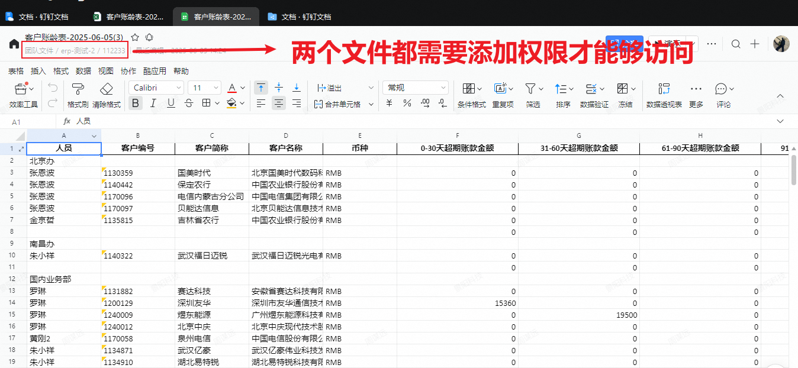
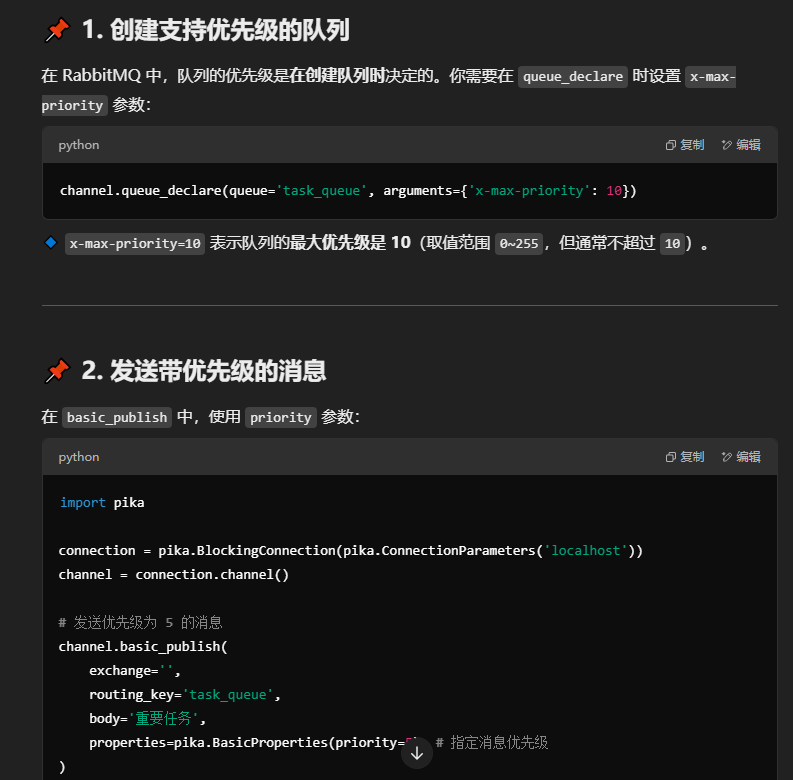

ls usr测试环境

```shell
putty登录
192.168.13.161:22 login:test pwd:sunell000
odoo-shell: docker exec -it -u root sunell_scm_fix bash
odoo shell -c /etc/odoo/odoo.conf -d prod_scm -p 8869

线上（注意）：odoo shell -c /etc/odoo/odoo.conf -d prod_wms -p 8870
日志打印：/usr/odoo_shell
		./scm_log.sh
		
日更环境数据库：/mnt3/backup_fix_pg/bak_file
		
161日更环境的代码路径：/usr/local/fix/sunell_scm
重启日更环境：docker restart sunell_scm_fix

scp拉取远端shell中的数据：
首先检查.ssh中有没有多余的文件，一般只有git的rsa文件和host文件即可，其他的都删除。
scp的执行环境是在本地shell进行
scp -P 22 username@remote_host:/path/file ./local_path 
scp -P 22 test@192.168.13.161:/mnt3/backup_fix_pg/bak_file/20250225-0130/pg_backup_20250225-0130.sql.gz ./  可以直接输入这个根据日期改除了sql还有
scp -P 22 test@192.168.13.161:/mnt3/backup_fix_pg/bak_file/20250225-0130/odoo_scm_20250225-0130.tar ./
odoo_scm_20241224-0130.tar

psql -U admin -d postgres -p 5433 -f dump.sql

密码：sunell2024.
然后输入远端的密码就行

注意这种还原是直接还原了线上的数据，还要执行本地化的脚本
SCM：
注意执行scm脚本之前，要直接去数据库中修改表wms_settings的值  而且update_scm_setting方法填的是wms的地址和端口，wms那边也同理
from odoo.addons.base_ext.script import update_system_setting; 
update_system_setting.update_scm_setting(env, 'localhost', '8169'); 
from odoo.addons.base_ext.script import update_system_setting; 
update_system_setting.update_background_color(env, '#54BBFC'); env.ref('scm.scm_settings_data_1').modify_redis_ip_and_port(ip='172.20.0.5', port=6379, commit=1)

WMS：
from odoo.addons.base_ext.script import update_system_setting; 
update_system_setting.update_wms_setting(env, 'localhost', '8069'); 
from odoo.addons.base_ext.script import update_system_setting; 
update_system_setting.update_background_color(env, '#54BBFC')

数据库用户：project_manage
	密码:sunell
	scp username@remote_host:/path/to/remote/file /path/to/local/directory
	
记得干掉：mrp_result_line_detail
	
研发8个测试数据库：
1panel内部地址:  http://192.168.123.107:38485/43d46f8269
面板用户:  4665a56c71
面板密码:  60a2e01bcf
定时任务： 每天晚上8个任务，从02:45开始至08:30依次恢复（如有不想恢复的，可登录1panel停止对应任务）
数据库信息用户：project_manage
密码：sunell库名：postgres
IP: 192.168.123.107 5531 sunell_pg14_zmy
其他：1、静态文件存在于日更服务器的/mnt/new/backup/backup目录
2、自动恢复的sql文件是xxxx-0130.sql.gz，可根据日期去查找对应的静态文件
3、pg容器名称根据人员名字首字母缩写目前容器sunell_pg14_qzn已测试恢复数据，其他大家可以明天试试
	
ITD线上shell账户
sunell2020
sunell

数据中心测试服：
192.168.123.151 sunell/Qs39aZ6w
/opt/flask_test/flask_config
 docker logs -f --tail=100 sunell_flask_test
 docker restart sunell_flask_test


app_key: 'dingr2nrpipwk0gjlwnn'
app_secret: '4pKOWGVVdo5BzGjMAA79ZcPPeSnG8HZz19mXzqXdnkUTIhzC3RjnkC1aI5-Pgihy'


https://pypi.org/simple 官方镜像

https://pypi.tuna.tsinghua.edu.cn/simple 清华镜像

中国科学技术大学 : https://pypi.mirrors.ustc.edu.cn/simple

阿里云：http://mirrors.aliyun.com/pypi/simple/

pip isntall <module> -i http://mirrors.aliyun.com/pypi/simple/ --trusted-host mirrors.aliyun.com

本地日更scm启动
F:\Environment\python38\python.exe F:\odoo\odoo-14.0\odoo-14.0\odoo-bin --config=F:/ERP/config/odoo-scm.conf
F:\Environment\python38\python.exe F:\odoo\odoo-14.0\odoo-14.0\odoo-bin shell --config=F:/ERP/config/odoo-scm.conf
添加bat文件后简写 odoo --config=F:/ERP/config/odoo-scm.conf  odoo-shel --config=F:/ERP/config/odoo-scm.conf 

本地日更wms启动
F:\Environment\python38\python F:\odoo\odoo-14.0\odoo-14.0\odoo-bin shell --config=F:\ERP\config\odoo-wms.conf

本地周更scm启动
F:\Environment\python38\python.exe F:\odoo\odoo-14.0\odoo-14.0\odoo-bin --config=F:/ERP-week/config/odoo-scm.conf

本地周更wms启动
F:\Environment\python38\python F:\odoo\odoo-14.0\odoo-14.0\odoo-bin shell --config=F:\ERP-week\config\odoo-wms.conf
 
查找端口占用情
netstat -ano | findstr :8080

删除pid为1234的进程
taskkill /PID 1234 /F
 
```

```
越南线上shell：sunell@192.168.14.128       sunell2025--
	docker exec -it -u odoo sunell_scm_vn bash
	odoo shell -c /etc/odoo/odoo.conf -d prod_scm -p 9999

ITD线上：sunell@192.168.123.130 sunell2020
scm日更：192.168.13.161 login:test pwd:sunell000


```




```
union_id : Fd38s6oVnjywacuVObYiPvwiEiE 我的 726220868
			ZUBpt5et95ORdzGes68HvwiEiE 耀泽的 336058475
			师伟 233453444124168759   G49GRFDj8tTESoQb7E3uXQiEiE
			志胜 pfZ4MGfDZiP6pG0xHCsDHuwiEiE  15460072
			
from odoo.addons.ding_link.operation.dingding_storage import DingDingStorage
ds = DingDingStorage(self.env)

union_id = 'Fd38s6oVnjywacuVObYiPvwiEiE'
ding_user_id = '726220868'
test_user_id = '15460072'
			
13 DnRL6jAJMGn2R6RdIk66E04ZWyMoPYe1  170607278228

channel.basic_publish(exchange='yuenan', routing_key='yuenan_data_sync', body="11233", properties=pika.BasicProperties(delivery_mode=2))
```

```json
POST /v1.0/workflow/processInstances HTTP/1.1
Host:api.dingtalk.com
Content-Type:application/json

{
    /*
      该接口当前尚未支持审批应用中的所有控件，以以下列出示例的控件为准。
      基本的控件数据在传递时只需要填写 name 和 value 属性即可，两者都是字符串格式。
      如果数据是 json 格式，也需要先转义为字符串格式。
    */ 
    "processCode": "PROC-17428B8C-6C60-xxxx-924C-64F1037AE067",
    "originatorUserId": "26652461xxxx5992",
    "deptId": 1,
    "microappAgentId": 1234,
    "formComponentValues":[
        {
            "name": "单行输入框",
            "value": "单行输入框示例"
        },
        {
            "name": "多行输入框",
            "value": "请输入多行文本内容，需要换行时请输入\r\n"
        },
        {
            "name": "数字输入框",
            "value": "100"
        },
        {
            /*
                value 可以直接填写实际的选项值
                选项值-如"选项1"必须是配置的选项列表中的值
                非法选项值后续有发起失败风险
            */
            "name": "单选框",
            "value": "选项1"
        },
        {
            /*
                value 需要将实际的选项值组成的数组转义为字符串，即使只有一个
                选项也需要是数组形式
                选项值-如"选项1"、"选项2"必须是配置的选项列表中的值
                非法选项值后续有发起失败风险
            */
            "name": "多选框",
            "value": "[\"选项1\",\"选项2\"]"
        }, 
        {
            /*
                value 仅支持 yyyy-MM-dd 一种格式
            */
            "name": "日期",
            "value": "2021-08-17"
        },
        {
            /*
                value 是时间数组的字符串形式，同样仅支持 yyyy-MM-dd 一种格式
            */
            "name": "[\"开始时间\",\"结束时间\"]",
            "value": "[\"2019-02-19\",\"2019-02-25\"]"
        },
        {
            /*
                value 需要将实际的 url 组成的数组转义为字符串，即使只有一个
                选项也需要是数组形式
            */
            "name": "图片",
            "value": "[\"http://url1\",\"http://url2\",\"http://url3\"]"
        },
        {
            /*
                表格控件的 value 是一个 json 对象的二维数组。数组中的每一行表示了表格中的一行数据，
                一行中的每个 json 对象表示表格中的一个控件。
            */
            "name": "表格",
            "value": "[[{\"name\":\"单行输入框\",\"value\":\"明细单行输入框\"},{\"name\":\"数字输入框\",\"value\":\"100\"}]]"
        },
        {
            "name": "金额（元）",
            "value": "100"
        },
        {
            /*
                附件控件的 value 是一个 json 数组转义为字符串形式。数组中的每个 json 对象是一个附件文件，
                每个文件都必须包含 spaceId、fileName、fileSize、fileType 和 fileId 字段，这些字段
                都可以通过调用钉盘的上传附件接口获取。
            */
            "name": "附件",
            "value": "[{\"spaceId\": \"163xxxx658\", \"fileName\": \"2644.JPG\", \"fileSize\": \"333\", \"fileType\": \"jpg\", \"fileId\": " +
    "\"643xxxx140\"}]"
        },
        {
            /*
                联系人中传的值是userId
                如果传入的userId不是当前企业在职的用户userId, 后续有发起失败风险
            */
            "name": "联系人",
            "value": "[\"4525xxxxxxxx77041\"]"
        },
        {
            /*
                value 需要将实际的审批单组成的数组转义为字符串，即使只有一个
                选项也需要是数组形式
                传入不存在的审批实例ID，后续有导致发起失败的风险
            */
            "name": "关联审批单",
            "value": "[\"fa2aa864-xxxx-xxxx-xxxx-75572c0e2cdf\", \"7125778e-xxxx-xxxx-xxxx-faa987478a9b\"]"
        },
        {
            /*
                国内手机号 +86 加不加均可，国际手机号需加国际区号，否则可能导致无法解析；
                固话区号加不加均可
            */
        	"name": "电话",
          	"value": "157xxxx4545"
        },
        {
            /*
                省市区必须遵照地址控件的格式正确传递才可识别，且需使用英文格式逗号进行分隔
            */
          	"name": "省市区",
          	"value": "北京,北京市,河东区"
        },
        {
          	"name": "评分",
          	"value": "5"
        },
        {
            /*
                value 是钉钉通讯录内部门的id。当选择多个部门时，value 用英文逗号分隔
                如果传入的是非法的部门ID，后续有导致审批发起失败风险
            */
          	"name": "部门",
          	"value": "钉钉通讯录部门1的id,钉钉通讯录部门2的id"
        }
    ],
    "targetSelectActioners":[
        {
            "actionerKey": "manual_f953_8c70_xxxx_7ffa",
            "actionerUserIds": ["26652461xxxx5992", "011220460xxxx8765"]
        }
    ],
    "approvers": [
        {
            "actionType": "AND",
            "userIds": ["26652461xxxx5992", "011220460xxxx8765"]
        }
    ],
    "ccList": ["25054456xxxx0123"],
    "ccPosition": "START",
    "RequestId" : "4F73A5B6-81E5-1556-BC35-C2912C84993D"
}
```


dingding_link模块开发记录

```
pip install alibabacloud_dingtalk
```


```
from odoo.addons.ding_link.operation.dingding_storage import DingDingStorage
ds = DingDingStorage(self.env)
res = ds.query_dentry_info('Fd38s6oVnjywacuVObYiPvwiEiE', 'ERP测试文件夹')


'dentryUuid': 'KAYQBnd5ExVEvrwAxdBfrJyeZqMmz4Pj' # 唯一
  = 'resourceUrls': ['https://sz-dualstack.trans.dingtalk.com/yundisk0/iAEJAqRmaWxlA6h5dW5kaXNrMATOIQP2ugXNDQEGzM8HzmemzGMIzgACNQA.file'] # 不唯一
 
 
 headers = info.body.header_signature_info.headers
 upload_key = info.body.upload_key
 url = info.body.header_signature_info.resource_urls[0]
 
 
 erp测试文件夹所在的的space_id = 25954989133 dentryUuid = KAYQBnd5ExVEvrwAxdBfrJyeZqMmz4Pj
 test.txt文件的dentryUUID = QBnd5ExVEvrwAxdBfEwomlmBJyeZqMmz 
 dentryId = 168563059426 这个在commit文件之后会有返回给你
 https://qr.dingtalk.com/page/yunpan?route=previewDentry&spaceId=25954989133&fileId=168563059426&type=file
 
 
 
 
 ds.add_space
 erp-2-测试 25974005038   
 ds.add_dentry
 erp-2-测试/112233  3NwLYZXWynpe3936Hjp7jj50VkyEqBQm 168876218093
 ds.upload_file
 test.txt  14dA3GK8gj7ng6gyhQdOAOlPJ9ekBD76 168879242822
 ds.add_permission
  https://qr.dingtalk.com/page/yunpan?route=previewDentry&spaceId=25974005038&fileId=168879242822&type=file
 

  
 union_id : Fd38s6oVnjywacuVObYiPvwiEiE 我的 726220868
			ZUBpt5et95ORdzGes68HvwiEiE 耀泽的 336058475
			师伟 233453444124168759   G49GRFDj8tTESoQb7E3uXQiEiE
			志胜 pfZ4MGfDZiP6pG0xHCsDHuwiEiE  15460072
```

```
记录：事件event到达消费者线程时，handler方法需要处理时需要try catch，然后将事件结果返回给前一个方法
    
```

```python
from odoo.addons.base_ext.script.update_system_setting import update_background_color
update_background_color(self.env, '#66ff66') # 修改系统颜色

# 向目标系统同步初始化数据
sys_info = self.env.ref('sys_info.sunell_sync_test')
from odoo.addons.data_sync.script.fix_script import init_target_sys
init_target_sys(self.env, sys_info)
```



日更SCM执行一下 @唐佳铭(唐佳铭)
from odoo.addons.scm.script.fix_script import sync_unsync_product_template_to_wms_1206
sync_unsync_product_template_to_wms_1206(self.env)


```


```


在 Windows 系统中，如果你想结束某个端口的进程，可以通过以下步骤来查找并结束该进程。

### 步骤 1：查找占用端口的进程

首先，你需要找到占用特定端口的进程 ID（PID）。可以使用 `netstat` 或 `PowerShell` 命令来获取占用端口的进程。

#### 使用 `netstat` 命令

1. 打开 **命令提示符**（CMD），可以按 `Win + R`，输入 `cmd` 然后回车。

2. 输入以下命令来列出当前系统上的所有端口占用信息：

   ```bash
   netstat -ano | findstr :<端口号>
   ```

   例如，如果你想查看占用端口 `8080` 的进程，可以执行：

   ```bash
   netstat -ano | findstr :8080
   ```

   该命令会返回占用指定端口的相关信息，包括 **PID**（进程 ID）。

   输出样例：

   ```
   TCP    0.0.0.0:8080            0.0.0.0:0              LISTENING       1234
   ```

   其中，`1234` 就是占用端口 8080 的进程 ID。

### 步骤 2：结束进程

一旦你知道了进程的 PID，你可以通过任务管理器或者命令行来结束该进程。

#### 使用任务管理器

1. 按 `Ctrl + Shift + Esc` 打开任务管理器。
2. 转到 **详细信息** 选项卡，找到对应的 PID（进程 ID）。
3. 右键点击该进程，选择 **结束任务**。

#### 使用命令行

1. 打开 **命令提示符**（CMD），以管理员身份运行。

2. 输入以下命令来结束进程：

   ```bash
   taskkill /PID <进程ID> /F
   ```

   例如，要结束 PID 为 `1234` 的进程，可以执行：

   ```bash
   taskkill /PID 1234 /F
   ```

   这将强制终止该进程。

### 使用 PowerShell

你也可以使用 PowerShell 来完成这些操作。打开 PowerShell，执行以下命令：

```powershell
Get-Process -Id (Get-NetTCPConnection -LocalPort <端口号>).OwningProcess | Stop-Process
```

例如，要结束占用 8080 端口的进程，可以使用：

```powershell
Get-Process -Id (Get-NetTCPConnection -LocalPort 8080).OwningProcess | Stop-Process
```

### 总结

1. 使用 `netstat -ano | findstr :<端口号>` 查找占用端口的进程。
2. 使用 `taskkill /PID <进程ID> /F` 强制结束进程。
3. 或者使用 PowerShell 执行类似命令进行结束。

这样，你就能顺利结束占用指定端口的进程了。


```
sys_info = self.env['sys.info'].browse(5)
if '日本' in sys_info.description:
    from odoo.addons.data_sync.script.fix_script import init_target_sys
    init_target_sys(self.env, sys_info)
else:
	print('未找到日本系统数据')


```


<font size=4 color='pink'>1234</font>

==11==

<p align='right'>右对齐</p>

[百度](www.baidu.com)

:smile::100:

:crying_cat_face:

:question:

:anger:

:boom:

:star::star::star::star::star:

emoj触发方式  :英文:

> [!NOTE]
>
> 111123

> [!WARNING]
>
> 23123213

> [!CAUTION]
>
> 12512512

> [!TIP]
>
> 111111

> [!IMPORTANT]
>
> 22222

引用：ctrl + shift + q + [!NOTE] or [!WARNING] or [!CAUTION] or [!IMPORTANT] or [!TIP]
